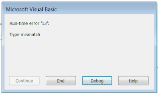
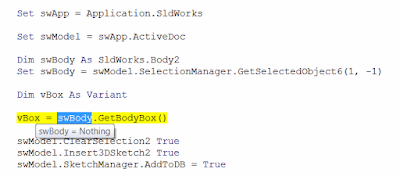

 修复运行宏时出现的“运行时错误'91'”或“运行时错误'13'”
image: vba-error-type-mismatch.png
labels: [宏, 故障排除]
redirect-from:
  - /2018/04/macro-troubleshooting-macros-precondition-are-not-met.html
---

## 症状

运行处理活动模型或选择的SOLIDWORKS宏时，会出现“运行时错误'91'：对象变量或With块变量未设置”错误或“运行时错误'13'：类型不匹配”错误，或以其他方式出现问题。

{ width=320 height=191 }

## 原因

根据宏的功能，可能需要满足某些前提条件，例如打开零件或装配，或选择特定对象（例如体、特征、尺寸等）。

如果宏没有正确处理错误并显示用户友好的消息，VBA环境将会出错。

## 解决方法

* 调查宏的前提条件。如果可能，请联系宏的开发人员，或比较它正常工作和不正常工作的条件之间的差异。
* 检查代码。查看错误发生时所突出显示的代码行。
例如，如果*swModel*或*Part*变量为*Nothing*，则要求模型处于打开状态。
如果从*GetSelectedObjectX*方法分配的对象为*Nothing*，则在运行宏之前选择了错误的对象或没有选择任何对象。

{ width=400 height=175 }