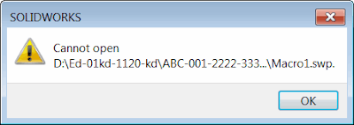

## 症状

SOLIDWORKS宏存储在PDM保险库中的长项目结构下，或者宏是在安全位置（隔离存储）上生成并通过SOLIDWORKS API运行。

当宏运行或编辑时，会显示“无法打开”错误。从其他位置运行宏时，它可以正常运行。

{ width=400 height=141 }

## 原因

宏路径的最大支持长度为255个字符。

虽然宏被放置在超过255个字符的目录中的可能性很小，但当宏从API中运行并且其位置需要被混淆时（例如使用隔离存储），仍然有可能使用长路径。

在PDM环境（如SOLIDWORKS PDM保险库）中可能存在长路径，其中文件夹结构可能反映项目编号、分支等。

## 解决方案

无法强制SOLIDWORKS使用长路径运行宏。将宏移动到新位置。
或者，可以开发一个宏启动器宏，该宏将宏从长路径复制到短路径并运行。