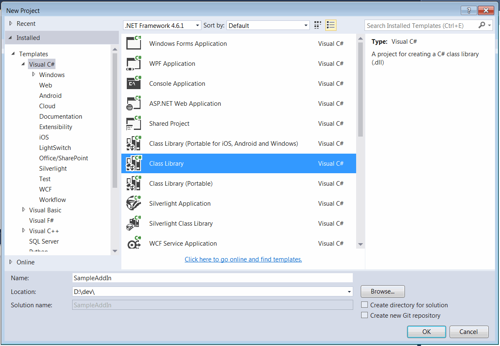
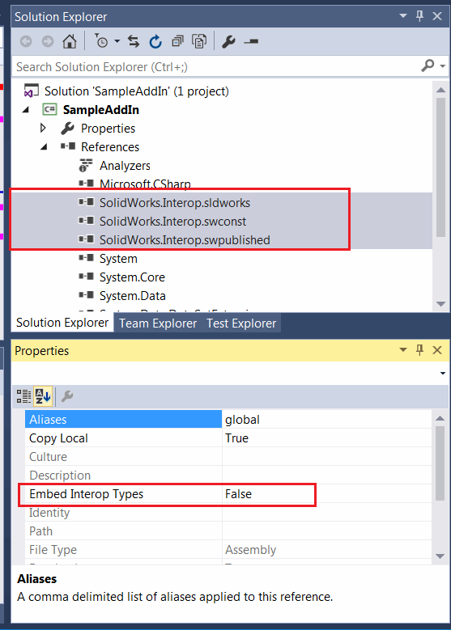
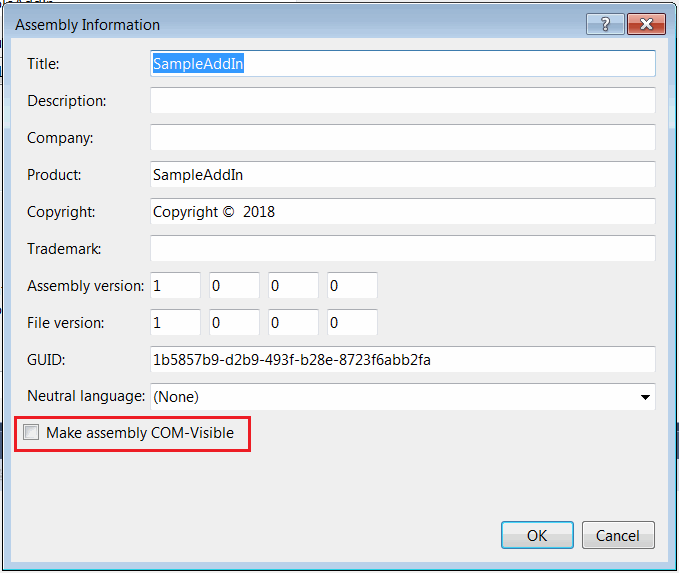
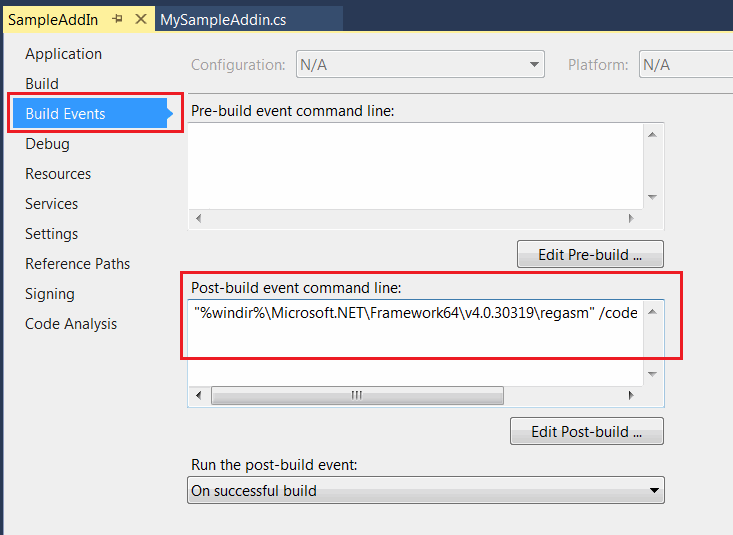
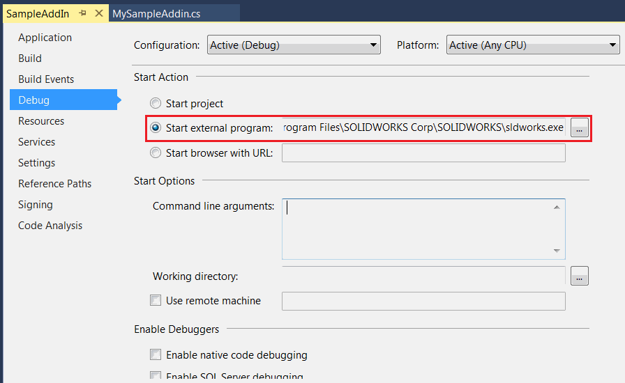

 使用C#从头开始创建SOLIDWORKS插件的详细指南
image: new-project-class-library.png
labels: [插件, c#]
---
* 在Microsoft Visual Studio中创建新项目
* 在*Visual C#*模板下选择*类库*模板。指定项目的位置和名称

{ width=450 }

* 添加对SolidWorks Interop库的引用：SolidWorks.Interop.sldworks.dll、SolidWorks.Interop.swconst.dll、SolidWorks.Interop.swpublished.dll。Interop库位于**SOLIDWORKS安装文件夹**\api\redist，用于针对Framework 4.0及更高版本的项目，位于**SOLIDWORKS安装文件夹**\api\redist\CLR2，用于针对Framework 2.0和3.5的项目。

对于针对Framework 4.0的项目，建议将**[嵌入互操作类型](https://docs.microsoft.com/en-us/dotnet/framework/interop/type-equivalence-and-embedded-interop-types)**选项设置为false。
否则，在调用SOLIDWORKS API时可能会出现类型转换问题，导致应用程序行为不可预测。

{ width=350 }

> 在一些教程中，添加了对solidworkstools.dll库的引用。这个库是可选的，在本教程中不会使用到。

* 添加一个具有用户友好名称的公共类。这将是插件的主类。该类必须是公共的和COM可见的。我建议使用[ComVisibleAttribute](https://docs.microsoft.com/en-us/dotnet/api/system.runtime.interopservices.comvisibleattribute?view=netframework-4.7.2)将类标记为COM可见对象，并使用[GuidAttribute](https://docs.microsoft.com/en-gb/dotnet/api/system.runtime.interopservices.guidattribute?view=netframework-4.7.2)为插件类显式分配COM GUID：

~~~ cs
[ComVisible(true)]
[Guid("31B803E0-7A01-4841-A0DE-895B726625C9")]
public class MySampleAddin : ISwAddin
{
    ...
}
~~~

我建议在项目设置中不选择*使程序集COM可见*选项，而只将所需的类标记为COM可见，如上所述。

{ width=400 }

* 插件dll必须使用/codebase标志进行注册。项目设置中的*注册COM互操作*选项在注册时不使用此选项，因此不适用于此情况。而是添加以下后期构建操作：

~~~ bat
"%windir%\Microsoft.NET\Framework64\v4.0.30319\regasm" /codebase "$(TargetPath)"
~~~

{ width=400 }

这将确保在每次构建插件项目时进行正确的注册。

* 为了获得更好的调试体验，我建议在项目设置中设置SOLIDWORKS的完整路径作为外部应用程序。

{ width=400 }

这将允许通过按下绿色运行按钮或F5键从Visual Studio启动SOLIDWORKS并自动附加调试器。

* 需要将注册信息添加到SOLIDWORKS注册表分支中，以使其对应用程序可见。为了简化这个过程，可以通过定义函数并使用[ComRegisterFunctionAttribute](https://docs.microsoft.com/en-us/dotnet/api/system.runtime.interopservices.comregisterfunctionattribute?view=netframework-4.7.2)和[ComUnregisterFunctionAttribute](https://docs.microsoft.com/en-us/dotnet/api/system.runtime.interopservices.comunregisterfunctionattribute?view=netframework-4.7.2)属性对它们进行装饰，当dll作为COM对象注册和取消注册时，可以自动添加和删除这些信息。

* 复制并粘贴如下所示的插件代码，并编译项目

~~~ cs
using SolidWorks.Interop.sldworks;
using SolidWorks.Interop.swpublished;
using System;
using System.ComponentModel;
using System.Diagnostics;
using System.Linq;
using System.Runtime.InteropServices;

namespace SampleAddIn
{
    [ComVisible(true)]
    [Guid("31B803E0-7A01-4841-A0DE-895B726625C9")]
    [DisplayName("Sample Add-In")]
    [Description("Sample 'Hello World' SOLIDWORKS add-in")]
    public class MySampleAddin : ISwAddin
    {
        #region Registration

        private const string ADDIN_KEY_TEMPLATE = @"SOFTWARE\SolidWorks\Addins\{{{0}}}";
        private const string ADDIN_STARTUP_KEY_TEMPLATE = @"Software\SolidWorks\AddInsStartup\{{{0}}}";
        private const string ADD_IN_TITLE_REG_KEY_NAME = "Title";
        private const string ADD_IN_DESCRIPTION_REG_KEY_NAME = "Description";

        [ComRegisterFunction]
        public static void RegisterFunction(Type t)
        {
            try
            {
                var addInTitle = "";
                var loadAtStartup = true;
                var addInDesc = "";

                var dispNameAtt = t.GetCustomAttributes(false).OfType<DisplayNameAttribute>().FirstOrDefault();

                if (dispNameAtt != null)
                {
                    addInTitle = dispNameAtt.DisplayName;
                }
                else
                {
                    addInTitle = t.ToString();
                }

                var descAtt = t.GetCustomAttributes(false).OfType<DescriptionAttribute>().FirstOrDefault();

                if (descAtt != null)
                {
                    addInDesc = descAtt.Description;
                }
                else
                {
                    addInDesc = t.ToString();
                }

                var addInkey = Microsoft.Win32.Registry.LocalMachine.CreateSubKey(
                    string.Format(ADDIN_KEY_TEMPLATE, t.GUID));

                addInkey.SetValue(null, 0);

                addInkey.SetValue(ADD_IN_TITLE_REG_KEY_NAME, addInTitle);
                addInkey.SetValue(ADD_IN_DESCRIPTION_REG_KEY_NAME, addInDesc);

                var addInStartupkey = Microsoft.Win32.Registry.CurrentUser.CreateSubKey(
                    string.Format(ADDIN_STARTUP_KEY_TEMPLATE, t.GUID));
                
                addInStartupkey.SetValue(null, Convert.ToInt32(loadAtStartup), Microsoft.Win32.RegistryValueKind.DWord);
            }
            catch (Exception ex)
            {

                Console.WriteLine("Error while registering the addin: " + ex.Message);
            }
        }

        [ComUnregisterFunction]
        public static void UnregisterFunction(Type t)
        {
            try
            {
                Microsoft.Win32.Registry.LocalMachine.DeleteSubKey(
                    string.Format(ADDIN_KEY_TEMPLATE, t.GUID));

                Microsoft.Win32.Registry.CurrentUser.DeleteSubKey(
                    string.Format(ADDIN_STARTUP_KEY_TEMPLATE, t.GUID));
            }
            catch (Exception e)
            {
                Console.WriteLine("Error while unregistering the addin: " + e.Message);
            }
        }
        
        #endregion

        private ISldWorks m_App;

        public bool ConnectToSW(object ThisSW, int Cookie)
        {
            m_App = ThisSW as ISldWorks;

            m_App.SendMsgToUser("Hello World!");

            return true;
        }

        public bool DisconnectFromSW()
        {
            return true;
        }
    }
}

~~~

* 编译时可能会显示以下警告。

{ width=450 }

可以忽略此警告。

* 运行SOLIDWORKS，将显示*Hello World*消息框。

上述代码可以使用[xCAD.NET Framework](https://xcad.net/)框架简化如下：

~~~ cs
[Title("Sample Add-In")]
[Description("Sample 'Hello World' SOLIDWORKS add-in")]
[ComVisible(true), Guid("31B803E0-7A01-4841-A0DE-895B726625C9")]
public class MySampleAddIn : SwAddInEx
{
    public override void OnConnect()
    {
        Application.ShowMessageBox("Hello World!");
    }
}
~~~