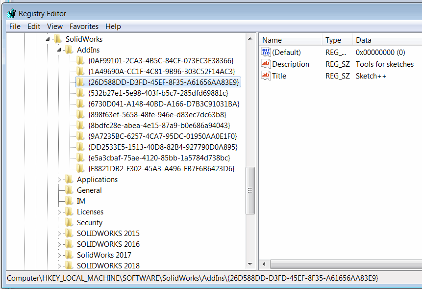

 使用SOLIDWORKS API触发（加载/卸载）指定的加载项的宏
image: toggle-addins.svg
labels: [加载项, 加载]
group: 框架
---
此宏允许使用[SldWorks::LoadAddIn](https://help.solidworks.com/2018/english/api/sldworksapi/solidworks.interop.sldworks~solidworks.interop.sldworks.isldworks~loadaddin.html)和[SldWorks::UnloadAddIn](https://help.solidworks.com/2018/english/api/sldworksapi/solidworks.interop.sldworks~solidworks.interop.sldworks.isldworks~unloadaddin.html) SOLIDWORKS API触发指定加载项的加载状态。

这对于通过单击一个按钮来加载和卸载加载项非常有用。建议使用[宏按钮](/docs/codestack/solidworks-api/getting-started/macros/macro-buttons/)在工具栏中创建加载项按钮。

宏要求在宏的开头指定加载项的全局唯一标识符（GUID）。

~~~ vb
Const ADD_IN_GUID As String = "{1730410d-85ad-4be8-aa2d-ed977b93fe5d}"
~~~

在注册表的*HKLM\SOFTWARE\SolidWorks\AddIns*位置找到所需SOLIDWORKS加载项的GUID。该注册表键的每个子键都代表一个加载项。选择每个键以查看加载项的标题和描述。复制代表加载项GUID的键的名称。

{ width=450 }

可选地，可以在*ADD_IN_PATH*变量中指定加载项的路径。在某些情况下，宏无法从其GUID中检索加载项的路径，可能会失败。您可以在SOLIDWORKS加载项对话框中找到加载项的路径：

{ width=450 }

~~~ vb
Const ADD_IN_PATH As String = "C:\Program Files\CodeStack\MyToolbar\CodeStack.Sw.MyToolbar.dll"
~~~

如果不使用此选项，请将值设置为空字符串。

~~~ vb
Const ADD_IN_PATH As String = ""
~~~

~~~ vb
Const ADD_IN_GUID As String = "{63496b16-e9ad-4d3a-8473-99d124a1672b}"
Const ADD_IN_PATH As String = "C:\Program Files\CodeStack\MyToolbar\CodeStack.Sw.MyToolbar.dll"

Dim swApp As SldWorks.SldWorks

Sub main()

    Set swApp = Application.SldWorks
    
    Dim isLoaded As Boolean
    
    isLoaded = IsAddInLoaded(ADD_IN_GUID)
    
    Debug.Print "加载项已加载: " & isLoaded
    
    Dim addInPath As String
    
    If ADD_IN_PATH <> "" Then
        addInPath = ADD_IN_PATH
    Else
        addInPath = GetAddInPath(ADD_IN_GUID)
    End If
    
    Debug.Print LoadAddIn(addInPath, Not isLoaded)
    
End Sub

Function IsAddInLoaded(addInGuid As String) As Boolean
    
    Dim addIn As Object
    Set addIn = swApp.GetAddInObject(addInGuid)
    
    IsAddInLoaded = Not addIn Is Nothing
    
End Function

Function LoadAddIn(addInGuid As String, load As Boolean) As Boolean
    
    Const SUCCESS As Long = 0
    
    Dim res As Long
    If True = load Then
        res = swApp.LoadAddIn(addInGuid)
    Else
        res = swApp.UnloadAddIn(addInGuid)
    End If
    
    LoadAddIn = (res = SUCCESS)
    
End Function

Function GetAddInPath(addInGuid As String) As String
    
    Dim addInUri As String
    addInUri = CreateObject("WScript.Shell").RegRead("HKCR\CLSID\" & addInGuid & "\InprocServer32\CodeBase")
    
    GetAddInPath = UriToLocalPath(addInUri)
    
End Function

Function UriToLocalPath(uri As String) As String
    UriToLocalPath = Right(uri, Len(uri) - Len("file:///"))
    UriToLocalPath = Replace(UriToLocalPath, "/", "\")
End Function
~~~