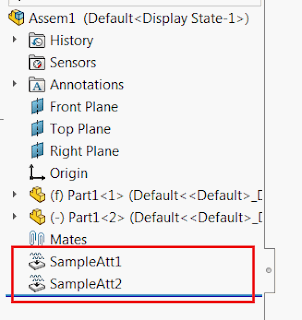

---
title: 使用SOLIDWORKS API添加和读取带参数的组件属性
caption: 添加带参数的属性到组件并读取值
description: 该示例使用[SOLIDWORKS API](https://help.solidworks.com/2018/english/api/sldworksapi/solidworks.interop.sldworks~solidworks.interop.sldworks.iattributedef.html)接口，将带有字符串值的属性作为参数添加到选定的组件中。通过使用[IComponent2::FindAttribute](https://help.solidworks.com/2018/english/api/sldworksapi/SOLIDWORKS.Interop.sldworks~SOLIDWORKS.Interop.sldworks.IComponent2~FindAttribute.html)方法，重建模型并读取属性。

属性是可以附加到SOLIDWORKS实体并存储自定义数据的轻量级特征。

{ width=301 height=320 }

~~~ vb
Enum CreateAtttributeOptions_e
    Visible = 0
    Hidden = 1
End Enum

Dim swApp As SldWorks.SldWorks
Dim swSelMgr As SldWorks.SelectionMgr
Dim swAssy As SldWorks.AssemblyDoc
Dim swAttDef As SldWorks.AttributeDef

Const ATT_DEF_NAME As String = "SampleAtt"
Const ATT_PARAM_NAME As String = "RefData"

Sub main()

    Set swApp = Application.SldWorks
    
    Set swAttDef = swApp.DefineAttribute(ATT_DEF_NAME)
    
    '添加单个字符串参数
    swAttDef.AddParameter ATT_PARAM_NAME, swParamType_e.swParamTypeString, 0, 0

    If False = swAttDef.Register Then
        MsgBox "属性注册失败"
        End
    End If
    
    Set swAssy = swApp.ActiveDoc
    
    Set swSelMgr = swAssy.SelectionManager
    
    '为所有选定的组件创建属性
    AddAttributes
    
    swAssy.EditRebuild
    
    '读取属性中的数据
    ReadAttributes
    
End Sub

Sub AddAttributes()
    
    Dim swComp As SldWorks.Component2
    Dim swAtt As SldWorks.Attribute
    Dim i As Integer
    
    For i = 1 To swSelMgr.GetSelectedObjectCount2(-1)

        Set swComp = swSelMgr.GetSelectedObjectsComponent3(i, -1)
        
        If Not swComp Is Nothing Then
            
            Set swAtt = swAttDef.CreateInstance5(swAssy, swComp, ATT_DEF_NAME & i, CreateAtttributeOptions_e.Visible, swInConfigurationOpts_e.swAllConfiguration)

            Dim swParam As SldWorks.Parameter

            Set swParam = swAtt.GetParameter(ATT_PARAM_NAME)
            
            swParam.SetStringValue2 "Data for " & swComp.Name2 & " at index " & i, swInConfigurationOpts_e.swAllConfiguration, ""
            
        End If
        
    Next
    
End Sub

Sub ReadAttributes()
    
    Dim swComp As SldWorks.Component2
    Dim swAtt As SldWorks.Attribute
    Dim i As Integer
    
    For i = 1 To swSelMgr.GetSelectedObjectCount2(-1)

        Set swComp = swSelMgr.GetSelectedObjectsComponent3(i, -1)
        
        If Not swComp Is Nothing Then
            
            Dim j As Integer

            For j = 0 To 10
            
                Set swAtt = swComp.FindAttribute(swAttDef, j)
                
                If Not swAtt Is Nothing Then
                    
                    Set swParam = swAtt.GetParameter(ATT_PARAM_NAME)
                    Debug.Print swParam.GetStringValue()
                    
                End If
            
            Next
            
        End If
        
    Next

End Sub

~~~