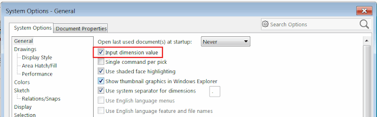

该示例使用SOLIDWORKS API在两个选定的草图线段（例如草图线）之间添加尺寸。尺寸将放置在两个选定点的中间。

{ width=320 height=237 }

在使用SOLIDWORKS API以编程方式添加尺寸时，重要的是禁用输入尺寸值选项，否则宏将被中断并需要用户输入。

下面的示例临时移除了此选项，并在插入尺寸后恢复原始值，以确保不影响用户设置。

{ width=640 height=198 }

```vb
Dim swApp As SldWorks.SldWorks
Dim swModel As SldWorks.ModelDoc2
Dim swSelMgr As SldWorks.SelectionMgr

Sub main()

    Set swApp = Application.SldWorks
    
    Set swModel = swApp.ActiveDoc
    
    If Not swModel Is Nothing Then
    
        Set swSelMgr = swModel.SelectionManager
                
        If swSelMgr.GetSelectedObjectCount2(-1) = 2 Then
    
            Dim vPt1 As Variant
            Dim vPt2 As Variant
            
            vPt1 = swSelMgr.GetSelectionPoint2(1, -1)
            vPt2 = swSelMgr.GetSelectionPoint2(2, -1)
            
            Dim inputDimDefVal As Boolean
            inputDimDefVal = swApp.GetUserPreferenceToggle(swUserPreferenceToggle_e.swInputDimValOnCreate)
        
            swApp.SetUserPreferenceToggle swUserPreferenceToggle_e.swInputDimValOnCreate, False

            swModel.AddDimension2 (vPt1(0) + vPt2(0)) / 2, (vPt1(1) + vPt2(1)) / 2, (vPt1(2) + vPt2(2)) / 2
            
            swApp.SetUserPreferenceToggle swUserPreferenceToggle_e.swInputDimValOnCreate, inputDimDefVal
    
        Else
            MsgBox "请选定草图线段以添加尺寸"
        End If
        
    Else
        MsgBox "请打开模型"
    End If
    
End Sub
```

