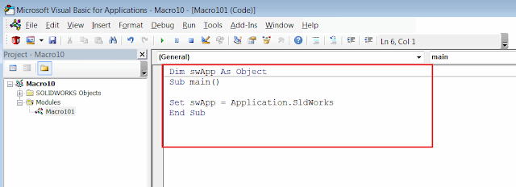

This macro will display the callouts with the diameter values of all selected circular edges in the 3D model using [ISelectionMgr::CreateCallout2](https://help.solidworks.com/2018/english/api/sldworksapi/solidworks.interop.sldworks~solidworks.interop.sldworks.iselectionmgr~createcallout2.html) SOLIDWORKS API method.

This can be useful while inspecting the model and it is required to see multiple diameters at the same time.

{ width=400 height=290 }

The callout is a visual element in SOLIDWORKS which displays data organized in key-value pairs (single or multiple rows). The callout elements are used in some standard SOLIDWORKS tools such as [Measure tool](https://help.solidworks.com/2017/english/solidworks/sldworks/t_using_the_measure_tool.htm). Usually callouts are attached to the selection and destroyed once the object is deselected.

To run the macro:

1. Select circular edges and run the macro
1. Callouts with the diameter value in the model's units are displayed for all circular edges
1. Clear the selection to remove the callouts

Create new macro and copy the following code into the macro's module:

{ width=640 height=230 }

~~~ vb
Dim swApp As SldWorks.SldWorks
Dim swModel As SldWorks.ModelDoc2
Dim swSelMgr As SldWorks.SelectionMgr

Sub main()

    Set swApp = Application.SldWorks
    
    Set swModel = swApp.ActiveDoc
    
    If Not swModel Is Nothing Then
    
        Set swSelMgr = swModel.SelectionManager
        
        Dim swCalloutHandler As New HoleDiamCalloutHandler
        
        Dim i As Integer
        
        Dim swCalloutsCollection As New Collection
        
        For i = 1 To swSelMgr.GetSelectedObjectCount2(-1)
        
            If swSelMgr.GetSelectedObjectType3(i, -1) = swSelectType_e.swSelEDGES Then
            
                Dim swEdge As SldWorks.Edge
                
                Set swEdge = swSelMgr.GetSelectedObject6(i, -1)
                
                Dim swCurve As SldWorks.Curve
                
                Set swCurve = swEdge.GetCurve
                
                If swCurve.IsCircle() Then
                
                    Dim vParams As Variant
                    vParams = swCurve.CircleParams
                    
                    Dim diam As Double
                    diam = vParams(6) * 2
                    
                    Dim swUserUnit As SldWorks.UserUnit
                    Set swUserUnit = swModel.GetUserUnit(swUserUnitsType_e.swLengthUnit)
                    
                    Dim diamVal As String
                    diamVal = swUserUnit.ConvertToUserUnit(diam, False, False)
                    
                    Dim swCallout As SldWorks.Callout
                    Set swCallout = swSelMgr.CreateCallout2(1, swCalloutHandler)
                    
                    swCallout.Label2(0) = "Diameter"
                    swCallout.Value(0) = diamVal
                    
                    swSelMgr.SetCallout i, swCallout
                    
                    swCalloutsCollection.Add swCallout
                
                End If
                
            End If
            
        Next
        
        While swSelMgr.GetSelectedObjectCount2(-1) > 0
            DoEvents
        Wend
    
    Else
        MsgBox "Please open the model"
    End If
    
End Sub
~~~

Create new class module and name it *HoleDiamCalloutHandler.*  

{ width=320 height=220 }

Copy the following code in there:

~~~ vb
Implements swCalloutHandler

Private Function swCalloutHandler_OnStringValueChanged(ByVal pManipulator As Object, ByVal RowID As Long, ByVal Text As String) As Boolean

End Function

~~~

