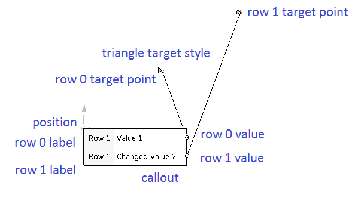

 该示例演示了如何使用SOLIDWORKS API在选择对象时创建具有多行的标注
image: sw-callout-spec.png
labels: [装饰, 标注, 示例, 注意, solidworks api]
redirect-from:
  - /2018/04/solidworks-api-adornment-create-multirow-callout.html
---

该示例演示了如何使用[SOLIDWORKS API的ISelectionMgr::CreateCallout2](https://help.solidworks.com/2018/english/api/sldworksapi/solidworks.interop.sldworks~solidworks.interop.sldworks.iselectionmgr~createcallout2.html)方法在选择对象时创建具有多行的标注。

{ width=640 height=354 }

显示的标注的第一行是只读的，无法编辑。第二行的值可以更改。更改后的值将显示在消息框中。

*宏*

~~~ vb
Dim swApp As SldWorks.SldWorks
Dim swModel As ModelDoc2
Dim swSelMgr As SelectionMgr
Dim swMathUtilss As MathUtility

Sub main()

    Set swApp = Application.SldWorks
    
    Set swMathUtils = swApp.GetMathUtility
    
    Set swModel = swApp.ActiveDoc
    
    If Not swModel Is Nothing Then
    
        Set swSelMgr = swModel.SelectionManager
        
        Dim swMathPt As MathPoint
        Dim dPt(2) As Double
    
        dPt(0) = 0#: dPt(1) = 0#: dPt(2) = 0#
    
        Set swMathPt = swMathUtils.CreatePoint(dPt)
    
        Dim swCallout As SldWorks.Callout
        Dim swCalloutHandler As CalloutHandler
        
        Set swCalloutHandler = New CalloutHandler
        
        Set swCallout = swSelMgr.CreateCallout2(2, swCalloutHandler)
        swCallout.TargetStyle = swCalloutTargetStyle_e.swCalloutTargetStyle_Triangle
             
        swCallout.Label2(0) = "第一行"
        swCallout.Value(0) = "值1"
        swCallout.SetTargetPoint 0, 0.01, 0.01, 0.01
        swCallout.ValueInactive(0) = True
        
        swCallout.Label2(1) = "第二行"
        swCallout.Value(1) = "值2"
        swCallout.SetTargetPoint 1, 0.02, 0.02, 0.02
        swCallout.ValueInactive(1) = False
        
        swCallout.SetLeader True, True
        swCallout.Position = swMathPt
                
        swCallout.Display True
        
        Stop
        
        swCallout.Display False
        Set swCallout = Nothing
        
    Else
        MsgBox "请打开模型"
    End If
        
End Sub
~~~

*CalloutHandler类*

~~~ vb
Implements swCalloutHandler

Private Function SwCalloutHandler_OnStringValueChanged(ByVal pManipulator As Object, ByVal RowID As Long, ByVal Text As String) As Boolean

        MsgBox "第" & RowID & "行的文本已更改: " & Text
                
        SwCalloutHandler_OnStringValueChanged = True

End Function
~~~