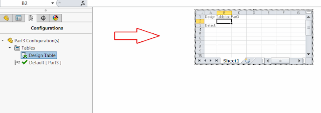

该示例演示了如何使用SOLIDWORKS API方法[ISwOLEObject::Boundaries](https://help.solidworks.com/2018/english/api/sldworksapi/solidworks.interop.sldworks~solidworks.interop.sldworks.iswoleobject~boundaries.html)来调整和移动模型图形区域中的设计表OLE对象。

{ width=640 height=226 }

在这个示例中，将移动一个现有的设计表元素，使其向右移动与对象宽度相等的距离。

~~~ vb
Const DESIGN_TABLE_CLSID As String = "{00020830-0000-0000-C000-000000000046}"

Dim swApp As SldWorks.SldWorks
Dim swModel As SldWorks.ModelDoc2

Sub main()

    Set swApp = Application.SldWorks

    Set swModel = swApp.ActiveDoc
            
    If Not swModel Is Nothing Then
                
        Dim vOleObjs As Variant
        vOleObjs = swModel.Extension.GetOLEObjects(swOleObjectOptions_e.swOleObjectOptions_GetAll)
        
        Dim i As Integer
        
        Dim isDesTableFound As Boolean
        
        For i = 0 To UBound(vOleObjs)
            
            Dim swOleObj As SldWorks.SwOLEObject
            Set swOleObj = vOleObjs(i)
            
            If swOleObj.Clsid = DESIGN_TABLE_CLSID Then
                
                isDesTableFound = True
                
                Dim vBounds As Variant
                vBounds = swOleObj.Boundaries
                
                Dim width As Double
                                
                width = vBounds(3) - vBounds(0)
                                
                Dim newBounds(6) As Double
                newBounds(0) = vBounds(0) + width: newBounds(1) = vBounds(1): newBounds(2) = 0
                newBounds(3) = vBounds(3) + width * 2: newBounds(4) = vBounds(4): newBounds(5) = 0
    
                swOleObj.Boundaries = newBounds
                
            End If
            
        Next
        
        If Not isDesTableFound Then
            MsgBox "在该模型中未找到设计表"
        End If
    
    Else
        
        MsgBox "请打开带有设计表的模型"
        
    End If
    
End Sub
~~~