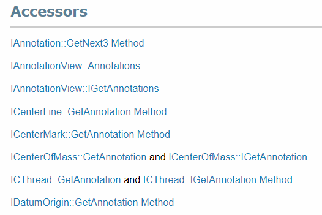

In the SOLIDWORKS API Help documentation, you can find accessibility information for certain interfaces in the *Accessors* section of the specific interface.

For example, the snapshot below shows the *Accessors* section of the [IAnnotation interface](https://help.solidworks.com/2018/english/api/sldworksapi/SolidWorks.Interop.sldworks~SolidWorks.Interop.sldworks.IAnnotation.html).

{ width=250 }

This means that you can obtain a pointer to the [IAnnotation interface](https://help.solidworks.com/2018/english/api/sldworksapi/SolidWorks.Interop.sldworks~SolidWorks.Interop.sldworks.IAnnotation.html) through the [IAnnotation::GetNext3 method](https://help.solidworks.com/2018/english/api/sldworksapi/SOLIDWORKS.Interop.sldworks~SOLIDWORKS.Interop.sldworks.IAnnotation~GetNext3.html), the [IAnnotationView::Annotations property](https://help.solidworks.com/2018/english/api/sldworksapi/SolidWorks.Interop.sldworks~SolidWorks.Interop.sldworks.IAnnotationView~Annotations.html), or other properties or methods listed here.

Certain interfaces can be explicitly or implicitly converted from one interface to another. For example, [IModelDoc2](https://help.solidworks.com/2018/english/api/sldworksapi/SolidWorks.Interop.sldworks~SolidWorks.Interop.sldworks.IModelDoc2.html) represents the parent interface (although not directly inherited) and [IPartDoc](https://help.solidworks.com/2018/english/api/sldworksapi/SolidWorks.Interop.sldworks~SolidWorks.Interop.sldworks.IPartDoc.html), [IAssemblyDoc](https://help.solidworks.com/2018/english/api/sldworksapi/SolidWorks.Interop.sldworks~SolidWorks.Interop.sldworks.IAssemblyDoc.html), [IDrawingDoc](https://help.solidworks.com/2018/english/api/sldworksapi/SolidWorks.Interop.sldworks~SolidWorks.Interop.sldworks.IDrawingDoc.html) interfaces are its child interfaces.

This means that the parent interface and the specific object will point to the same object in memory.

**VBA**
```vb
Dim swModel As SldWorks.ModelDoc2
...
Dim swPart As SldWorks.PartDoc
Set swPart = swModel
```

**VB.NET**
```vb
Dim swModel As IModelDoc2
...
Dim swPart As IPartDoc = CType(swModel, IPartDoc)
```

**C#**
```cs
IModelDoc2 model;
...
IPartDoc part = model as IPartDoc;
```

**C++**
```cpp
LPMODELDOC2 pModelDoc;
...
LPPARTDOC pPartDoc = NULL;
hres = pModelDoc->QueryInterface(IID_IPartDoc, (LPVOID*)&pPartDoc);
```