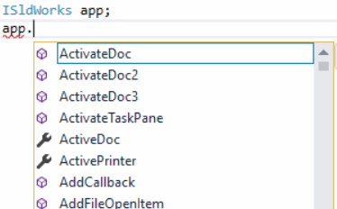

 Explains the difference between method and interface names starting with "I" (e.g. IModelDoc2 vs ModelDoc2)
image: intellisense-events.png
labels: [events, I methods, I interfaces]
---

There are two versions of methods, properties, and objects (interfaces) in the SOLIDWORKS API:

* Starting with **I** (e.g. ISldWorks, IModelDoc2, IAnnotation, ISldWorks::IActiveDoc)
* Not starting with **I** (e.g. SldWorks, ModelDoc2, Annotation, SldWorks::ActiveDoc)

These two versions correspond to the same object or method. The main differences are as follows:

* I-version methods do not expose events.

Here is a snapshot of the events available when the variable is declared as *SldWorks*. Events are available.

{ width=250 }

Here is a snapshot of the members available when the variable is declared as *ISldWorks*. No events are available.

{ width=250 }

* I-version methods typically return a type-safe interface version instead of an object or IDispatch. This means that explicit casting is not required in type-safe languages (e.g. C#) at compile time:

```cs
ISldWorks app;
...
IModelDoc2 model = app.IActiveDoc; // Correct
IModelDoc2 model = app.ActiveDoc; // Compilation error
IModelDoc2 model = app.ActiveDoc as IModelDoc2; // Correct
```