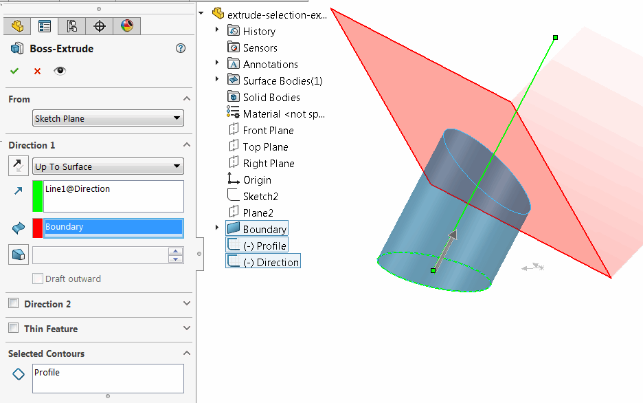

 Example shows how to select the object for API purpose only (without graphics selection) preserving current user selections
image: extrude-direction-up-to-surface.png
labels: [selection, extrude]
---
{ width=500 }

This example shows how to create extrude feature in SOLIDWORKS part by selecting the inputs for API purpose only (without graphics selection) preserving current user selections.

To run the macro

* Download the example file and open it in SOLIDWORKS [Extrude Selection Example](extrude-selection-example.SLDPRT)
* Select any objects (e.g. Front and Right plane)
* Debug the macro step-by-step. The macro pre-selects the required objects for the extrude feature directly in the data base (i.e. it is not visible for the user)

As the result the extrude is created with the specified direction up to specified surface and all the original user selections are preserved.

~~~ vb
Dim swApp As SldWorks.SldWorks
Dim swModel As SldWorks.ModelDoc2
Dim swSelMgr As SldWorks.SelectionMgr

Sub main()

    Set swApp = Application.SldWorks

    Set swModel = swApp.ActiveDoc
    
    If Not swModel Is Nothing Then
            
        Set swSelMgr = swModel.SelectionManager
        
        Dim swProfileSketch As SldWorks.Feature
        Set swProfileSketch = swModel.FeatureByName("Profile")
        
        Dim swBoundarySurface As SldWorks.Feature
        Set swBoundarySurface = swModel.FeatureByName("Boundary")
        
        Dim swDirectionSketch As SldWorks.Sketch
        Set swDirectionSketch = swModel.FeatureByName("Direction").GetSpecificFeature
        
        Dim swDirectionSeg As SldWorks.SketchSegment
        Set swDirectionSeg = swDirectionSketch.GetSketchSegments()(0)
        
        swSelMgr.SuspendSelectionList 'preserving current selections
        
        'selecting objects for extrude features (those selections won't be visible in the graphics view)
        AddToCurrentSelectionSet swProfileSketch, 0
        AddToCurrentSelectionSet swBoundarySurface, 1
        AddToCurrentSelectionSet swDirectionSeg, 16
        
        swModel.FeatureManager.FeatureExtrusion2 True, False, False, swEndConditions_e.swEndCondUpToSurface, 0, 0, 0, False, False, False, False, 0, 0, False, False, False, False, True, True, True, 0, 0, False

        'resuming the original selections
        swSelMgr.ResumeSelectionList
        
    Else
        MsgBox "Please open the sample model"
    End If

End Sub

Sub AddToCurrentSelectionSet(obj As Object, selMark As Integer)
    
    Dim swSelData As SldWorks.SelectData
    
    Set swSelData = swSelMgr.CreateSelectData
    
    swSelData.Mark = selMark
    
    swSelMgr.AddSelectionListObject obj, swSelData
    
End Sub
~~~

