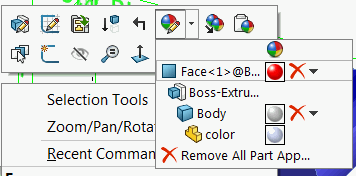

 该宏演示了如何使用SOLIDWORKS API从零件或装配文档的所有级别（面、特征、实体、模型）中删除所有颜色。
image: remove-colors.svg
labels: [删除颜色, 外观, 材料属性]
group: 零件
---
{ width=250 }

该宏使用SOLIDWORKS API从零件文档的所有级别（面、特征、实体、模型）中删除所有颜色。

该宏可以配置为从所有配置或仅活动配置中删除颜色。可以通过更改宏开头的以下常量的值来设置此选项：

~~~ vb
Const REMOVE_FROM_ALL_CONFIGS As Boolean = True 'True表示从所有配置中删除，False表示仅从活动配置中删除
~~~

~~~ vb
Const REMOVE_FROM_ALL_CONFIGS As Boolean = True

Dim swApp As SldWorks.SldWorks

Sub main()

    Set swApp = Application.SldWorks
    
    Dim swModel As SldWorks.ModelDoc2
    
    Set swModel = swApp.ActiveDoc
    
    If Not swModel Is Nothing Then
        
        If swModel.GetType() = swDocumentTypes_e.swDocDRAWING Then
            Err.Raise vbError, "", "不支持绘图"
        End If
        
        Dim configOpts As swInConfigurationOpts_e
        configOpts = GetConfigurationOptions(REMOVE_FROM_ALL_CONFIGS)
        
        If swModel.GetType() = swDocumentTypes_e.swDocPART Then
                    
            Dim swPart As SldWorks.PartDoc
            Set swPart = swModel
                    
            Dim vBodies As Variant
            vBodies = swPart.GetBodies2(swBodyType_e.swAllBodies, False)
            
            RemoveMaterialPropertiesFromBodies vBodies, True, configOpts
            RemoveMaterialPropertiesFromFeatures swPart.FeatureManager.GetFeatures(False), configOpts
        
        End If
        
        swModel.Extension.RemoveMaterialProperty configOpts, Empty
        
        swModel.GraphicsRedraw2
        
    Else
        Err.Raise "请打开零件或装配文档"
    End If
    
End Sub

Sub RemoveMaterialPropertiesFromBodies(bodies As Variant, removeFromFaces As Boolean, configOpts As swInConfigurationOpts_e)
    
    If Not IsEmpty(bodies) Then
        
        Dim i As Integer
        
        For i = 0 To UBound(bodies)
            
            Dim swBody As SldWorks.Body2
            Set swBody = bodies(i)
            
            swBody.RemoveMaterialProperty configOpts, Empty
                        
            If removeFromFaces Then
                Dim vFaces As Variant
                vFaces = swBody.GetFaces()
                RemoveMaterialPropertiesFromFaces vFaces, configOpts
            End If
            
        Next
        
    End If
        
End Sub

Sub RemoveMaterialPropertiesFromFaces(faces As Variant, configOpts As swInConfigurationOpts_e)
    
    Dim i As Integer
    
    If Not IsEmpty(faces) Then
    
        For i = 0 To UBound(faces)
            
            Dim swFace As SldWorks.Face2
            Set swFace = faces(i)
            
            swFace.RemoveMaterialProperty2 configOpts, Empty

        Next
    
    End If
    
End Sub

Sub RemoveMaterialPropertiesFromFeatures(features As Variant, configOpts As swInConfigurationOpts_e)
    
    Dim i As Integer
    
    If Not IsEmpty(features) Then
    
        For i = 0 To UBound(features)
            
            Dim swFeat As SldWorks.Feature
            Set swFeat = features(i)
            
            Debug.Print swFeat.Name
            swFeat.RemoveMaterialProperty2 configOpts, Empty
                
        Next
    
    End If
End Sub

Function GetConfigurationOptions(allConfigs As Boolean) As swInConfigurationOpts_e
    
    If REMOVE_FROM_ALL_CONFIGS Then
        GetConfigurationOptions = swInConfigurationOpts_e.swAllConfiguration
    Else
        GetConfigurationOptions = swInConfigurationOpts_e.swThisConfiguration
    End If
    
End Function
~~~