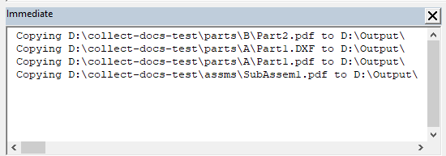

This VBA macro allows to collect all output files such as DXF, DWG, PDF etc. from all referenced parts and sub-assembly documents on all levels and copy to a specified folder.

Referenced parts and sub-assemblies can be located in any directory. It is not required those to be in the same folder or drive of a main assembly.

For example the main assembly **TopAssm1.sldasm** is saved in **C:\Assms** folder and it refers 2 part files located in **D:\Parts\A\Part1.sldprt** and **D:\Parts\B\Part2.sldprt**. DXF and PDF files were created for Part1 and Part2 and saved in the same folder, i.e. **D:\Parts\A\Part1.dxf**, **D:\Parts\A\Part1.pdf**, **D:\Parts\B\Part2.dxf**, **D:\Parts\B\Part2.pdf**. As the result of running this macro all those 4 files will be copied to the specified output folder.

## Notes

* Reference documents must have the same name as the file they derived from, i.e. **Part1.pdf** is derived from **Part1.sldprt**
* Reference documents of the main assembly will also be included
* Macro will open the folder browse dialog to select the output folder
* All file paths which are copied are output to the *Immediate* window of VBA editor
* Suppressed components will not be included into the collection
* Assembly opened in Large Design Review mode is not supported

## Configuration

Macro can be configured by changing the constants at the beginning of the macro

~~~ vb
Const SEARCH_SUB_FOLDERS As Boolean = False
Const EXTENSIONS As String = "dxf,pdf"
Const ALLOW_OVERWRITE As Boolean = False
~~~

**SEARCH_SUB_FOLDERS** indicates if macro should recursively search referenced documents. If this option is set to **False** only files next to the source files will be collected (e.g. Part1.dxf must be in the same folder as Part1.sldprt). In some cases output files can be placed into sub-folders (e.g. DXFs\Part1.dxf of Part1.sldprt) to collect such files set the **SEARCH_SUB_FOLDERS** to **True**. Note, if any child folder contains another file with the same name it will also be collected (e.g. A\B\C\Part1.pdf).

**EXTENSIONS** is a comma-separated list of file extension to collect.

**ALLOW_OVERWRITE** option indicates if the files in the destination directory need to be overwritten if exist. It is recommended to set this option to **False** and manually clean the target directory. This would reduce the risk of overwriting the files and catching the potential errors.

~~~ vb
Const SEARCH_SUB_FOLDERS As Boolean = False
Const EXTENSIONS As String = "dxf,pdf"
Const ALLOW_OVERWRITE As Boolean = False

Dim swApp As SldWorks.SldWorks

Sub main()

    Set swApp = Application.SldWorks
    
try_:
    On Error GoTo catch_
    
    Dim swAssy As SldWorks.AssemblyDoc
    Set swAssy = swApp.ActiveDoc
    
    If False <> swAssy.IsOpenedViewOnly() Then
        Err.Raise vbError, "", "Assembly opened in Large Design Review mode is not supported"
    End If
    
    Dim exts As Variant
    exts = Split(EXTENSIONS, ",")
    
    Dim i As Integer
    
    For i = 0 To UBound(exts)
        exts(i) = Trim(CStr(exts(i)))
    Next
    
    Dim destDir As String
    destDir = BrowseForFolder("Select folder to copy documents to")
    
    If destDir = "" Then
        Exit Sub
    End If
        
    Dim vRefDocs As Variant
    vRefDocs = CollectRefDocuments(swAssy, exts, SEARCH_SUB_FOLDERS)
    
    If Not IsEmpty(vRefDocs) Then
        CopyRefDocs vRefDocs, destDir
    Else
        Err.Raise vbError, "", "There are no referenced documents"
    End If
    
    GoTo finally_
catch_:
    swApp.SendMsgToUser2 Err.Description, swMessageBoxIcon_e.swMbStop, swMessageBoxBtn_e.swMbOk
finally_:
    
End Sub

Sub CopyRefDocs(refDocs As Variant, destFolder As String)
    
    Dim fso As Object
    Set fso = CreateObject("Scripting.FileSystemObject")

    Dim i As Integer
    
    If Right(destFolder, 1) <> "\" Then
        destFolder = destFolder & "\"
    End If
    
    For i = 0 To UBound(refDocs)
        
        Dim srcFilePath As String
        srcFilePath = CStr(refDocs(i))
        
        Debug.Print "Copying " & srcFilePath & " to " & destFolder
        
        fso.CopyFile srcFilePath, destFolder, ALLOW_OVERWRITE
    Next
    
End Sub

Function CollectRefDocuments(assy As SldWorks.AssemblyDoc, exts As Variant, includeSubFolder As Boolean) As Variant
    
    Dim isInit As Boolean
    isInit = False
    
    Dim vComps As Variant
    vComps = assy.GetComponents(False)
    
    Dim refDocsPath() As String
    
    Dim i As Integer
    
    For i = -1 To UBound(vComps)
        
        Dim swComp As SldWorks.Component2
        
        If i = -1 Then
            Set swComp = assy.ConfigurationManager.ActiveConfiguration.GetRootComponent()
        Else
            Set swComp = vComps(i)
        End If
        
        If False = swComp.IsSuppressed() Then
        
            Dim path As String
            path = swComp.GetPathName()
            
            Dim dir As String
            dir = Left(path, InStrRev(path, "\"))
            
            Dim vRefFiles As Variant
            vRefFiles = GetFiles(dir, includeSubFolder, exts)
            
            Dim j As Integer
            
            Dim srcFileName As String
            srcFileName = GetFileNameWithoutExtension(path)
            
            For j = 0 To UBound(vRefFiles)
            
                Dim refFilePath As String
                refFilePath = CStr(vRefFiles(j))
                
                Dim refFileName As String
                refFileName = GetFileNameWithoutExtension(refFilePath)
                
                If LCase(srcFileName) = LCase(refFileName) Then
                
                    Dim add As Boolean
                    add = False
                    
                    If Not isInit Then
                        isInit = True
                        ReDim refDocsPath(0)
                        add = True
                    Else
                        If Not Contains(refDocsPath, refFilePath) Then
                            ReDim Preserve refDocsPath(UBound(refDocsPath) + 1)
                            add = True
                        End If
                    End If
                    
                    If add Then
                        refDocsPath(UBound(refDocsPath)) = refFilePath
                    End If
                
                End If
                
            Next
            
        End If
        
    Next
    
    If isInit Then
        CollectRefDocuments = refDocsPath
    Else
        CollectRefDocuments = Empty
    End If
    
End Function

Function GetFileNameWithoutExtension(filePath As String) As String
    GetFileNameWithoutExtension = Mid(filePath, InStrRev(filePath, "\") + 1, InStrRev(filePath, ".") - InStrRev(filePath, "\") - 1)
End Function

Function GetFiles(path As String, includeSubFolders As Boolean, exts As Variant) As Variant

    Dim paths() As String
    Dim isInit As Boolean
    
    isInit = False
    
    Dim fso As Object
    Set fso = CreateObject("Scripting.FileSystemObject")
    
    Dim folder As Object
    Set folder = fso.GetFolder(path)
    
    CollectFilesFromFolder folder, includeSubFolders, exts, paths, isInit
    
    If isInit Then
        GetFiles = paths
    Else
        GetFiles = Empty
    End If
    
End Function

Sub CollectFilesFromFolder(folder As Object, includeSubFolders As Boolean, exts As Variant, ByRef paths() As String, ByRef isInit As Boolean)
    
    For Each file In folder.files
        
        Dim fileExt As String
        fileExt = Right(file.path, Len(file.path) - InStrRev(file.path, "."))
        
        If Contains(exts, fileExt) Then
            If Not isInit Then
                ReDim paths(0)
                isInit = True
            Else
                ReDim Preserve paths(UBound(paths) + 1)
            End If
            paths(UBound(paths)) = file.path
        End If
    Next
    
    If includeSubFolders Then
        Dim subFolder As Object
        For Each subFolder In folder.SubFolders
            CollectFilesFromFolder subFolder, includeSubFolders, exts, paths, isInit
        Next
    End If
    
End Sub

Function BrowseForFolder(Optional title As String = "Select Folder") As String
    
    Dim shellApp As Object
    
    Set shellApp = CreateObject("Shell.Application")
    
    Dim folder As Object
    Set folder = shellApp.BrowseForFolder(0, title, 0)
    
    If Not folder Is Nothing Then
        BrowseForFolder = folder.Self.path
    End If
    
End Function

Function Contains(arr As Variant, item As String) As Boolean
    
    Dim i As Integer
    
    For i = 0 To UBound(arr)
        If LCase(arr(i)) = LCase(item) Then
            Contains = True
            Exit Function
        End If
    Next
    
    Contains = False
    
End Function
~~~

