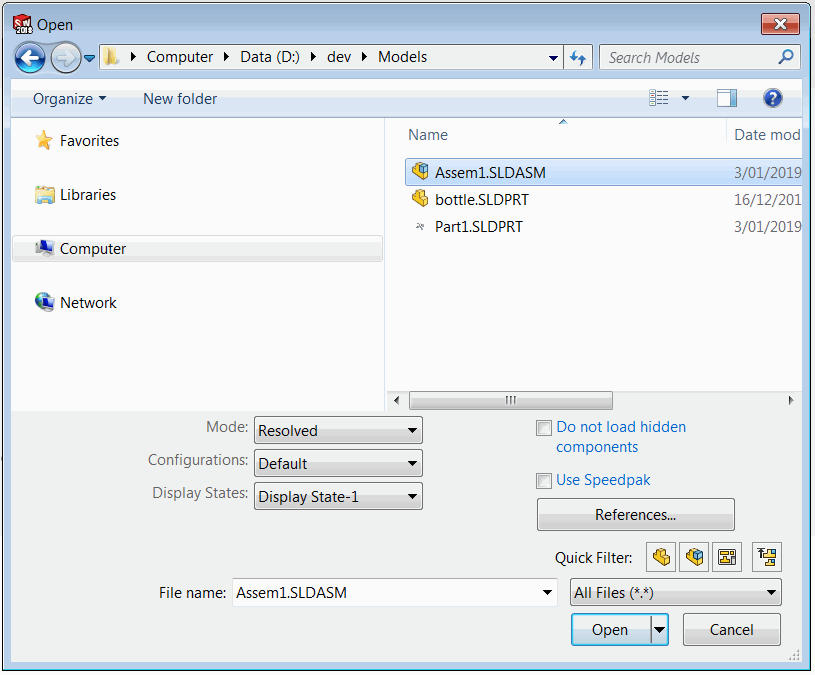
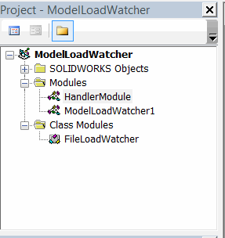



这个VBA宏使用SOLIDWORKS API处理文档加载事件，并为每个文档运行自定义代码。

该宏在后台运行，需要在每个会话中运行一次以开始监视。

可见（在自己的窗口中打开）和不可见（作为装配或绘图组件打开）的文档都会被处理。

{ width=350 }

## 配置

* 创建新的宏
* 将代码复制到宏的相应模块中。VBA宏树应该类似于下面的图片：

{ width=250 }

* 将代码放入*HandlerModule*模块的*main*子程序中。将[IModelDoc2](https://help.solidworks.com/2012/english/api/sldworksapi/SolidWorks.Interop.sldworks~SolidWorks.Interop.sldworks.IModelDoc2.html)文档的指针作为参数传递。使用该指针而不是[ISldWorks::ActiveDoc](https://help.solidworks.com/2012/english/api/sldworksapi/solidworks.interop.sldworks~solidworks.interop.sldworks.isldworks~activedoc.html)来正确处理不可见文档。

~~~ vb
Sub main(model As SldWorks.ModelDoc2)
    'TODO: 在这里添加你的代码
End Sub
~~~

* 可以自动运行此宏以每个SOLIDWORKS会话。请查看[在SOLIDWORKS启动时自动运行宏](/docs/codestack/solidworks-api/getting-started/macros/run-macro-on-solidworks-start/)链接获取更多信息。

## 宏模块

启动事件监视的入口点

~~~ vb
Dim swFileLoadWatcher As FileLoadWatcher

Sub main()
    
    Set swFileLoadWatcher = New FileLoadWatcher
    
    While True
        DoEvents
    Wend
    
End Sub
~~~

## FileLoadWatcher 类模块

处理SOLIDWORKS API通知的类

~~~ vb
Dim WithEvents swApp As SldWorks.SldWorks

Private Sub Class_Initialize()
    Set swApp = Application.SldWorks
End Sub

Private Function swApp_DocumentLoadNotify2(ByVal docTitle As String, ByVal docPath As String) As Long
    
    Dim swModel As SldWorks.ModelDoc2
        
    If docPath <> "" Then
        Set swModel = swApp.GetOpenDocumentByName(docPath)
    Else
        Dim vDocs As Variant
        vDocs = swApp.GetDocuments
        
        Dim i As Integer
        
        For i = 0 To UBound(vDocs)
            Dim swDoc As SldWorks.ModelDoc2
            Set swDoc = vDocs(i)
            If swDoc.GetTitle() = docTitle Then
                Set swModel = swDoc
                Exit For
            End If
        Next
    End If
    
    OnModelLoad swModel
    
End Function

Sub OnModelLoad(model As SldWorks.ModelDoc2)
    HandlerModule.main model
End Sub
~~~

## HandlerModule 模块

需要为每个打开的文档运行的自定义VBA代码

~~~ vb
Sub main(model As SldWorks.ModelDoc2)
    'TODO: 实现过程
    MsgBox "文件已加载：" & model.GetTitle()
End Sub
~~~