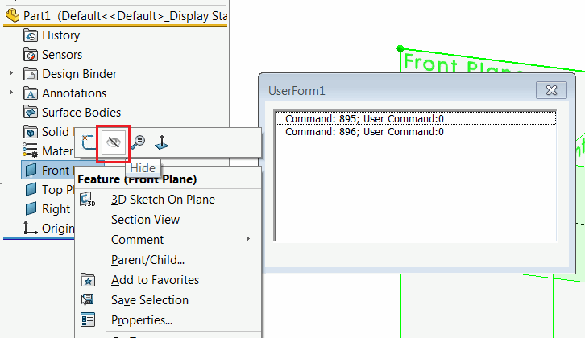
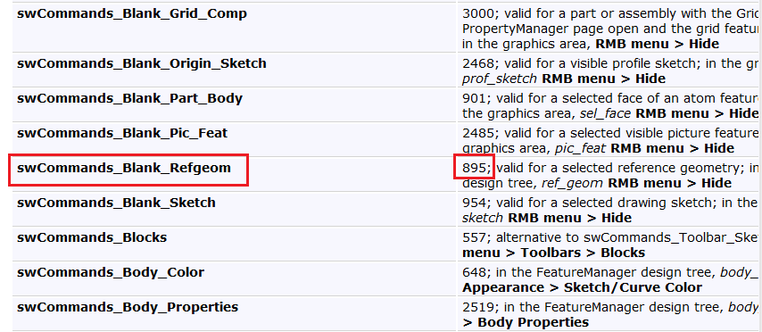
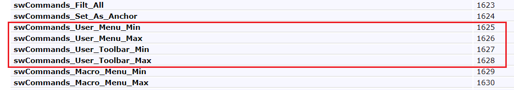
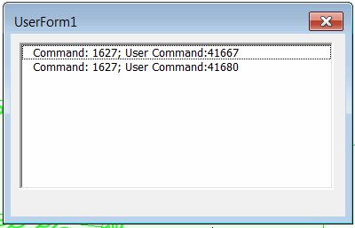
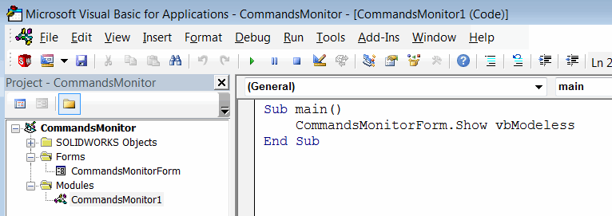
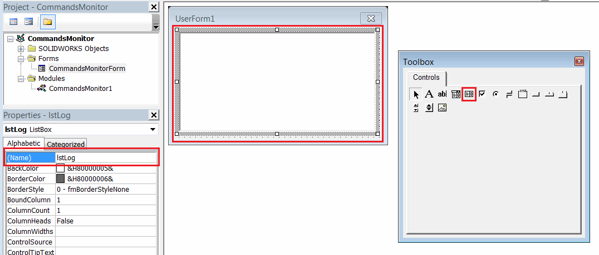

此宏允许捕获SOLIDWORKS命令ID（例如工具栏、页面按钮或上下文菜单点击）。命令在[swCommands_e](https://help.solidworks.com/2012/english/api/swcommands/solidworks.interop.swcommands~solidworks.interop.swcommands.swcommands_e.html)枚举中定义，并可以使用[SOLIDWORKS API](https://help.solidworks.com/2012/english/api/sldworksapi/solidworks.interop.sldworks~solidworks.interop.sldworks.isldworks~runcommand.html)方法调用。

当SDK中某些SOLIDWORKS API不可用时，这可能特别有用。

所有命令都有用户友好的名称，但它们不一定与用户界面中的名称匹配。这个事实可能会使查找正确的命令变得困难（因为当前有超过3000个可用命令）。例如，用户界面中的隐藏草图命令对应于*swCommands_Blank_Refgeom*命令ID。

## 捕获标准命令

此宏可帮助直接从SOLIDWORKS中捕获命令ID，方法是单击所需的命令。

* 运行宏。显示带有列表的窗体。
* 执行所需操作（例如单击按钮或菜单项）。
* 命令ID将被记录并显示在列表中。

{ width=350 }

可以在[命令列表](https://help.solidworks.com/2012/english/api/swcommands/solidworks.interop.swcommands~solidworks.interop.swcommands.swcommands_e.html)中查找命令ID。

{ width=350 }

> 不需要显式使用[swCommands_e](https://help.solidworks.com/2012/english/api/swcommands/solidworks.interop.swcommands~solidworks.interop.swcommands.swcommands_e.html)枚举，因为它在另一个interop（*solidworks.interop.swcommands.dll*）中定义。相反，命令ID可以定义为整数或自定义枚举。

## 从自定义加载项捕获命令

对于标准SOLIDWORKS命令，User Command参数将等于0。但是，不能为任何自定义加载项或[宏按钮](/docs/codestack/solidworks-api/getting-started/macros/macro-buttons/)定义命令。

如果单击此命令，则命令ID将等于以下之一：

{ width=450 }

Command将指示按钮的类型（最小化工具栏、菜单、宏按钮等），而User Command Id将等于自定义按钮的用户ID。这是可以通过在SOLIDWORKS加载项中创建自定义命令管理器时使用[ICommandGroup::CommandId](https://help.solidworks.com/2012/english/api/sldworksapi/SolidWorks.Interop.sldworks~SolidWorks.Interop.sldworks.ICommandGroup~CommandID.html)属性检索的命令用户ID。

{ width=250 }

## 创建宏

* 将用户窗体模块添加到宏中，并将其命名为*CommandsMonitorForm*

{ width=450 }

* 将列表框控件拖放到窗体上，并将其命名为*lstLog*

{ width=450 }

* 将代码添加到相应的模块中

**宏**

~~~ vb
Sub main()
    CommandsMonitorForm.Show vbModeless
End Sub
~~~

**CommandsMonitorForm**

~~~ vb
Dim WithEvents swApp As SldWorks.SldWorks

Private Sub UserForm_Initialize()
    Set swApp = Application.SldWorks
End Sub

Private Function swApp_CommandOpenPreNotify(ByVal Command As Long, ByVal UserCommand As Long) As Long
    lstLog.AddItem "Command: " & Command & "; User Command:" & UserCommand
End Function
~~~