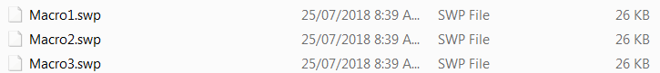

 Macro demonstrates how to run the group of macros within one macro using SOLIDWORKS API
image: macros-library.png
labels: [macro, run group]
group: Frame
---

Macro can be run from another macro using the [ISldWorks::RunMacro2](https://help.solidworks.com/2010/english/api/sldworksapi/solidworks.interop.sldworks~solidworks.interop.sldworks.isldworks~runmacro2.html) SOLIDWORKS API function.

This enables the possibility to run multiple macros from within one macro. This can be useful when [adding the custom macro buttons on the macro toolbar](/docs/codestack/solidworks-api/getting-started/macros/macro-buttons/) so multiple commands can be executed by one button click.

The following example allows to run several SOLIDWORKS macros within one macro.

~~~ vb
Dim swApp As SldWorks.SldWorks

Sub main()

    Set swApp = Application.SldWorks
    
    RunMacro "C:\Macros\Macro1.swp", "Macro11", "main"
    RunMacro "C:\Macros\Macro2.swp", "Macro21", "main"
    RunMacro "C:\Macros\Macro3.swp", "Macro31", "main"
    
End Sub

Sub RunMacro(path As String, moduleName As String, procName As String)
    swApp.RunMacro2 path, moduleName, procName, swRunMacroOption_e.swRunMacroUnloadAfterRun, 0
End Sub
~~~

Change the arguments of **RunMacro** call to call your own group of macros.

~~~ vb
RunMacro "Full Path To Macro", "Module Name", "Entry Function Name"
~~~

Where

{ width=350 }

* **Full Path To Macro** - full path to .swp or .dll for [VBA or VSTA macro](/docs/codestack/solidworks-api/getting-started/macros/types)
* **Module Name** - name of the module where the main entry function is defined. This is usually the macro name followed by 1.
* **Entry Function Name** - name of the entry function. This function cannot have parameters. Usually named **main**

> Modify the macro as per your needs. You can add remove the calls to **RunMacro** and change path, module and function names to match the path to the macro in the library

The following macro provides more advanced functionality of running the macro. It allows to specify the multiple comma separated macros as well as folders using the full path or relative path.

This enables better experience when maintaining the macro.

This macro also handles the errors:

* When the specified macro path is not found:

{ width=250 }

* When macro cannot be run (e.g. macro is corrupted)

{ width=250 }

In order to configure the macro it is required to modify the value of the **MACROS_PATH** variable:

* It is possible to specify multiple macros to run by separating them by comma, e.g. **Macro1.swp, Macro2.swp**
* Macro can be specified with a full path (e.g. **D:\Macros\Macro1.swp**) or using relative path (e.g. **Macro1.swp**). If later the macro must be available in the same folder as this master macro
* It is possible to specify the folder of macros to run (e.g. **D:\Macros** or **Macros**). Same as macro path either full path or relative folder path are accepted. In this case all macros from the specified folder will be run
* If empty string is specified, i.e. 

~~~ vb
Const MACROS_PATH As String = " "
~~~

All macros of the folder where this master macro is placed will be run. This option is useful as it is only required to copy the master macro to the location of the macro library to run without the need to modify it.

~~~ vb
#If VBA7 Then
     Private Declare PtrSafe Function PathIsRelative Lib "shlwapi" Alias "PathIsRelativeA" (ByVal path As String) As Boolean
#Else
     Private Declare Function PathIsRelative Lib "shlwapi" Alias "PathIsRelativeA" (ByVal Path As String) As boolean
#End If
        
Const MACROS_PATH As String = "Macro1.swp, D:\Macro2.swp, D:\MacrosFolder, Macros\Assembly"

Const PATH_DELIMETER As String = ","
Const MACRO_EXT As String = "swp"

Dim swApp As SldWorks.SldWorks

Sub main()

    Set swApp = Application.SldWorks
              
    Dim swMacrosColl As Collection
    Set swMacrosColl = New Collection
    
    AddMacros swMacrosColl
    
    Set swMacrosColl = ResolvePaths(swMacrosColl)
    
    RunMacros swMacrosColl

End Sub

Function ResolvePaths(swMacrosColl As Collection) As Collection

    Dim fso As Object
    Set fso = CreateObject("Scripting.FileSystemObject")
    
    Dim resColl As Collection
    Set resColl = New Collection
    
    Dim i As Integer
    
    For i = 1 To swMacrosColl.Count
        
        Dim path As String
        path = swMacrosColl(i)
        
        If PathIsRelative(path) Then
            path = fso.BuildPath(swApp.GetCurrentMacroPathFolder(), path)
        End If
        
        If fso.FolderExists(path) Then
            
            swMacrosColl.Remove i
            
            For Each file In fso.GetFolder(path).Files
                If LCase(fso.GetExtensionName(file)) = LCase(MACRO_EXT) Then
                    AddMacroToCollection resColl, file.path
                End If
            Next
            
        ElseIf fso.FileExists(path) Then
            AddMacroToCollection resColl, path
        Else
            Err.Raise vbObjectError, , "Macro file is not found: " & path
        End If
        
    Next
    
    Set ResolvePaths = resColl
    
End Function

Sub AddMacroToCollection(coll As Collection, item As String)
    
    If UCase(item) <> UCase(swApp.GetCurrentMacroPathName()) Then
        Dim i As Integer
        
        For i = 1 To coll.Count
            If UCase(coll.item(i)) = UCase(item) Then
                Exit Sub
            End If
        Next
        
        coll.Add item
    End If
    
End Sub

Sub RunMacros(swMacrosColl As Collection)
    
    Dim i As Integer
    
    For i = 1 To swMacrosColl.Count
        Dim path As String
        path = swMacrosColl(i)
        Dim macroErr As Long
        
        Dim moduleName As String
        Dim procName As String
        
        GetMacroEntryPoint path, moduleName, procName
        
        If False = swApp.RunMacro2(path, moduleName, procName, swRunMacroOption_e.swRunMacroUnloadAfterRun, macroErr) Then
            Err.Raise vbObjectError, , "Failed to run macro: " & path & ", error: " & macroErr
        End If
        
    Next
    
End Sub

Sub GetMacroEntryPoint(macroPath As String, ByRef moduleName As String, ByRef procName As String)
        
    Dim vMethods As Variant
    vMethods = swApp.GetMacroMethods(macroPath, swMacroMethods_e.swMethodsWithoutArguments)
    
    Dim i As Integer
    
    If Not IsEmpty(vMethods) Then
    
        For i = 0 To UBound(vMethods)
            Dim vData As Variant
            vData = Split(vMethods(i), ".")
            
            If i = 0 Or LCase(vData(1)) = "main" Then
                moduleName = vData(0)
                procName = vData(1)
            End If
        Next
        
    End If
    
End Sub

Sub AddMacros(swMacrosColl As Collection)
    
    Dim vPaths As Variant
    vPaths = Split(MACROS_PATH, PATH_DELIMETER)
    
    Dim i As Integer
    
    For i = 0 To UBound(vPaths)
    
        Dim path As String
        path = Trim(vPaths(i))
        swMacrosColl.Add path
        
    Next
    
End Sub
~~~

