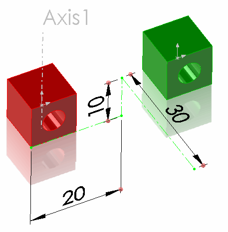

 该示例演示了如何从CSV文件加载组件的变换矩阵，并将其应用为展示变换
image: original-component-position.png
labels: [assembly, transform, csv]
---
{ width=250 }

该示例演示了如何使用SOLIDWORKS API从CSV文件加载组件的变换矩阵，并将其应用为展示变换。

* 下载并打开[示例SOLIDWORKS文件](presentation-transform-example.zip)
* 下载[CSV文件](transforms.csv)并保存到磁盘
* 修改宏常量中的CSV文件路径
* 运行宏。宏停止执行，组件将按照下图所示进行变换

{ width=250 }

红色组件在XYZ空间中平移，绿色组件绕全局Y轴（轴1）旋转90度。

请注意，这些组件被移动，而不考虑它们是否在空间中完全定义（通过配合或固定约束）。并且配合仍然保留。原因是应用了展示变换而不是永久变换。这允许仅为了视觉目的移动组件，而不改变几何形状。

按F5或播放按钮继续执行宏以移除展示变换。如果需要，可以使用[IComponent2::Transform2](https://help.solidworks.com/2012/english/api/sldworksapi/SolidWorks.Interop.sldworks~SolidWorks.Interop.sldworks.IComponent2~Transform2.html) SOLIDWORKS API属性而不是[IComponent2::PresentationTransform](https://help.solidworks.com/2012/english/api/sldworksapi/solidworks.interop.sldworks~solidworks.interop.sldworks.icomponent2~presentationtransform.html)应用永久变换（在这种情况下，需要删除任何不适合此变换的配合）。

~~~ vb
Const INPUT_FILE_PATH = "D:\transforms.csv"

Dim swApp As SldWorks.SldWorks
Dim swAssy As SldWorks.AssemblyDoc

Sub main()

    On Error GoTo Error

    Set swApp = Application.SldWorks
    
    Set swAssy = swApp.ActiveDoc
    
    Dim vTable As Variant
    vTable = ReadCsvFile(INPUT_FILE_PATH, True)
    
    swAssy.EnablePresentation = True
    PreviewComponentsPosition vTable
    
Error:
    Stop
    swAssy.EnablePresentation = False
        
End Sub

Function ReadCsvFile(filePath As String, firstRowHeader As Boolean) As Variant
    
    'rows x columns
    Dim vTable() As Variant
    
    On Error GoTo Error
    
    Dim fileName As String
    Dim tableRow As String
    Dim fileNo As Integer

    fileNo = FreeFile
    
    Open filePath For Input As #fileNo
    
    Dim isFirstRow As Boolean
    Dim isTableInit As Boolean
    
    isFirstRow = True
    isTableInit = False
    
    Do While Not EOF(fileNo)
        
        Line Input #fileNo, tableRow
            
        If Not isFirstRow Or Not firstRowHeader Then
            
            Dim vCells As Variant
            vCells = Split(tableRow, ",")
            
            Dim lastRowIndex As Integer
            
            If Not isTableInit Then
                lastRowIndex = 0
                isTableInit = True
                ReDim Preserve vTable(lastRowIndex)
            Else
                lastRowIndex = UBound(vTable, 1) + 1
                ReDim Preserve vTable(lastRowIndex)
            End If
            
            vTable(lastRowIndex) = vCells
            
        End If
        
        If isFirstRow Then
            isFirstRow = False
        End If
    
    Loop
    
    Close #fileNo
    
    ReadCsvFile = vTable
    
    Exit Function
    
Error:

    ReadCsvFile = Empty
    
End Function

Sub PreviewComponentsPosition(table As Variant)
    
    Dim i As Integer
    
    For i = 0 To UBound(table)
    
        Dim swComp As SldWorks.Component2
        
        Dim compName As String
        compName = table(i)(0)
        
        Set swComp = GetComponent(compName)
        
        If Not swComp Is Nothing Then
            swComp.RemovePresentationTransform
            swComp.PresentationTransform = CreateTransform(table(i))
        Else
            Debug.Print compName & " is not found"
        End If
        
    Next
    
    Dim swModelView As SldWorks.ModelView
    Set swModelView = swAssy.ActiveView
    swModelView.GraphicsRedraw Nothing
    
End Sub

Function CreateTransform(tableRow As Variant) As SldWorks.MathTransform
    
    Dim swMathUtils As SldWorks.MathUtility
    Set swMathUtils = swApp.GetMathUtility
    
    Dim dMatrix(15) As Double
    
    dMatrix(0) = CDbl(tableRow(1)): dMatrix(1) = CDbl(tableRow(2)): dMatrix(2) = CDbl(tableRow(3)): dMatrix(3) = CDbl(tableRow(5))
    dMatrix(4) = CDbl(tableRow(6)): dMatrix(5) = CDbl(tableRow(7)): dMatrix(6) = CDbl(tableRow(9)): dMatrix(7) = CDbl(tableRow(10))
    dMatrix(8) = CDbl(tableRow(11)): dMatrix(9) = CDbl(tableRow(13)): dMatrix(10) = CDbl(tableRow(14)): dMatrix(11) = CDbl(tableRow(15))
    dMatrix(12) = CDbl(tableRow(16)): dMatrix(13) = CDbl(tableRow(4)): dMatrix(14) = CDbl(tableRow(8)): dMatrix(15) = CDbl(tableRow(12))
    
    Dim swXform As SldWorks.MathTransform
    Set swXform = swMathUtils.CreateTransform(dMatrix)

    Set CreateTransform = swXform
    
End Function

Function GetComponent(compPath As String) As Component2
    
    Dim swComp As SldWorks.Component2
    
    Dim compNames As Variant
    compNames = Split(compPath, "\")
    
    Dim i As Integer
    Set swComp = swAssy.ConfigurationManager.ActiveConfiguration.GetRootComponent()
    
    For i = 0 To UBound(compNames)
        If Not swComp Is Nothing Then
            
            Dim vChildComps As Variant
            Dim j As Integer
            
            vChildComps = swComp.GetChildren
            
            Dim isCompFound As Boolean
            isCompFound = False
            
            If Not IsEmpty(vChildComps) Then
                
                Dim shortCompName As String
                
                For j = 0 To UBound(vChildComps)
                    
                    Dim swChildComp As SldWorks.Component2
                    Set swChildComp = vChildComps(j)
                    
                    Dim vShortNames As Variant
                    vShortNames = Split(swChildComp.Name2, "/")
                    shortCompName = vShortNames(UBound(vShortNames))
                    
                    If LCase(shortCompName) = LCase(compNames(i)) Then
                        Set swComp = swChildComp
                        isCompFound = True
                    End If
                Next
            End If
            
            If Not isCompFound Then
                Set swComp = Nothing
            End If
            
        End If
    Next
    
    Set GetComponent = swComp
    
End Function

~~~