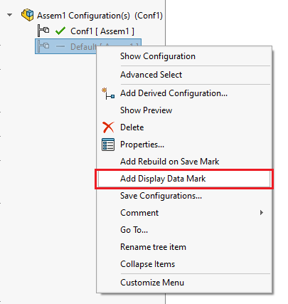

This VBA macro is useful for the users working with assemblies in the Large Design Review mode or when it is required to support configurations in eDrawings.

By default only active configuration is preserved for using the the Large Design Review mode and other configurations of the assembly cannot be activated:

This macro will traverse all components of the root assembly and find all the used configurations and add the display mark data to all of them.

This will allow to open all sub components in the Large Design Review mode and activate used configurations.

~~~ vb
Dim swApp As SldWorks.SldWorks

Sub main()

    Set swApp = Application.SldWorks
            
    Dim swAssy As SldWorks.AssemblyDoc
    Set swAssy = swApp.ActiveDoc
    
    If Not swAssy Is Nothing Then
    
        Dim vComps As Variant
        vComps = CollectSelectedComponents(swAssy)
        
        If IsEmpty(vComps) Then
            vComps = swAssy.GetComponents(False)
        End If
        
        Dim files As Object
        Set files = CollectFilesNeedDisplayMarks(vComps, swAssy.GetPathName)
        
        For Each filePath In files.Keys
            Dim vConfNames As Variant
            vConfNames = files.item(filePath)
            AddDisplayMarks CStr(filePath), vConfNames
        Next
    
    Else
        Err.Raise vbError, "", "Open assembly"
    End If
    
End Sub

Function CollectSelectedComponents(model As SldWorks.ModelDoc2) As Variant
    
    Dim i As Integer
    
    Dim swSelMgr As SldWorks.SelectionMgr
    Set swSelMgr = model.SelectionManager
    
    Dim swComps() As SldWorks.Component2
    Dim isInit As Boolean
    
    For i = 1 To swSelMgr.GetSelectedObjectCount2(-1)
        
        If swSelMgr.GetSelectedObjectType3(i, -1) = swSelectType_e.swSelCOMPONENTS Then
            
            Dim swComp As SldWorks.Component2
            Set swComp = swSelMgr.GetSelectedObject6(i, -1)
            
            If Not isInit Then
                isInit = True
                ReDim swComps(0)
            Else
                ReDim Preserve swComps(UBound(swComps) + 1)
            End If
            
            Set swComps(UBound(swComps)) = swComp
            
        End If
    Next
    
    If isInit Then
        CollectSelectedComponents = swComps
    Else
        CollectSelectedComponents = Empty
    End If
    
End Function

Function CollectFilesNeedDisplayMarks(comps As Variant, rootDocPath As String) As Object
    
    Dim files As Object
    Set files = CreateObject("Scripting.Dictionary")
    
    Dim i As Integer
    
    For i = 0 To UBound(comps)
        
        Dim swComp As SldWorks.Component2
        Set swComp = comps(i)
        
        Dim filePath As String
        filePath = ResolveReferencePath(rootDocPath, swComp.GetPathName())
        
        If Dir(filePath) <> "" Then
        
            Dim refConfName As String
            refConfName = swComp.ReferencedConfiguration
            
            Dim activeConfName As String
            activeConfName = swApp.GetActiveConfigurationName(swComp.GetPathName())
            
            Dim confNames() As String
            
            If LCase(refConfName) <> LCase(activeConfName) Then
                If files.Exists(LCase(filePath)) Then
                    confNames = files(LCase(filePath))
                    If Not Contains(confNames, refConfName) Then
                        ReDim Preserve confNames(UBound(confNames) + 1)
                        confNames(UBound(confNames)) = refConfName
                        files(LCase(filePath)) = confNames
                    End If
                Else
                    ReDim confNames(0)
                    confNames(0) = refConfName
                    files.Add LCase(filePath), confNames
                End If
            End If
        Else
            Debug.Print "Failed to resolve component " & swComp.Name2 & " path: " & filePath
        End If
        
    Next
    
    Set CollectFilesNeedDisplayMarks = files
    
End Function

Function Contains(arr() As String, item As String) As Boolean
    
    Dim i As Integer
    
    For i = 0 To UBound(arr)
        If LCase(arr(i)) = LCase(item) Then
            Contains = True
            Exit Function
        End If
    Next
    
    Contains = False
    
End Function

Sub AddDisplayMarks(filePath As String, confNames As Variant)
    
    Debug.Print "Adding display mark for " & filePath
    
    Dim swModel As SldWorks.ModelDoc2
    Dim swDocSpec As SldWorks.DocumentSpecification
    
    Set swDocSpec = swApp.GetOpenDocSpec(filePath)
    
    swDocSpec.LightWeight = False
    swDocSpec.ViewOnly = False
    swDocSpec.Silent = True
    
    Set swModel = swApp.OpenDoc7(swDocSpec)
    
    If Not swModel Is Nothing Then
    
        Set swModel = swApp.ActivateDoc3(swModel.GetTitle(), False, swRebuildOnActivation_e.swDontRebuildActiveDoc, -1)
        
        If Not swModel Is Nothing Then
        
            Dim i As Integer
            
            For i = 0 To UBound(confNames)
                Dim swConf As SldWorks.Configuration
                Set swConf = swModel.GetConfigurationByName(CStr(confNames(i)))
                swConf.LargeDesignReviewMark = True
            Next
            
            swModel.ForceRebuild3 False
            
            swModel.Save3 swSaveAsOptions_e.swSaveAsOptions_Silent, 0, 0
            
            swApp.CloseDoc swModel.GetTitle
        
        Else
            Debug.Print "Failed to activate document: " & filePath
        End If
        
    Else
        Debug.Print "Failed to open document: " & filePath
    End If

End Sub

Function ResolveReferencePath(rootDocPath As String, refPath As String) As String
    
    Dim pathParts As Variant
    pathParts = Split(refPath, "\")
    
    Dim rootFolder As String
    rootFolder = rootDocPath
    rootFolder = Left(rootFolder, InStrRev(rootFolder, "\") - 1)

    Dim i As Integer
    
    Dim curRelPath As String
    
    For i = UBound(pathParts) To 1 Step -1
        
        curRelPath = pathParts(i) & IIf(curRelPath <> "", "\", "") & curRelPath
        Dim path As String
        path = rootFolder & "\" & curRelPath
        
        If Dir(path) <> "" Then
            ResolveReferencePath = path
            Exit Function
        End If
        
    Next
    
    ResolveReferencePath = refPath
    
End Function
~~~

Alternative version of the macro will only process configurations of the active part or assembly and add the Display Data marks

~~~ vb
Dim swApp As SldWorks.SldWorks

Sub main()

    Set swApp = Application.SldWorks
    
    Dim swModel As SldWorks.ModelDoc2
    
    Set swModel = swApp.ActiveDoc
    
    If Not swModel Is Nothing Then
            
        If swModel.GetType() = swDocumentTypes_e.swDocASSEMBLY Or swModel.GetType() = swDocumentTypes_e.swDocPART Then
            
            Dim vConfNames As Variant
            vConfNames = swModel.GetConfigurationNames
            
            Dim i As Integer
            
            For i = 0 To UBound(vConfNames)
                Dim swConf As SldWorks.Configuration
                Set swConf = swModel.GetConfigurationByName(CStr(vConfNames(i)))
                swConf.LargeDesignReviewMark = True
            Next
            
            swModel.ForceRebuild3 False
            
        Else
            Err.Raise vbError, "", "Only assemblies and parts are supported"
        End If
        
    Else
        Err.Raise vbError, "", "No files opened"
    End If
    
End Sub
~~~

