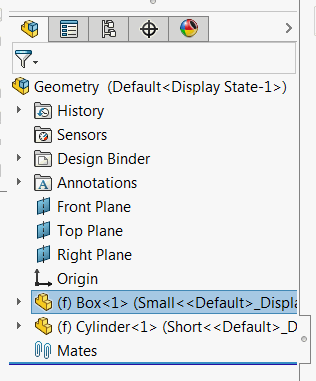

 使用SOLIDWORKS API将选定组件的路径复制到剪贴板的宏
image: copy-component-path.png
labels: [路径, 剪贴板, 组件]
group: 组件
---
{ width=250 }

此宏使用SOLIDWORKS API将选定组件的完整路径复制到剪贴板。

* 组件可以在装配或绘图文档中选择
* 组件可以在特征树或图形区域中选择
    * 还可以选择组件实体（例如面或边）以获取组件的路径

~~~ vb
Dim swApp As SldWorks.SldWorks
Dim swModel As SldWorks.ModelDoc2

Sub main()

    Set swApp = Application.SldWorks
    
    Set swModel = swApp.ActiveDoc
    
    If Not swModel Is Nothing Then
        
        Dim swSelMgr As SldWorks.SelectionMgr
        Set swSelMgr = swModel.SelectionManager
        
        Dim swComp As SldWorks.Component2
        
        If TypeOf swModel Is SldWorks.AssemblyDoc Then
            
            Set swComp = swSelMgr.GetSelectedObjectsComponent4(1, -1)
            
        ElseIf TypeOf swModel Is SldWorks.DrawingDoc Then
            
            Dim swDrawComp As SldWorks.DrawingComponent
            Set swDrawComp = swSelMgr.GetSelectedObjectsComponent4(1, -1)
            
            If swDrawComp Is Nothing Then
                '对于在图形视图中选择的实体-第一个选择是视图本身
                Set swDrawComp = swSelMgr.GetSelectedObjectsComponent4(2, -1)
            End If
            
            If Not swDrawComp Is Nothing Then
                Set swComp = swDrawComp.Component
            End If
            
        Else
            MsgBox "仅支持零件和绘图"
            End
        End If
        
        If Not swComp Is Nothing Then
            
            Dim path As String
            path = swComp.GetPathName
            Debug.Print path
            SetTextToClipboard path
            
        Else
            MsgBox "请选择组件"
        End If
        
    Else
        MsgBox "请打开文档"
    End If
    
End Sub

Sub SetTextToClipboard(text As String)
    
    Dim dataObject As Object
    Set dataObject = CreateObject("new:{1C3B4210-F441-11CE-B9EA-00AA006B1A69}")
    dataObject.SetText text
    dataObject.PutInClipboard
    Set dataObject = Nothing
    
End Sub
~~~