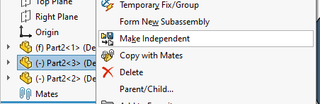

这个VBA宏模仿了SOLIDWORKS的**使独立**功能，但还会额外复制并重命名与复制的零件或装配组件相关联的文件。

这个宏可以处理单个组件或多个选定的组件，但所有的组件必须对应于同一个文件。

宏将复制与目标文件同名的关联图纸，并将其放置在目标文件旁边。

## 注意事项

* 宏只会复制与源文件同名且位于相同文件夹中的图纸
* 如果目标图纸文件已经存在，宏不会覆盖它

~~~ vb
Private Declare PtrSafe Function GetSaveFileName Lib "comdlg32.dll" Alias "GetSaveFileNameA" (pOpenfilename As OPENFILENAME) As Boolean

Private Type OPENFILENAME
  lStructSize As Long
  hwndOwner As LongPtr
  hInstance As LongPtr
  lpstrFilter As String
  lpstrCustomFilter As String
  nMaxCustFilter As Long
  nFilterIndex As Long
  lpstrFile As String
  nMaxFile As Long
  lpstrFileTitle As String
  nMaxFileTitle As Long
  lpstrInitialDir As String
  lpstrTitle As String
  Flags As LongPtr
  nFileOffset As Integer
  nFileExtension As Integer
  lpstrDefExt As String
  lCustData As Long
  lpfnHook As Long
  lpTemplateName As String
End Type

Dim swApp As SldWorks.SldWorks

Sub main()

    Set swApp = Application.SldWorks
    
try_:
    On Error GoTo catch_
    
    Dim swModel As SldWorks.ModelDoc2
    
    Set swModel = swApp.ActiveDoc
    
    If Not swModel Is Nothing Then
    
        If swModel.GetType() = swDocumentTypes_e.swDocASSEMBLY Then
            Dim swAssy As SldWorks.AssemblyDoc
            
            Set swAssy = swModel
            
            Dim vComps As Variant
            vComps = GetSelectedComponents(swModel.SelectionManager)
            
            If Not IsEmpty(vComps) Then
            
                Dim i As Integer
                Dim path As String
                path = vComps(0).GetPathName()
                
                For i = 1 To UBound(vComps)
                    If LCase(vComps(i).GetPathName()) <> LCase(path) Then
                        Err.Raise vbError, "", "只支持相同的组件"
                    End If
                Next
                
                Dim ext As String
                ext = Right(path, Len(path) - InStrRev(path, ".") + 1)
                
                Dim filter As String
                Dim fileType As String
                
                If LCase(ext) = ".sldprt" Then
                    fileType = "SOLIDWORKS零件"
                ElseIf LCase(ext) = ".sldasm" Then
                    fileType = "SOLIDWORKS装配"
                Else
                    Err.Raise vbError, "", "未知错误"
                End If
                
                filter = fileType & " (*" & ext & ")|*" & ext & "|所有文件 (*.*)|*.*"
                
                Dim replaceFilePath As String
                replaceFilePath = BrowseForFileSave("选择替换文件路径", filter, path)
                
                If replaceFilePath <> "" Then
                    If False = swAssy.MakeIndependent(replaceFilePath) Then
                        Err.Raise vbError, "", "无法使组件独立"
                    End If
                    
                    MakeDrawingIndependent path, replaceFilePath
                    
                End If
            Else
                Err.Raise vbError, "", "请选择组件"
            End If
            
        Else
            Err.Raise vbError, "", "只支持装配文档"
        End If
        
    Else
        Err.Raise vbError, "", "未找到模型"
    End If
    
    GoTo finally_
    
catch_:
    MsgBox Err.Description, vbCritical
finally_:
    
End Sub

Sub MakeDrawingIndependent(srcFilePath As String, destFilePath As String)
        
    Dim srcDrwFilePath As String
    srcDrwFilePath = Left(srcFilePath, InStrRev(srcFilePath, ".") - 1) & ".slddrw"
    
    Dim destDrwFilePath As String
    destDrwFilePath = Left(destFilePath, InStrRev(destFilePath, ".") - 1) & ".slddrw"

    Dim fso As Object
    Set fso = CreateObject("Scripting.FileSystemObject")

    If fso.FileExists(srcDrwFilePath) Then
        
        If fso.FileExists(destDrwFilePath) Then
            Err.Raise vbError, "", "目标图纸已经存在"
        End If
        
        fso.CopyFile srcDrwFilePath, destDrwFilePath, False
        
        Dim destDrwFilePathAttr As VbFileAttribute
        destDrwFilePathAttr = GetAttr(destDrwFilePath)
        
        If destDrwFilePathAttr And vbReadOnly Then
            Debug.Print "从目标图纸中移除只读标志: " & destDrwFilePath
            SetAttr destDrwFilePath, destDrwFilePathAttr Xor vbReadOnly
        End If
        
        If False = swApp.ReplaceReferencedDocument(destDrwFilePath, srcFilePath, destFilePath) Then
            Err.Raise vbError, "", "替换引用的图纸文档失败"
        End If
                
    End If
    
End Sub

Function GetSelectedComponents(selMgr As SldWorks.SelectionMgr) As Variant

    Dim isInit As Boolean
    isInit = False
    
    Dim swComps() As SldWorks.Component2

    Dim i As Integer
    
    For i = 1 To selMgr.GetSelectedObjectCount2(-1)
                
        Dim swComp As SldWorks.Component2
    
        Set swComp = selMgr.GetSelectedObjectsComponent4(i, -1)
        
        If Not swComp Is Nothing Then
            
            If Not isInit Then
                ReDim swComps(0)
                Set swComps(0) = swComp
                isInit = True
            Else
                If Not Contains(swComps, swComp) Then
                    ReDim Preserve swComps(UBound(swComps) + 1)
                    Set swComps(UBound(swComps)) = swComp
                End If
            End If
                        
        End If
    
    Next

    If isInit Then
        GetSelectedComponents = swComps
    Else
        GetSelectedComponents = Empty
    End If

End Function

Function BrowseForFileSave(title As String, filters As String, initFilePath As String) As String
    
    Dim ofn As OPENFILENAME
    Const FILE_PATH_BUFFER_SIZE As Integer = 260
    
    Dim initFileName As String
    initFileName = Right(initFilePath, Len(initFilePath) - InStrRev(initFilePath, "\"))
    
    ofn.lpstrFilter = Replace(filters, "|", Chr(0)) & Chr(0)
    ofn.lpstrTitle = title
    ofn.nMaxFile = FILE_PATH_BUFFER_SIZE
    ofn.nMaxFileTitle = FILE_PATH_BUFFER_SIZE
    ofn.lpstrInitialDir = Left(initFilePath, InStrRev(initFilePath, "\") - 1)
    ofn.lpstrFile = initFileName & String(FILE_PATH_BUFFER_SIZE - Len(initFileName), Chr(0))
    ofn.lStructSize = LenB(ofn)
    
    Dim res As Boolean
    
    res = GetSaveFileName(ofn)

    If res Then
        
        Dim filePath As String
        filePath = Left(ofn.lpstrFile, InStr(ofn.lpstrFile, vbNullChar) - 1)
        
        Dim vFilters As Variant
        vFilters = Split(filters, "|")
        Dim ext As String
        ext = vFilters((ofn.nFilterIndex - 1) * 2 + 1)
        ext = Right(ext, Len(ext) - InStrRev(ext, ".") + 1)
        
        If LCase(Right(filePath, Len(ext))) <> LCase(ext) Then
            filePath = filePath & ext
        End If
        
        BrowseForFileSave = filePath
        
    Else
        BrowseForFileSave = ""
    End If
    
End Function

Function Contains(vArr As Variant, item As Object) As Boolean
    
    Dim i As Integer
    
    For i = 0 To UBound(vArr)
        If vArr(i) Is item Then
            Contains = True
            Exit Function
        End If
    Next
    
    Contains = False
    
End Function
~~~