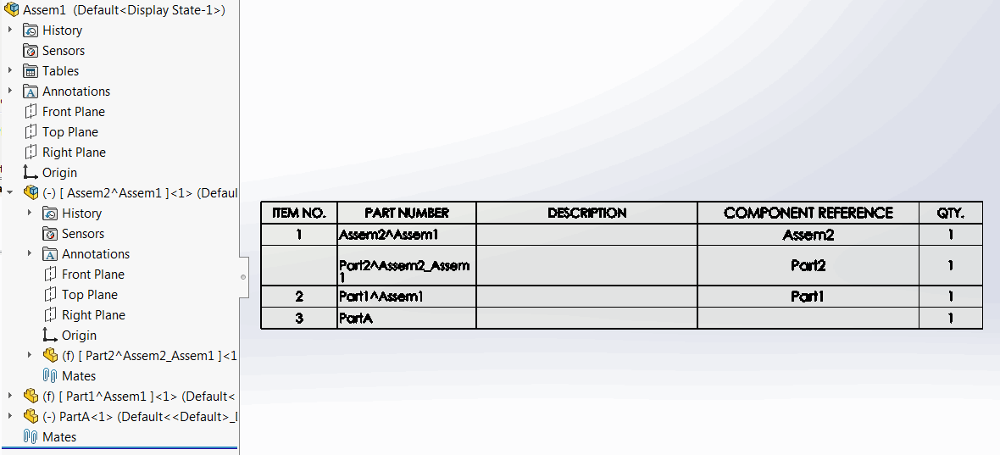

 使用SOLIDWORKS API将活动装配中的组件名称复制到组件引用的VBA宏，可以过滤虚拟组件
image: component-reference.png
labels: [名称,虚拟,组件引用]
group: 装配
---
{ width=350 }

这个VBA宏允许使用SOLIDWORKS API将活动装配中的组件名称复制到组件引用。

通过将*VIRTUAL_ONLY*选项设置为*True*，该宏可以只处理虚拟组件。

~~~ vb
Const VIRTUAL_ONLY As Boolean = True
~~~

如果组件名称用于存储项目属性（例如零件编号），则此宏可能很有用，因为组件名称无法添加到物料清单，而组件引用可以。

{ width=350 }

~~~ vb
Const VIRTUAL_ONLY As Boolean = False

Dim swApp As SldWorks.SldWorks

Sub main()
    
    Set swApp = Application.SldWorks
    
    Dim swModel As SldWorks.ModelDoc2
    Dim swSelMgr As SldWorks.SelectionMgr

    Set swModel = swApp.ActiveDoc
    
    If Not swModel Is Nothing Then
    
        If swModel.GetType() = swDocumentTypes_e.swDocASSEMBLY Then
        
            Dim swAssy As SldWorks.AssemblyDoc
            Set swAssy = swModel
            
            Dim vComps As Variant
            vComps = swAssy.GetComponents(False)
            
            Dim i As Integer
            
            For i = 0 To UBound(vComps)
                
                Dim swComp As SldWorks.Component2
                Set swComp = vComps(i)
                
                If swComp.IsVirtual Or Not VIRTUAL_ONLY Then
                
                    Dim compName As String
                    
                    compName = swComp.Name2
                    
                    If Not swComp.GetParent() Is Nothing Then
                        '如果不是根组件，则删除子装配的名称
                        compName = Right(compName, Len(compName) - InStrRev(compName, "/"))
                    End If
                    
                    If swComp.IsVirtual() Then
                        '如果是虚拟组件，则删除上下文装配的名称
                        compName = Left(compName, InStr(compName, "^") - 1)
                    Else
                        '删除索引名称
                        compName = Left(compName, InStrRev(compName, "-") - 1)
                    End If
                    
                    swComp.ComponentReference = compName
                
                End If
                
            Next

        Else
            MsgBox "活动文档不是装配"
        End If
    
    Else
        MsgBox "请打开装配文档"
    End If
    
End Sub
~~~