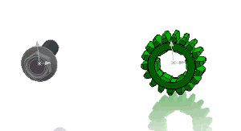

 该示例演示了如何使用SOLIDWORKS API中的演示变换来运行组件绕轴的平滑旋转动画。
image: component-rotation.gif
labels: [assembly, transform, rotation, animation]
---

此宏演示了如何使用演示变换通过[SOLIDWORKS API](https://help.solidworks.com/2012/english/api/sldworksapi/solidworks.interop.sldworks~solidworks.interop.sldworks.icomponent2~presentationtransform.html)方法在组件的Y轴周围运行平滑的旋转动画。

这样可以只移动组件以实现视觉效果，而不改变几何形状。组件将被移动，无论它在空间中是否完全定义（通过配合或固定约束）。并且配合关系仍然保留。

* 选择装配中的任何组件并运行宏
* 组件围绕其Y轴旋转
* 要停止动画，请清除选择（取消选择所有对象）
* 要修改旋转速度，请更改*RunRotationAnimation*方法的可选参数*speed*

~~~ vb
If Not swComp Is Nothing Then
    RunRotationAnimation swModel, swComp, 2 '速度x2
Else
    MsgBox "请选择组件"
End If
~~~

### 注意

为了启用演示模式，需要将[IAssemblyDoc::EnablePresentation](https://help.solidworks.com/2012/english/api/sldworksapi/SOLIDWORKS.Interop.sldworks~SOLIDWORKS.Interop.sldworks.IAssemblyDoc~EnablePresentation.html)属性设置为True。

在动画完成后，需要将此属性设置为False，否则所有SOLIDWORKS菜单都将被锁定：

{ width=300 }

~~~ vb
Const PI As Double = 3.14159265359

Dim swApp As SldWorks.SldWorks

Sub main()

    Set swApp = Application.SldWorks
    
    Dim swModel As SldWorks.ModelDoc2
    
    Set swModel = swApp.ActiveDoc
    
    If Not swModel Is Nothing Then
    
        Dim swSelMgr As SldWorks.SelectionMgr
        
        Set swSelMgr = swModel.SelectionManager
        
        Dim swComp As SldWorks.Component2
        Set swComp = swSelMgr.GetSelectedObjectsComponent4(1, -1)
        
        If Not swComp Is Nothing Then
            RunRotationAnimation swModel, swComp
        Else
            MsgBox "请选择组件"
        End If
        
    Else
        MsgBox "请打开装配"
    End If
    
End Sub

Sub RunRotationAnimation(assy As SldWorks.AssemblyDoc, comp As SldWorks.Component2, Optional speed As Double = 1)
    
    Dim swSelMgr As SldWorks.SelectionMgr
        
    Set swSelMgr = assy.SelectionManager
        
    Dim rotStep As Double
    rotStep = PI * 2 / 360 * speed
    
    Dim curAng As Double
    
    Dim swModelView As SldWorks.ModelView
    Set swModelView = assy.ActiveView
            
    assy.EnablePresentation = True
    
    While swSelMgr.GetSelectedObjectCount2(-1) <> 0
        For curAng = 0 To PI * 2 Step rotStep
            Dim animStep As MathTransform
            Set animStep = GetTransform(comp, curAng)
            comp.PresentationTransform = animStep
            swModelView.GraphicsRedraw Nothing
            DoEvents
        Next
    Wend
    
    assy.EnablePresentation = False
    
End Sub

Function GetTransform(comp As SldWorks.Component2, angle As Double) As MathTransform
    
    Dim swMathUtils As SldWorks.MathUtility
    
    Set swMathUtils = swApp.GetMathUtility
    
    Dim swOrigPt As SldWorks.MathPoint
    Dim dPt(2) As Double
    dPt(0) = 0: dPt(1) = 0: dPt(2) = 0
    
    Set swOrigPt = swMathUtils.CreatePoint(dPt)
    
    Set swOrigPt = swOrigPt.MultiplyTransform(comp.Transform2)
    
    Dim swAxisVec As SldWorks.MathVector
    Dim dVec(2) As Double
    dVec(0) = 0: dVec(1) = 1: dVec(2) = 0
    
    Set swAxisVec = swMathUtils.CreateVector(dVec)
    
    Set swAxisVec = swAxisVec.MultiplyTransform(comp.Transform2)
    
    Set GetTransform = swMathUtils.CreateTransformRotateAxis(swOrigPt, swAxisVec, angle)
    
End Function
~~~