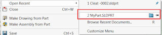

This macro demonstrates how to open the folder of the selected component in the assembly in the Windows File Explorer using SOLIDWORKS API.

The component's file will be preselected in the opened window.

This macro will produce similar results to the following manual steps:

1. Open component in its own window
1. Go to File Menu
1. Select the file from the Open Recent
1. Select "Show In Folder" option

{ width=320 height=69 }

If none of the components selected then the path of active model will be opened.

Watch [video demonstration](https://youtu.be/9uZCecGg25I?t=266)

~~~ vb
Dim swApp As SldWorks.SldWorks
Dim swModel As SldWorks.ModelDoc2
Dim swSelMgr As SldWorks.SelectionMgr
Dim swComp As SldWorks.Component2

Sub main()

    On Error Resume Next
    
    Set swApp = Application.SldWorks
    
    Set swModel = swApp.ActiveDoc
    
    If Not swModel Is Nothing Then
    
        Set swSelMgr = swModel.SelectionManager
        
        Set swComp = swSelMgr.GetSelectedObjectsComponent3(1, -1)

        Dim path As String
        
        If Not swComp Is Nothing Then
            path = swComp.GetPathName
        Else
            path = swModel.GetPathName
        End If
        
        If path <> "" Then
            Shell "explorer.exe /select, " & """" & path & """"
        Else
            MsgBox "Model is not saved"
        End If
    
    Else
        MsgBox "Please open assembly document and select the component"
    End If
    
End Sub

~~~

