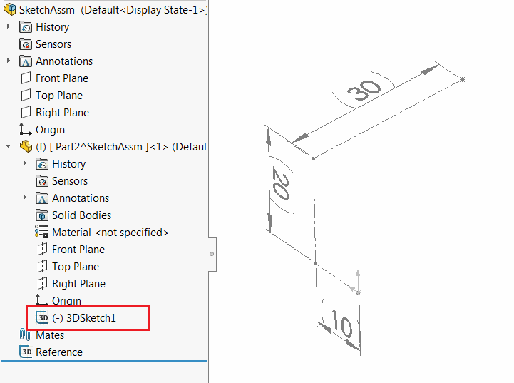
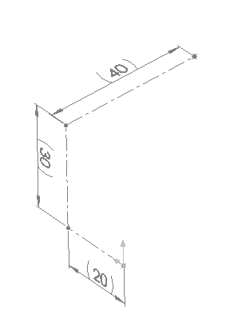
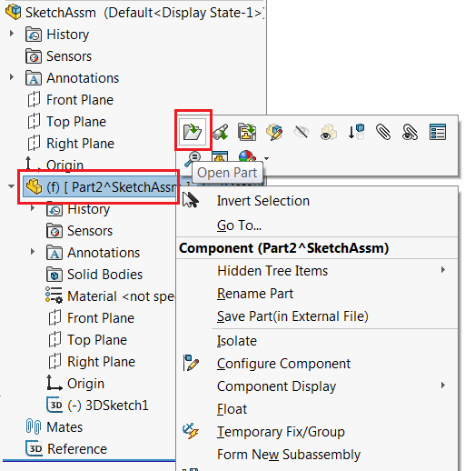
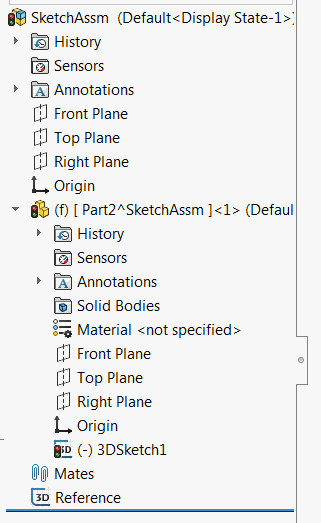

{ width=450 }

在3D模型（零件和装配体）中，所有SOLIDWORKS实体都可以以两种不同的上下文呈现：

* 模型上下文 - 实体在其中创建的上下文。例如，在零件文档中创建的特征，在零件中添加的尺寸。由突出特征生成的实体的面
* 装配上下文 - 实例化模型（及其所有实体）的上下文。例如，同一零件可以添加两次到装配体中，因此该零件的元素在装配体中具有两个不同的指针集，这些指针对应于相应的组件。

在使用SOLIDWORKS API处理元素时，使用正确的上下文非常重要。当执行装配上下文编辑时，必须在装配上下文中提供所有指针。

## 在装配体上下文中向零件添加特征

在编辑或添加特征树中的新特征时，始终需要使用指向活动装配体文档的指针（[ISldWorks::ActiveDoc](https://help.solidworks.com/2012/english/api/sldworksapi/solidworks.interop.sldworks~solidworks.interop.sldworks.isldworks~activedoc.html)），即使组件处于编辑状态。

例如，要将上述图像中正在上下文中编辑的零件文档中的挤压特征插入到零件中，必须在活动装配体上调用[IFeatureManager::FeatureExtrusion2](https://help.solidworks.com/2012/english/api/sldworksapi/SolidWorks.Interop.sldworks~SolidWorks.Interop.sldworks.IFeatureManager~FeatureExtrusion2.html)，而不是正在编辑的组件的模型。

~~~ vb
Dim swApp As SldWorks.SldWorks

Sub main()

    Set swApp = Application.SldWorks

    Dim swAssy As SldWorks.AssemblyDoc
    
    Set swAssy = swApp.ActiveDoc
    
    If Not swAssy Is Nothing Then
        
        Dim swComp As SldWorks.Component2
        
        swAssy.InsertNewVirtualPart Nothing, swComp
        
        swComp.Select4 False, Nothing, False
        
        swAssy.EditPart
        
        Debug.Assert swComp.GetModelDoc2() Is swAssy.GetEditTarget() '当前编辑模型等于组件的模型
        Debug.Assert Not swComp.GetModelDoc2() Is swAssy '组件的模型不等于装配体模型
        
        Dim swRefPlaneFeat As SldWorks.Feature
        Set swRefPlaneFeat = FindStandardPlane(swComp)
        
        Dim swSketchFeat As SldWorks.Feature
        
        '通过主装配模型在当前编辑模型的上下文中创建圆
        Set swSketchFeat = CreateCircle(swRefPlaneFeat, swAssy)
        
        '通过主装配模型在当前编辑模型的上下文中创建挤压
        CreateExtrude swSketchFeat, swAssy
        
        swAssy.EditAssembly
        swAssy.EditRebuild
        
    Else
        MsgBox "请打开装配体"
    End If

End Sub

Function FindStandardPlane(comp As SldWorks.Component2) As SldWorks.Feature
    
    Dim swCompModel As SldWorks.ModelDoc2
    Set swCompModel = comp.GetModelDoc2
    
    Dim i As Integer
    i = 1
    Dim swRefPlaneFeat As SldWorks.Feature
    
    Do
        Set swRefPlaneFeat = swCompModel.FeatureByPositionReverse(i)
        i = i + 1
    Loop While swRefPlaneFeat.GetTypeName2() <> "RefPlane"
    
    '将特征的指针转换为装配上下文，以便可以在装配体中选择它
    Set FindStandardPlane = comp.GetCorresponding(swRefPlaneFeat)
    
End Function

Function CreateCircle(plane As SldWorks.Feature, model As SldWorks.ModelDoc2) As SldWorks.Feature
    
    plane.Select2 False, -1
    
    model.SketchManager.InsertSketch True
    model.SketchManager.AddToDB = True
    
    Set CreateCircle = model.SketchManager.ActiveSketch
    
    model.ClearSelection2 True
    model.SketchManager.CreateCircleByRadius 0, 0, 0, 0.01
    model.SketchManager.AddToDB = False
    
    model.ClearSelection2 True
    model.SketchManager.InsertSketch True
    
End Function

Sub CreateExtrude(sketch As SldWorks.Feature, model As SldWorks.ModelDoc2)
    
    sketch.Select2 False, 0
    
    model.FeatureManager.FeatureExtrusion2 True, False, False, 0, 0, 0.01, 0.01, False, False, False, False, 0, 0, False, False, False, False, True, True, True, 0, 0, False
    model.ClearSelection2 True
    
End Sub
~~~

## 转换指针

SOLIDWORKS API提供了在上下文之间转换指针的方法：

* [IModelDocExtension::GetCorresponding](https://help.solidworks.com/2012/english/api/sldworksapi/solidworks.interop.sldworks~solidworks.interop.sldworks.imodeldocextension~getcorresponding.html)将指针从装配上下文转换为底层组件的模型上下文
* [IComponent2::GetCorresponding](https://help.solidworks.com/2012/english/api/sldworksapi/solidworks.interop.sldworks~solidworks.interop.sldworks.icomponent2~getcorresponding.html)将指针从底层模型上下文转换为该组件的装配上下文。

## 在装配上下文中的模型操作

{ width=350 }

以下测试案例将演示在装配上下文中使用上下文的不同方法和结果。[下载示例装配体](SketchAssm.SLDASM)。该装配体由一个虚拟组件（也可以是外部组件）组成。其中有一个3D草图（*3DSketch1*），其中包含组件模型中的一个点。为了简单起见，还添加了一个名为*Reference*的草图，用于显示当前点的坐标。

以下案例的目的是将3D草图中的点在装配体中沿XYZ方向移动10毫米。

### 测试案例1：通过直接从装配上下文获取指针进行移动

当打开装配体时，从组件中检索或转换的任何对象的指针将具有活动装配上下文。

例如：

* 从组件中选择的对象（例如面或特征）的[ISelectionMgr::GetSelectedObject6](https://help.solidworks.com/2012/english/api/sldworksapi/solidworks.interop.sldworks~solidworks.interop.sldworks.iselectionmgr~getselectedobject6.html)在当前装配中有效
* [IComponent2::FirstFeature](https://help.solidworks.com/2012/english/api/sldworksapi/solidworks.interop.sldworks~solidworks.interop.sldworks.icomponent2~firstfeature.html)返回组件模型中第一个特征的指针，该指针在装配上下文中有效。

在这些指针中，可以在该装配上下文中安全地使用。例如，可以更改面的颜色，重命名特征，修改点的坐标。

* 打开下载的示例装配体
* 在树中选择*3DSketch1*特征
* 运行以下宏

~~~ vb
Dim swApp As SldWorks.SldWorks

Sub main()

    Set swApp = Application.SldWorks
    
    Dim swAssy As SldWorks.AssemblyDoc
    
    Set swAssy = swApp.ActiveDoc
    
    If Not swAssy Is Nothing Then
    
        Dim swFeat As SldWorks.Feature
        Set swFeat = swAssy.SelectionManager.GetSelectedObject6(1, -1)
        
        MoveSketchPoints swFeat, swAssy
    
        '退出上下文模型的编辑
        swAssy.ClearSelection2 True
        swAssy.EditAssembly
        
    Else
        MsgBox "请打开装配体文档"
    End If
    
End Sub

Sub MoveSketchPoints(sketchFeat As SldWorks.Feature, editModel As SldWorks.ModelDoc2)
    
    Dim swSketch As SldWorks.Sketch
    Set swSketch = sketchFeat.GetSpecificFeature2
    
    Debug.Print "选择的草图特征: " & sketchFeat.Select2(False, -1)
    
    editModel.SketchManager.Insert3DSketch True
    
    Dim vSkPts As Variant
    vSkPts = swSketch.GetSketchPoints2()
    
    Dim i As Integer
    
    For i = 0 To UBound(vSkPts)
        Dim swSkPt As SldWorks.SketchPoint
        Set swSkPt = vSkPts(i)
        swSkPt.X = swSkPt.X + 0.01
        swSkPt.Y = swSkPt.Y + 0.01
        swSkPt.Z = swSkPt.Z + 0.01
    Next
    
    editModel.SketchManager.Insert3DSketch True
    
End Sub
~~~

结果是，草图点在XYZ方向上移动了10毫米。

{ width=250 }

### 测试案例2：在装配上下文中访问底层模型上下文中的对象

并非总是可以直接从装配上下文中检索所需对象的指针。如果在上下文之外使用上下文对象（即检索或转换为底层组件模型的对象），可能会产生意外结果。

> 使用上下文之外的对象等效于在不可见模型上调用API。在某些情况下，这将产生正确的行为，但在某些情况下可能失败，甚至导致崩溃。

以下示例演示了使用上下文之外的指针的结果，通过通过[IModelDocExtension::GetCorresponding](https://help.solidworks.com/2012/english/api/sldworksapi/solidworks.interop.sldworks~solidworks.interop.sldworks.imodeldocextension~getcorresponding.html)将上下文从装配转换为底层文档。

按照上一个测试案例的步骤运行以下宏

~~~ vb
Dim swApp As SldWorks.SldWorks

Sub main()

    Set swApp = Application.SldWorks
    
    Dim swAssy As SldWorks.AssemblyDoc
    
    Set swAssy = swApp.ActiveDoc
    
    If Not swAssy Is Nothing Then
    
        Dim swFeat As SldWorks.Feature
        Set swFeat = swAssy.SelectionManager.GetSelectedObject6(1, -1)
        
        Dim swComp As SldWorks.Component2
        Set swComp = swFeat.GetComponent
    
        Dim swCorrFeat As SldWorks.Feature
        Dim swCompModel As SldWorks.ModelDoc2
        Set swCompModel = swComp.GetModelDoc2
        Set swCorrFeat = swCompModel.Extension.GetCorresponding(swFeat)
        
        Dim swCorrFeatByName As SldWorks.Feature
        Set swCorrFeatByName = swCompModel.FeatureByName(swFeat.Name)
        
        Debug.Print "指针是否相等: " & (swCorrFeat Is swCorrFeatByName)
        
        MoveSketchPoints swCorrFeat, swCompModel
        
    Else
        MsgBox "请打开装配体文档"
    End If
    
End Sub

Sub MoveSketchPoints(sketchFeat As SldWorks.Feature, editModel As SldWorks.ModelDoc2)
    
    Dim swSketch As SldWorks.Sketch
    Set swSketch = sketchFeat.GetSpecificFeature2
    
    Debug.Print "选择的草图特征: " & sketchFeat.Select2(False, -1)
    
    editModel.SketchManager.Insert3DSketch True
    
    Dim vSkPts As Variant
    vSkPts = swSketch.GetSketchPoints2()
    
    Dim i As Integer
    
    For i = 0 To UBound(vSkPts)
        Dim swSkPt As SldWorks.SketchPoint
        Set swSkPt = vSkPts(i)
        swSkPt.X = swSkPt.X + 0.01
        swSkPt.Y = swSkPt.Y + 0.01
        swSkPt.Z = swSkPt.Z + 0.01
    Next
    
    editModel.SketchManager.Insert3DSketch True
    
End Sub
~~~

结果是，尽管输出窗口显示成功，但草图点没有移动。

{ width=250 }

这种行为的原因是，如果模型未在其自己的窗口中打开，则无法编辑草图。

现在，打开组件在其自己的窗口中

{ width=250 }

激活装配体并重新运行宏。现在显示了稍微不同的结果。组件被标记为已修改并需要重建。如果模型重建，则草图相应更新。

{ width=200 }

### 测试案例3：转换对象的上下文

在许多情况下，初始指针在底层模型的上下文中可用。如果需要在装配上下文中进行修改，则需要通过[IComponent2::GetCorresponding](https://help.solidworks.com/2012/english/api/sldworksapi/solidworks.interop.sldworks~solidworks.interop.sldworks.icomponent2~getcorresponding.html)方法将指针转换。

* 关闭所有模型并重新打开示例装配体
* 在组件中打开零件组件的自己的窗口。

{ width=250 }

* 在活动零件文档中选择*3DSketch1*
* 运行以下宏

~~~ vb
Dim swApp As SldWorks.SldWorks

Sub main()

    Set swApp = Application.SldWorks
    
    Dim swModel As SldWorks.ModelDoc2
    
    Set swModel = swApp.ActiveDoc
    
    If Not swModel Is Nothing Then
    
        Dim swFeat As SldWorks.Feature
        Set swFeat = swModel.SelectionManager.GetSelectedObject6(1, -1)
        
        Stop '激活装配体并选择组件
        
        Dim swAssy As SldWorks.AssemblyDoc
        Set swAssy = swApp.ActiveDoc
        
        Dim swComp As SldWorks.Component2
        Set swComp = swAssy.SelectionManager.GetSelectedObjectsComponent4(1, -1)
        Dim swCompFeat As SldWorks.Feature
        Set swCompFeat = swComp.GetCorresponding(swFeat)
        
        Dim swCompFeatByName As SldWorks.Feature
        Set swCompFeatByName = swComp.FeatureByName(swFeat.Name)
        
        Debug.Print "指针是否相等: " & (swCompFeat Is swCompFeatByName)
        
        MoveSketchPoints swCompFeat, swAssy
        
    Else
        MsgBox "请打开装配体文档"
    End If
    
End Sub

Sub MoveSketchPoints(sketchFeat As SldWorks.Feature, editModel As SldWorks.ModelDoc2)
    
    Dim swSketch As SldWorks.Sketch
    Set swSketch = sketchFeat.GetSpecificFeature2
    
    Debug.Print "选择的草图特征: " & sketchFeat.Select2(False, -1)
    
    editModel.SketchManager.Insert3DSketch True
    
    Dim vSkPts As Variant
    vSkPts = swSketch.GetSketchPoints2()
    
    Dim i As Integer
    
    For i = 0 To UBound(vSkPts)
        Dim swSkPt As SldWorks.SketchPoint
        Set swSkPt = vSkPts(i)
        swSkPt.X = swSkPt.X + 0.01
        swSkPt.Y = swSkPt.Y + 0.01
        swSkPt.Z = swSkPt.Z + 0.01
    Next
    
    editModel.SketchManager.Insert3DSketch True
    
End Sub
~~~

* 宏停止执行
* 激活装配体（可以只关闭零件文档）
* 选择组件并继续执行宏

宏将转换上下文并更改坐标，以便可以在装配上下文中成功更新坐标

## 总结

* 在装配上下文中添加或编辑组件的特征时，调用[IAssemblyDoc::EditPart2](https://help.solidworks.com/2017/english/api/sldworksapi/solidworks.interop.sldworks~solidworks.interop.sldworks.iassemblydoc~editpart2.html)/[IAssemblyDoc::EditAssembly](https://help.solidworks.com/2017/english/api/sldworksapi/solidworks.interop.sldworks~solidworks.interop.sldworks.iassemblydoc~editassembly.html)来开始/结束在上下文中编辑组件。

* 在执行某些操作时（例如编辑草图点位置、删除特征等），不需要显式设置*编辑上下文*状态。行为与用户界面行为相匹配（即如果需要调用*编辑部件*命令执行某些操作，则需要调用相应的API）。

* 不要使用组件的底层模型的指针（[IComponent2::GetModelDoc2](https://help.solidworks.com/2017/english/api/sldworksapi/solidworks.interop.sldworks~solidworks.interop.sldworks.icomponent2~getmodeldoc2.html)）来执行当前编辑目标组件的操作。使用顶层文档的指针（即活动装配体）。

* 避免使用错误的上下文。这可能导致意外的行为。

* 在需要时使用::GetCorresponding函数在上下文之间转换指针。