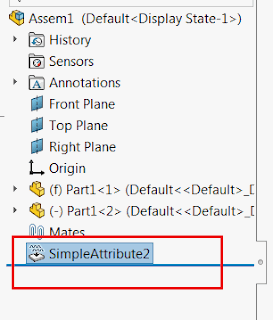

This example creates an invisible attribute and attaches to the selected object (entity or component).

Attribute ca be hidden by setting the corresponding flag in the [IAttributeDef::CreateInstance5](https://help.solidworks.com/2018/english/api/sldworksapi/solidworks.interop.sldworks~solidworks.interop.sldworks.iattributedef~createinstance5.html) SOLIDWORKS API method.

{ width=272 height=320 }

Macro stops the execution once the attribute is created. At this stage the attribute feature is invisible.
When execution of macro continues (F5 or run is clicked) the feature is set to visible.

~~~ vb
Enum CreateAtttributeOptions_e
    Visible = 0
    Hidden = 1
End Enum

Dim swApp As SldWorks.SldWorks
Dim swAttDef As SldWorks.AttributeDef
Dim swModel As SldWorks.ModelDoc2
Dim swSelMgr As SldWorks.SelectionMgr

Const ATT_DEF_NAME As String = "SimpleAttribute"

Sub main()

    Set swApp = Application.SldWorks
    
    Set swAttDef = swApp.DefineAttribute(ATT_DEF_NAME)
    
    swAttDef.Register
    
    Set swModel = swApp.ActiveDoc
    
    If Not swModel Is Nothing Then
    
        Set swSelMgr = swModel.SelectionManager
        
        Dim swAtt As SldWorks.Attribute
        Dim swSelObject As Object
        
        Set swSelObject = swSelMgr.GetSelectedObject6(1, -1)
        
        'get the unique name for the attribute
        Dim index As Integer
        index = 1
        
        Dim attName As String
        attName = ATT_DEF_NAME & index
        
        While swModel.FeatureManager.IsNameUsed(swNameType_e.swFeatureName, attName)
            attName = ATT_DEF_NAME & index
            index = index + 1
        Wend
        
        Set swAtt = swAttDef.CreateInstance5(swModel, swSelObject, attName, CreateAtttributeOptions_e.Hidden, swInConfigurationOpts_e.swAllConfiguration)
        
        'attribute feature is hidden in the tree
        Debug.Assert Not swAtt Is Nothing
        
        Dim swAttFeat As SldWorks.Feature
        Set swAttFeat = swModel.FeatureByName(swAtt.GetName())
        
        Stop
        
        'show the attribute feature
        swAttFeat.SetUIState swUIStates_e.swIsHiddenInFeatureMgr, False
        swModel.EditRebuild3
        
    Else
        MsgBox "Please open the model"
    End If
    
End Sub

~~~

