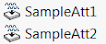

 本文介绍了使用属性（添加参数，与对象关联）的示例
image: attributes.png
labels: [跟踪, 属性, 选择, 参数]
---

属性是通过[SOLIDWORKS API方法IAttributeDef::CreateInstance5](https://help.solidworks.com/2012/english/api/sldworksapi/solidworks.interop.sldworks~solidworks.interop.sldworks.iattributedef~createinstance5.html)插入的特殊功能。虽然属性是本机功能，可以在特征管理器树中可见（可选），但无法通过常规用户界面插入或编辑（只能删除），只能通过API访问。

属性实例是从属性定义创建的。将使用属性的软件应通过[SOLIDWORKS API方法ISldWorks::DefineAttribute](https://help.solidworks.com/2012/english/api/sldworksapi/solidworks.interop.sldworks~solidworks.interop.sldworks.isldworks~defineattribute.html)定义其定义。

### 注意事项

* 属性可以与可选择对象（实体、组件、面、边、顶点、环或特征）关联
* 属性可以存储参数
* 属性可以在特征树中隐藏

有关属性使用的更多信息，请参阅**属性**部分中的示例。