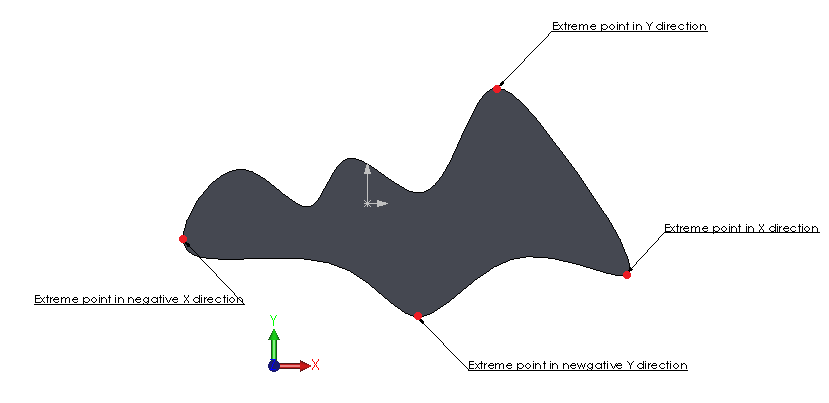
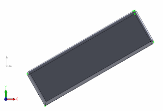

通常使用极值点来找到指定方向上最远的点。可以使用[SOLIDWORKS API的IBody2::GetExtremePoint](https://help.solidworks.com/2012/english/api/sldworksapi/solidworks.interop.sldworks~solidworks.interop.sldworks.ibody2~getextremepoint.html)函数来找到这些点。

该函数期望一个方向向量作为输入，并将该方向上的极值点的X、Y、Z坐标作为输出参数返回。

在定义方向时，不需要指定向量上的点。
通常在找到物体的边界尺寸时使用该函数，特别是当物体的方向与全局XYZ坐标不对齐时，不需要重新定位物体以找到其最佳匹配边界框。

与通过[IBody2::GetBodyBox](https://help.solidworks.com/2012/english/api/sldworksapi/solidworks.interop.sldworks~solidworks.interop.sldworks.ibody2~getbodybox.html)或任何其他边界框函数返回的边界框不同，极值点是精确的，这意味着这些数据可以用于比较和计算。

下图演示了模型在多个方向上的典型极值点。

{ width=400 }

以下代码示例将在所选物体的XYZ方向上查找极值点，并创建一个草图点。

{ width=320 height=217 }

~~~ vb
Dim swApp As SldWorks.SldWorks
Dim swModel As SldWorks.ModelDoc2
Dim swSelMgr As SldWorks.SelectionMgr

Sub main()

    Set swApp = Application.SldWorks
    
    Set swModel = swApp.ActiveDoc
    
    If Not swModel Is Nothing Then
    
        Set swSelMgr = swModel.SelectionManager
        
        If swSelMgr.GetSelectedObjectType3(1, -1) = swSelectType_e.swSelSOLIDBODIES Then
        
            Dim swBody As SldWorks.Body2
        
            Set swBody = swSelMgr.GetSelectedObject6(1, -1)
        
            swModel.ClearSelection2 True
            
            swModel.SketchManager.Insert3DSketch True
            swModel.SketchManager.AddToDB = True
            
            Dim vDirs(5) As Variant
            vDirs(0) = Array(1, 0, 0)
            vDirs(1) = Array(0, 1, 0)
            vDirs(2) = Array(0, 0, 1)
            vDirs(3) = Array(-1, 0, 0)
            vDirs(4) = Array(0, -1, 0)
            vDirs(5) = Array(0, 0, -1)
            
            Dim i As Integer
            
            For i = 0 To UBound(vDirs)
                
                Dim x As Double
                Dim y As Double
                Dim z As Double
            
                swBody.GetExtremePoint vDirs(i)(0), vDirs(i)(1), vDirs(i)(2), x, y, z
                swModel.SketchManager.CreatePoint x, y, z
                
            Next
                
            swModel.SketchManager.AddToDB = False
            swModel.SketchManager.Insert3DSketch True
        
        Else
            
            MsgBox "请选择实体物体"
            
        End If
        
    Else
        
        MsgBox "请打开零件或装配体"
        
    End If
    
End Sub

~~~