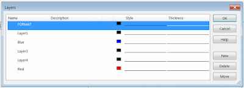

This macro will move all selected objects in the drawing sheet to specified layer using SOLIDWORKS API.

{ width=400 }

There is no common ::Layer SOLIDWORKS API property to change the layer for any entity, rather this property is added to each interface which supports it (e.g. [ISketchSegment::Layer](https://help.solidworks.com/2018/english/api/sldworksapi/solidworks.interop.sldworks~solidworks.interop.sldworks.isketchsegment~layer.html) property). This macro checks the type of the entity and calls corresponding SOLIDWORKS API property to change the layer.

~~~ vb
Dim swApp As SldWorks.SldWorks
Dim swDraw As SldWorks.DrawingDoc
Dim swSelMgr As SldWorks.SelectionMgr

Sub main()
    
    On Error Resume Next
    
    Set swApp = Application.SldWorks
    
    Set swDraw = swApp.ActiveDoc
    
    If Not swDraw Is Nothing Then
        
        Set swSelMgr = swDraw.SelectionManager
        
        If swSelMgr.GetSelectedObjectCount2(-1) > 0 Then
            
            Dim layerName As String
            layerName = InputBox("Specify the layer name to move selected objects to")
            
            Dim swAnn As SldWorks.Annotation
            
            Dim i As Integer
                        
            For i = 1 To swSelMgr.GetSelectedObjectCount2(-1)
                    
                Dim swSelObj As Object
                Set swSelObj = swSelMgr.GetSelectedObject6(i, -1)
                
                If TypeOf swSelObj Is SldWorks.SketchSegment Then
                    
                    Dim swSkSegment As SldWorks.SketchSegment
                    Set swSkSegment = swSelObj
                    swSkSegment.Layer = layerName
                
                ElseIf TypeOf swSelObj Is SldWorks.SketchPoint Then
                    
                    Dim swSkPoint As SldWorks.SketchPoint
                    Set swSkPoint = swSelObj
                    swSkPoint.Layer = layerName
                    
                ElseIf TypeOf swSelObj Is SldWorks.Note Then
                    
                    Dim swNote As SldWorks.Note
                    Set swNote = swSelObj
                    Set swAnn = swNote.GetAnnotation()
                    swAnn.Layer = layerName
                    
                ElseIf TypeOf swSelObj Is SldWorks.DisplayDimension Then
                    
                    Dim swDispDim As SldWorks.DisplayDimension
                    Set swDispDim = swSelObj
                    Set swAnn = swDispDim.GetAnnotation
                    swAnn.Layer = layerName
                    
                Else 'try to set the layer using late binding
                    swSelObj.Layer = layerName
                End If
                    
            Next
        Else
            MsgBox "Please select annotation, sketch segment or point to move to new layer"
        End If
        
    Else
        MsgBox "Please open drawing"
    End If
    
End Sub

~~~

