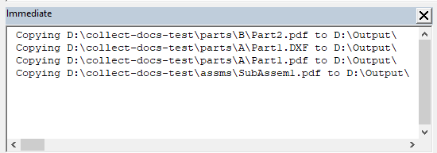

这个VBA宏允许将所有输出文件（如DXF、DWG、PDF等）从所有引用的零件和子装配体文档中，递归地复制到指定的文件夹中。

引用的零件和子装配体可以位于任何目录中。它们不需要在主装配体的相同文件夹或驱动器中。

例如，主装配体**TopAssm1.sldasm**保存在**C:\Assms**文件夹中，它引用了位于**D:\Parts\A\Part1.sldprt**和**D:\Parts\B\Part2.sldprt**的两个零件文件。为Part1和Part2创建了DXF和PDF文件，并保存在相同的文件夹中，即**D:\Parts\A\Part1.dxf**、**D:\Parts\A\Part1.pdf**、**D:\Parts\B\Part2.dxf**、**D:\Parts\B\Part2.pdf**。运行此宏后，所有这4个文件将被复制到指定的输出文件夹中。

## 注意事项

* 参考文档必须与其派生自的文件具有相同的名称，即**Part1.pdf**派生自**Part1.sldprt**
* 主装配体的参考文档也将被包括在内
* 宏将打开文件夹浏览对话框以选择输出文件夹
* 所有复制的文件路径都会输出到VBA编辑器的*Immediate*窗口中
* 被抑制的组件将不会包括在收集中
* 不支持在大型设计审查模式下打开的装配体

## 配置

可以通过更改宏开头的常量来配置宏

~~~ vb
Const SEARCH_SUB_FOLDERS As Boolean = False
Const EXTENSIONS As String = "dxf,pdf"
Const ALLOW_OVERWRITE As Boolean = False
~~~

**SEARCH_SUB_FOLDERS**指示宏是否应递归搜索引用的文档。如果将此选项设置为**False**，则只会收集源文件旁边的文件（例如，Part1.dxf必须与Part1.sldprt位于同一文件夹中）。在某些情况下，输出文件可以放置在子文件夹中（例如，Part1.sldprt的DXFs\Part1.dxf），要收集此类文件，请将**SEARCH_SUB_FOLDERS**设置为**True**。注意，如果任何子文件夹包含另一个具有相同名称的文件，它也将被收集（例如，A\B\C\Part1.pdf）。

**EXTENSIONS**是一个逗号分隔的文件扩展名列表，用于收集文件。

**ALLOW_OVERWRITE**选项指示是否需要覆盖目标目录中的文件。建议将此选项设置为**False**，并手动清理目标目录。这将减少覆盖文件和捕获潜在错误的风险。

~~~ vb
Const SEARCH_SUB_FOLDERS As Boolean = False
Const EXTENSIONS As String = "dxf,pdf"
Const ALLOW_OVERWRITE As Boolean = False

Dim swApp As SldWorks.SldWorks

Sub main()

    Set swApp = Application.SldWorks
    
try_:
    On Error GoTo catch_
    
    Dim swAssy As SldWorks.AssemblyDoc
    Set swAssy = swApp.ActiveDoc
    
    If False <> swAssy.IsOpenedViewOnly() Then
        Err.Raise vbError, "", "不支持在大型设计审查模式下打开的装配体"
    End If
    
    Dim exts As Variant
    exts = Split(EXTENSIONS, ",")
    
    Dim i As Integer
    
    For i = 0 To UBound(exts)
        exts(i) = Trim(CStr(exts(i)))
    Next
    
    Dim destDir As String
    destDir = BrowseForFolder("选择要复制文档的文件夹")
    
    If destDir = "" Then
        Exit Sub
    End If
        
    Dim vRefDocs As Variant
    vRefDocs = CollectRefDocuments(swAssy, exts, SEARCH_SUB_FOLDERS)
    
    If Not IsEmpty(vRefDocs) Then
        CopyRefDocs vRefDocs, destDir
    Else
        Err.Raise vbError, "", "没有参考文档"
    End If
    
    GoTo finally_
catch_:
    swApp.SendMsgToUser2 Err.Description, swMessageBoxIcon_e.swMbStop, swMessageBoxBtn_e.swMbOk
finally_:
    
End Sub

Sub CopyRefDocs(refDocs As Variant, destFolder As String)
    
    Dim fso As Object
    Set fso = CreateObject("Scripting.FileSystemObject")

    Dim i As Integer
    
    If Right(destFolder, 1) <> "\" Then
        destFolder = destFolder & "\"
    End If
    
    For i = 0 To UBound(refDocs)
        
        Dim srcFilePath As String
        srcFilePath = CStr(refDocs(i))
        
        Debug.Print "复制 " & srcFilePath & " 到 " & destFolder
        
        fso.CopyFile srcFilePath, destFolder, ALLOW_OVERWRITE
    Next
    
End Sub

Function CollectRefDocuments(assy As SldWorks.AssemblyDoc, exts As Variant, includeSubFolder As Boolean) As Variant
    
    Dim isInit As Boolean
    isInit = False
    
    Dim vComps As Variant
    vComps = assy.GetComponents(False)
    
    Dim refDocsPath() As String
    
    Dim i As Integer
    
    For i = -1 To UBound(vComps)
        
        Dim swComp As SldWorks.Component2
        
        If i = -1 Then
            Set swComp = assy.ConfigurationManager.ActiveConfiguration.GetRootComponent()
        Else
            Set swComp = vComps(i)
        End If
        
        If False = swComp.IsSuppressed() Then
        
            Dim path As String
            path = swComp.GetPathName()
            
            Dim dir As String
            dir = Left(path, InStrRev(path, "\"))
            
            Dim vRefFiles As Variant
            vRefFiles = GetFiles(dir, includeSubFolder, exts)
            
            Dim j As Integer
            
            Dim srcFileName As String
            srcFileName = GetFileNameWithoutExtension(path)
            
            For j = 0 To UBound(vRefFiles)
            
                Dim refFilePath As String
                refFilePath = CStr(vRefFiles(j))
                
                Dim refFileName As String
                refFileName = GetFileNameWithoutExtension(refFilePath)
                
                If LCase(srcFileName) = LCase(refFileName) Then
                
                    Dim add As Boolean
                    add = False
                    
                    If Not isInit Then
                        isInit = True
                        ReDim refDocsPath(0)
                        add = True
                    Else
                        If Not Contains(refDocsPath, refFilePath) Then
                            ReDim Preserve refDocsPath(UBound(refDocsPath) + 1)
                            add = True
                        End If
                    End If
                    
                    If add Then
                        refDocsPath(UBound(refDocsPath)) = refFilePath
                    End If
                
                End If
                
            Next
            
        End If
        
    Next
    
    If isInit Then
        CollectRefDocuments = refDocsPath
    Else
        CollectRefDocuments = Empty
    End If
    
End Function

Function GetFileNameWithoutExtension(filePath As String) As String
    GetFileNameWithoutExtension = Mid(filePath, InStrRev(filePath, "\") + 1, InStrRev(filePath, ".") - InStrRev(filePath, "\") - 1)
End Function

Function GetFiles(path As String, includeSubFolders As Boolean, exts As Variant) As Variant

    Dim paths() As String
    Dim isInit As Boolean
    
    isInit = False
    
    Dim fso As Object
    Set fso = CreateObject("Scripting.FileSystemObject")
    
    Dim folder As Object
    Set folder = fso.GetFolder(path)
    
    CollectFilesFromFolder folder, includeSubFolders, exts, paths, isInit
    
    If isInit Then
        GetFiles = paths
    Else
        GetFiles = Empty
    End If
    
End Function

Sub CollectFilesFromFolder(folder As Object, includeSubFolders As Boolean, exts As Variant, ByRef paths() As String, ByRef isInit As Boolean)
    
    For Each file In folder.files
        
        Dim fileExt As String
        fileExt = Right(file.path, Len(file.path) - InStrRev(file.path, "."))
        
        If Contains(exts, fileExt) Then
            If Not isInit Then
                ReDim paths(0)
                isInit = True
            Else
                ReDim Preserve paths(UBound(paths) + 1)
            End If
            paths(UBound(paths)) = file.path
        End If
    Next
    
    If includeSubFolders Then
        Dim subFolder As Object
        For Each subFolder In folder.SubFolders
            CollectFilesFromFolder subFolder, includeSubFolders, exts, paths, isInit
        Next
    End If
    
End Sub

Function BrowseForFolder(Optional title As String = "选择文件夹") As String
    
    Dim shellApp As Object
    
    Set shellApp = CreateObject("Shell.Application")
    
    Dim folder As Object
    Set folder = shellApp.BrowseForFolder(0, title, 0)
    
    If Not folder Is Nothing Then
        BrowseForFolder = folder.Self.path
    End If
    
End Function

Function Contains(arr As Variant, item As String) As Boolean
    
    Dim i As Integer
    
    For i = 0 To UBound(arr)
        If LCase(arr(i)) = LCase(item) Then
            Contains = True
            Exit Function
        End If
    Next
    
    Contains = False
    
End Function
~~~