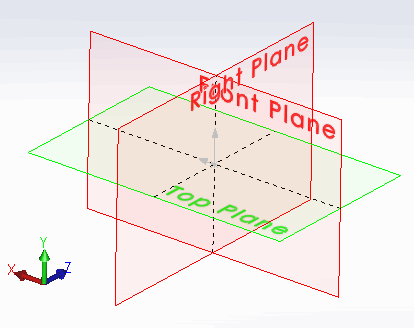

 该示例演示了如何使用SOLIDWORKS API比较零件或装配中的两个模型视图（通过方向、平移和缩放比例）
image: view-orientation.png
---
{ width=250 }

该示例演示了如何使用SOLIDWORKS API比较零件或装配中的两个模型视图。

宏将识别出变化并显示结果，如果：

* 视图相同
* 视图方向不同（即旋转）
* 视图平移不同（即移动）
* 视图缩放比例不同

宏使用用户定义的类型**ViewData**来存储视图的方向、平移和缩放比例。该结构与视图没有关联，表示视图变换的快照。

**CompareViewData**函数的结果定义为*CompareViewResult_e* [标志枚举器](/docs/codestack/visual-basic/data-structures/enumerators#flag-enumerator-multiple-options)。这允许返回视图方向的特定变化或变化的组合。

* 打开模型并启动宏。
* 一旦读取了第一个视图的数据，宏将暂停执行。
* 更改视图并继续执行宏。
* 结果将显示在消息框中。

~~~ vb
Type ViewData
    ViewScale As Double
    Orientation As SldWorks.MathTransform
    Translation As SldWorks.MathVector
End Type

Enum CompareViewResult_e
    Same = 0
    DiffOrientation = 2 ^ 0
    DiffTranslation = 2 ^ 1
    DiffScale = 2 ^ 2
End Enum

Dim swApp As SldWorks.SldWorks

Sub main()

    Set swApp = Application.SldWorks
    
    Dim swModel As SldWorks.ModelDoc2
    
    Set swModel = swApp.ActiveDoc
    
    If Not swModel Is Nothing Then
        
        Dim swView As SldWorks.ModelView
        Set swView = swModel.ActiveView
        
        If Not swView Is Nothing Then
            
            Dim origViewData As ViewData
            origViewData = GetViewData(swView)
            
            Stop '现在移动视图
            
            Dim newViewData As ViewData
            newViewData = GetViewData(swView)
            
            Dim compRes As CompareViewResult_e
            compRes = CompareViewData(origViewData, newViewData)
            
            If compRes = Same Then
                MsgBox "视图相同"
            Else
                Dim msg As String
                
                If compRes And DiffOrientation Then
                    msg = msg & vbLf & "方向"
                End If
                
                If compRes And DiffTranslation Then
                    msg = msg & vbLf & "平移"
                End If
                
                If compRes And DiffScale Then
                    msg = msg & vbLf & "缩放比例"
                End If
                
                MsgBox "视图不同。差异：" & msg
                
            End If
            
        Else
            MsgBox "请打开零件或装配"
        End If
        
    Else
        MsgBox "请打开模型"
    End If
    
End Sub

Function GetViewData(view As SldWorks.ModelView) As ViewData
    
    Dim data As ViewData
    
    Set data.Orientation = view.Orientation3
    Set data.Translation = view.Translation3
    data.ViewScale = view.Scale2
    
    GetViewData = data
    
End Function

Function CompareViewData(firstViewData As ViewData, secondViewData As ViewData) As CompareViewResult_e
    
    Dim res As CompareViewResult_e
    res = Same
    
    If Not CompareArrays(firstViewData.Orientation.ArrayData, secondViewData.Orientation.ArrayData) Then
        res = res + DiffOrientation
    End If
    
    If Not CompareArrays(firstViewData.Translation.ArrayData, secondViewData.Translation.ArrayData) Then
        res = res + DiffTranslation
    End If
    
    If firstViewData.ViewScale <> secondViewData.ViewScale Then
        res = res + DiffScale
    End If
    
    CompareViewData = res
    
End Function

Function CompareArrays(firstArr As Variant, secondArr As Variant) As Boolean
    
    If UBound(firstArr) = UBound(secondArr) Then
        
        Dim i As Integer
        
        For i = 0 To UBound(firstArr)
            If firstArr(i) <> secondArr(i) Then
                CompareArrays = False
                Exit Function
            End If
        Next
        
        CompareArrays = True
    Else
        CompareArrays = False
    End If
    
End Function
~~~