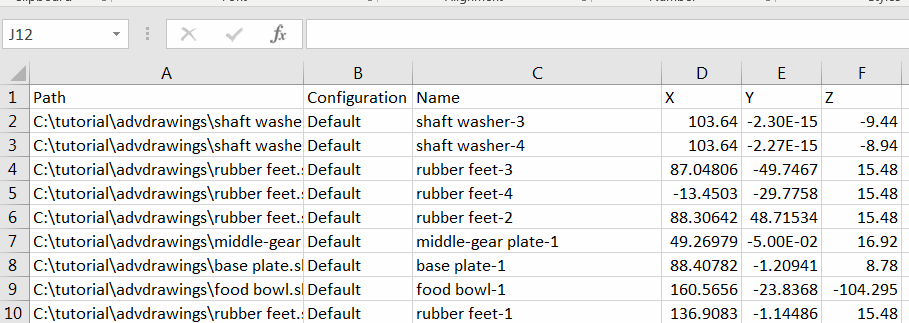

 This macro exports positions of components to an external CSV text file using SOLIDWORKS API
image: components-positions-table.png
labels: [export,csv,excel,origin]
group: Assembly
---
{ width=350 }

This macro exports the positions of components (X, Y, Z) from the active assembly to the comma separated values (CSV) file using SOLIDWORKS API. The file can be opened in Excel or any text editor.

The component position is a coordinate of the origin point (0, 0, 0) relative to the assembly origin.

Macro can export all components or only the instances of the selected component.

* Specify the path to output file via *OUT_FILE_PATH* constant

~~~ vb
Const OUT_FILE_PATH As String = "D:\locations.csv"
~~~

* Specify the conversion factor from meters for the coordinates

~~~ vb
Const CONV_FACTOR As Double = 1000 'meters to mm
~~~
* Optionally select the component to only export its instances (i.e. all of the components with the same file path and referenced configuration). Clear selection to export all components

As the result the CSV file is created which contains

* Component file full path
* Referenced configuration
* Component name
* X, Y, Z coordinate of the origin in the specified units

~~~ vb
Const OUT_FILE_PATH As String = "D:\locations.csv"
Const CONV_FACTOR As Double = 1000 'meters to mm

Dim swApp As SldWorks.SldWorks

Sub main()

    Set swApp = Application.SldWorks
    
    Dim swAssy As SldWorks.AssemblyDoc
    
    Set swAssy = swApp.ActiveDoc
    
    If Not swAssy Is Nothing Then
        
        Dim swSeedComp As SldWorks.Component2
        Set swSeedComp = swAssy.SelectionManager.GetSelectedObjectsComponent4(1, -1)
        
        Dim table As String
        table = GetComponentsPositions(swAssy, swSeedComp, CONV_FACTOR)
        WriteTextFile OUT_FILE_PATH, table
        
    Else
        MsgBox "Please open assembly"
    End If
    
End Sub

Function GetComponentsPositions(assy As SldWorks.AssemblyDoc, seedComp As SldWorks.Component2, convFactor As Double) As String
    
    Dim table As String
    table = "Path,Configuration,Name,X,Y,Z"
    
    Dim vComps As Variant
    vComps = assy.GetComponents(False)
    
    Dim i As Integer
    
    For i = 0 To UBound(vComps)
        
        Dim swComp As SldWorks.Component2
        Set swComp = vComps(i)
        
        If swComp.GetSuppression() <> swComponentSuppressionState_e.swComponentSuppressed Then
            
            Dim includeComp As Boolean
            
            If seedComp Is Nothing Then
                includeComp = True
            ElseIf LCase(seedComp.GetPathName()) = LCase(swComp.GetPathName()) And LCase(seedComp.ReferencedConfiguration) = LCase(swComp.ReferencedConfiguration) Then
                includeComp = True
            Else
                includeComp = False
            End If
            
            If includeComp Then
                Dim vOrigin As Variant
                vOrigin = GetOrigin(swComp)
                table = table & vbLf
                table = table & swComp.GetPathName() & "," & swComp.ReferencedConfiguration & "," & swComp.Name2 & "," & vOrigin(0) * convFactor & "," & vOrigin(1) * convFactor & "," & vOrigin(2) * convFactor
            End If
            
        End If
        
    Next
    
    GetComponentsPositions = table
    
End Function

Function GetOrigin(comp As SldWorks.Component2) As Variant
    
    Dim swXForm As SldWorks.MathTransform
    Set swXForm = comp.Transform2
    
    Dim swMathUtils As SldWorks.MathUtility
    Set swMathUtils = swApp.GetMathUtility
    
    Dim dPt(2) As Double
    dPt(0) = 0: dPt(1) = 0: dPt(2) = 0
    
    Dim swMathPt As SldWorks.MathPoint
    Set swMathPt = swMathUtils.CreatePoint(dPt)
    
    Set swMathPt = swMathPt.MultiplyTransform(swXForm)
    
    GetOrigin = swMathPt.ArrayData
    
End Function

Sub WriteTextFile(filePath As String, content As String)
    
    Dim fileNmb As Integer
    fileNmb = FreeFile
    
    Open filePath For Output As #fileNmb
    Print #fileNmb, content
    Close #fileNmb
    
End Sub
~~~

