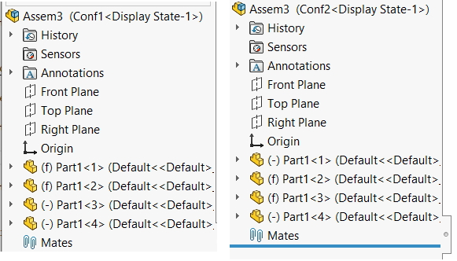

This VBA example demonstrates a simple workaround for missing SOLIDWORKS API to fix or float the component in active configuration only. [IAssemblyDoc::FixComponent](https://help.solidworks.com/2017/english/api/sldworksapi/solidworks.interop.sldworks~solidworks.interop.sldworks.iassemblydoc~fixcomponent.html) only fixes the components in all configurations.

Create an example assembly with 2 configurations and 4 instances of the component, where first 2 instances are floating in both configurations, while last 2 instances are fixed in both configuration.

As the result of running this macro components will be changed to the following result:

~~~ vb
#If VBA7 Then
     Private Declare PtrSafe Function SendMessage Lib "User32" Alias "SendMessageA" (ByVal hWnd As Long, ByVal wMsg As Long, ByVal wParam As Long, lParam As Any) As Long
#Else
     Private Declare Function SendMessage Lib "User32" Alias "SendMessageA" (ByVal hWnd As Long, ByVal wMsg As Long, ByVal wParam As Long, lParam As Any) As Long
#End If

Dim swApp As SldWorks.SldWorks

Sub main()

    Set swApp = Application.SldWorks
    
    Dim swAssy As SldWorks.AssemblyDoc
    
    Set swAssy = swApp.ActiveDoc
    
    FixComponent swAssy.GetComponentByName("Part1-1"), True
    FixComponent swAssy.GetComponentByName("Part1-2"), False
    FloatComponent swAssy.GetComponentByName("Part1-3"), True
    FloatComponent swAssy.GetComponentByName("Part1-4"), False
    
End Sub

Sub FixComponent(comp As SldWorks.Component2, thisConf As Boolean)

    Const CMD_FixCompInThisConf As Long = 51605
    Const CMD_FixCompInAllConf As Long = 51611
    
    If False <> comp.Select4(False, Nothing, False) Then
        
        Const WM_COMMAND As Long = &H111
        Dim cmd As Long
        
        If thisConf Then
            cmd = CMD_FixCompInThisConf
        Else
            cmd = CMD_FixCompInAllConf
        End If
        
        SendMessage swApp.Frame().GetHWnd(), WM_COMMAND, cmd, 0
    Else
        Err.Raise vbError, "", "Failed to select component"
    End If
    
End Sub

Sub FloatComponent(comp As SldWorks.Component2, thisConf As Boolean)
    
    Const CMD_FloatCompInThisConf As Long = 51609
    Const CMD_FloatCompInAllConf As Long = 51608
    
    If False <> comp.Select4(False, Nothing, False) Then
        
        Const WM_COMMAND As Long = &H111
        Dim cmd As Long
        
        If thisConf Then
            cmd = CMD_FloatCompInThisConf
        Else
            cmd = CMD_FloatCompInAllConf
        End If
        
        SendMessage swApp.Frame().GetHWnd(), WM_COMMAND, cmd, 0
    Else
        Err.Raise vbError, "", "Failed to select component"
    End If
    
End Sub
~~~

