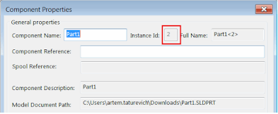

 该示例使用SOLIDWORKS API从组件的名称中提取组件实例索引。
image: sw-component-properties.png
labels: [装配, 组件, 示例, 实例ID, SOLIDWORKS API]
redirect-from:
  - /2018/03/solidworks-api-assembly-get-component-instance-id.html
  - /solidworks-api/document/assembly/get-component-instance-id
---

该示例使用SOLIDWORKS API从组件的名称中提取组件实例索引。

{ width=400 }

```vb
Dim swApp As SldWorks.SldWorks
Dim swModel As SldWorks.ModelDoc2
Dim swSelMgr As SldWorks.SelectionMgr
Dim swComp As SldWorks.Component2

Sub main()

    Set swApp = Application.SldWorks

    Set swModel = swApp.ActiveDoc
    
    If Not swModel Is Nothing Then
    
        Set swSelMgr = swModel.SelectionManager
        
        Set swComp = swSelMgr.GetSelectedObjectsComponent3(1, -1)
        
        If Not swComp Is Nothing Then
        
            Dim instId As Integer
            Dim compName As String
            compName = swComp.Name2
            instId = CInt(Right(compName, Len(compName) - InStrRev(compName, "-")))
            
            MsgBox "所选组件的实例ID为 " & instId
                
        Else
            
            MsgBox "请选择组件"
            
        End If
        
    Else
        
        MsgBox "请打开装配体"
        
    End If
    
End Sub
```

