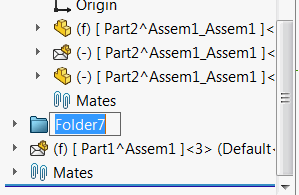

 通过SOLIDWORKS API将选定的组件移动到特征管理器树中的新文件夹中的宏
image: move-components-to-folder.png
labels: [组件, 移动到文件夹]
group: 组件装配
---
{ width=250 }

此宏允许使用SOLIDWORKS API将选定的组件移动到特征管理器树中的新文件夹中。

可以在图形区域中选择组件（或其任何实体）。例如，只能选择组件的面或边以使宏正常工作。

~~~ vb
#If VBA7 Then
     Private Declare PtrSafe Function SendMessage Lib "User32" Alias "SendMessageA" (ByVal hWnd As Long, ByVal wMsg As Long, ByVal wParam As Long, lParam As Any) As Long
#Else
     Private Declare Function SendMessage Lib "User32" Alias "SendMessageA" (ByVal hWnd As Long, ByVal wMsg As Long, ByVal wParam As Long, lParam As Any) As Long
#End If

Dim swApp As SldWorks.SldWorks

Sub main()

    Set swApp = Application.SldWorks
    
    Dim swModel As SldWorks.ModelDoc2
    
    Set swModel = swApp.ActiveDoc
    
    If Not swModel Is Nothing Then
        SelectComponentsFromCurrentSelection swModel
        AddSelectedComponentsToNewFolder ""
    Else
        MsgBox "请打开装配体"
    End If

End Sub

Sub SelectComponentsFromCurrentSelection(model As SldWorks.ModelDoc2)
    
    Dim swComps() As SldWorks.Component2
    Dim isArrInit As Boolean
    isArrInit = False
    
    Dim i As Integer
    
    Dim swSelMgr As SldWorks.SelectionMgr
    Set swSelMgr = model.SelectionManager
    
    For i = 1 To swSelMgr.GetSelectedObjectCount2(-1)
        
        Dim swComp As SldWorks.Component2
        Set swComp = swSelMgr.GetSelectedObjectsComponent4(i, -1)
        
        If Not swComp Is Nothing Then
        
            Dim unique As Boolean
            unique = False
            
            If False = isArrInit Then
                isArrInit = True
                ReDim swComps(0)
                unique = True
            Else
                unique = Not Contains(swComps, swComp)
                If True = unique Then
                    ReDim Preserve swComps(UBound(swComps) + 1)
                End If
            End If
                
            If True = unique Then
                Set swComps(UBound(swComps)) = swComp
            End If
        
        End If
        
    Next
    
    If True = isArrInit Then
        If UBound(swComps) + 1 <> model.Extension.MultiSelect2(swComps, False, Nothing) Then
            Err.Raise vbError, , "选择组件失败"
        End If
    End If
    
End Sub

Function Contains(vArr As Variant, item As Object) As Boolean
    
    Dim i As Integer
    
    For i = 0 To UBound(vArr)
        If vArr(i) Is item Then
            Contains = True
            Exit Function
        End If
    Next
    
    Contains = False
    
End Function

Sub AddSelectedComponentsToNewFolder(dummy)
    
    Const WM_COMMAND As Long = &H111
    Const CMD_ADD_TO_NEW_FOLDER As Long = 37922
    
    Dim swFrame As SldWorks.Frame
        
    Set swFrame = swApp.Frame
        
    SendMessage swFrame.GetHWnd(), WM_COMMAND, CMD_ADD_TO_NEW_FOLDER, 0
    
End Sub
~~~