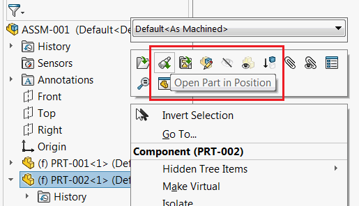

This VBA macro opens all selected components in the active assembly in their own windows in the same position as they appear in the original SOLIDWORKS assembly.

This macro emulates the *Open Part In Position* command in SOLIDWORKS toolbar, but allows to open multiple selected components at the same time.

{ width=250 }

~~~ vb
Dim swApp As SldWorks.SldWorks
    
Sub main()
 
    Set swApp = Application.SldWorks
    
    Dim swAssy As SldWorks.AssemblyDoc

    Set swAssy = swApp.ActiveDoc
    
try:
    
    On Error GoTo catch
    
    If Not swAssy Is Nothing Then
    
        Dim swSelMgr As SldWorks.SelectionMgr
       
        Set swSelMgr = swAssy.SelectionManager
        
        Dim i As Integer
        
        Dim hasCompSel As Boolean
        hasCompSel = False
        
        For i = 1 To swSelMgr.GetSelectedObjectCount2(-1)
        
            Dim swComp As SldWorks.Component2
        
            Set swComp = swSelMgr.GetSelectedObjectsComponent3(i, -1)
        
            If Not swComp Is Nothing Then
             
                hasCompSel = True
                
                Dim swCompTransform As SldWorks.MathTransform
                Dim swViewTransform As SldWorks.MathTransform
                Dim swTotalTransform As SldWorks.MathTransform
             
                Set swCompTransform = swComp.Transform2
             
                Set swViewTransform = swAssy.ActiveView.Orientation3
             
                Set swTotalTransform = swCompTransform.Multiply(swViewTransform)
                
                OpenComponentWithTransforms swComp, swTotalTransform
                
            End If
            
        Next
        
        If Not hasCompSel Then
            Err.Raise vbError, , "No components selected"
        End If
        
    Else
        Err.Raise vbError, , "Please open assembly"
    End If
    
    GoTo finally
catch:
    swApp.SendMsgToUser2 Err.Description, swMessageBoxIcon_e.swMbStop, swMessageBoxBtn_e.swMbOk
finally:

End Sub

Sub OpenComponentWithTransforms(comp As SldWorks.Component2, transform As SldWorks.MathTransform)
    
    Dim swRefModel As SldWorks.ModelDoc2
    
    Dim swDocSpec As SldWorks.DocumentSpecification
    Set swDocSpec = swApp.GetOpenDocSpec(comp.GetPathName())
    
    swDocSpec.Silent = True
    Set swRefModel = swApp.OpenDoc7(swDocSpec)
    
    Dim errs As Long
    Dim warns As Long
    
    If Not swRefModel Is Nothing Then
        
        If Not swApp.ActiveDoc Is swRefModel Then
            
            Set swRefModel = swApp.ActivateDoc3(swRefModel.GetTitle(), False, swRebuildOnActivation_e.swUserDecision, errs)
            
            If swRefModel Is Nothing Then
                Err.Raise vbError, , "Cannot activate the referenced document. Error code:" & errs
            End If
        End If
        
        Dim swView As SldWorks.ModelView
        Set swView = swRefModel.ActiveView
        swView.Orientation3 = transform
        swRefModel.ViewZoomtofit2
        
    Else
        Err.Raise vbError, , "Cannot open the referenced document. Error code:" & swDocSpec.Error
    End If

End Sub
~~~

