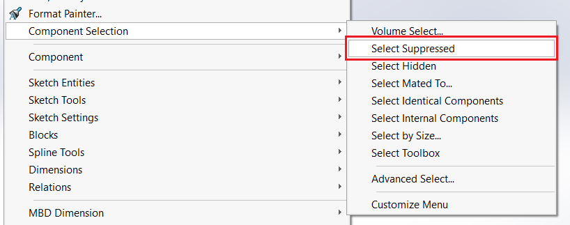

 使用VBA宏在装配体文档中批量运行“组件选择-选择被压制”命令以选择所有装配体组件
image: select-suppressed-components.png
labels: [命令, 被压制, 组件]
---
这个VBA宏允许在活动的SOLIDWORKS装配体中批量选择所有被压制的组件，使用了SOLIDWORKS和Windows API。

这个宏执行了*组件选择*菜单中的*选择被压制*命令。

{ width=500 }

与逐个遍历组件的[遍历组件](/docs/codestack/solidworks-api/document/assembly/components/traversing-tree)相比，这是选择所有被压制组件的首选选项，因为它具有更好的性能。

~~~ vb
#If VBA7 Then
     Private Declare PtrSafe Function SendMessage Lib "User32" Alias "SendMessageA" (ByVal hWnd As Long, ByVal wMsg As Long, ByVal wParam As Long, lParam As Any) As Long
#Else
     Private Declare Function SendMessage Lib "User32" Alias "SendMessageA" (ByVal hWnd As Long, ByVal wMsg As Long, ByVal wParam As Long, lParam As Any) As Long
#End If
 
Dim swApp As SldWorks.SldWorks
 
Sub main()
    
    Set swApp = Application.SldWorks
    
    Dim swAssy As SldWorks.AssemblyDoc
    
    Set swAssy = swApp.ActiveDoc
    
    If Not swAssy Is Nothing Then
        SelectSuppressedComponents
    Else
       MsgBox "请打开装配体"
    End If
     
End Sub

Sub SelectSuppressedComponents()
    
    Const WM_COMMAND As Long = &H111
    Const CMD_SELECT_SUPPRESSED_COMPS As Long = 54409
    
    Dim swFrame As SldWorks.Frame
        
    Set swFrame = swApp.Frame
        
    SendMessage swFrame.GetHWnd(), WM_COMMAND, CMD_SELECT_SUPPRESSED_COMPS, 0

End Sub
~~~