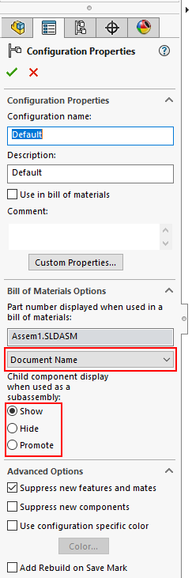

 VBA宏，用于更改SOLIDWORKS文档中所有或活动配置的Bill Of Materials零件号来源（配置名称、文档名称、父级名称）和子组件显示（显示、隐藏、提升）选项
image: configuration-options.png
---
该VBA宏允许更改配置在Bill Of Materials中的处理选项

* 零件号来源
    * 配置名称
    * 文档名称
    * 父级名称
* 子组件显示
    * 显示
    * 隐藏
    * 提升

宏可以仅处理活动配置或所有配置

通过更改宏的常量来配置宏

对于**PART_NUMBER_SRC**或**CHILD_COMPS_DISP**选项，指定-1以保留原始值，或指定新值以覆盖

~~~ vb
Const ALL_CONFIGS As Boolean = True 'True表示处理所有配置，False表示仅处理活动配置
Const PART_NUMBER_SRC As Integer = swBOMPartNumberSource_e.swBOMPartNumber_ConfigurationName '零件号来源：-1保持不变，或swBOMPartNumberSource_e.swBOMPartNumber_ConfigurationName、swBOMPartNumberSource_e.swBOMPartNumber_DocumentName或swBOMPartNumberSource_e.swBOMPartNumber_ParentName
Const CHILD_COMPS_DISP As Integer = swChildComponentInBOMOption_e.swChildComponent_Promote 'BOM中组件的显示：-1保持不变，或swChildComponentInBOMOption_e.swChildComponent_Show、swChildComponentInBOMOption_e.swChildComponent_Hide或swChildComponentInBOMOption_e.swChildComponent_Promote
~~~

~~~ vb
Const ALL_CONFIGS As Boolean = True
Const PART_NUMBER_SRC As Integer = swBOMPartNumberSource_e.swBOMPartNumber_ConfigurationName
Const CHILD_COMPS_DISP As Integer = swChildComponentInBOMOption_e.swChildComponent_Promote

Dim swApp As SldWorks.SldWorks

Sub main()

    Set swApp = Application.SldWorks
    
    Dim swModel As SldWorks.ModelDoc2
    
    Set swModel = swApp.ActiveDoc
    
    If swModel Is Nothing Then
        Err.Raise vbError, "", "打开文档"
    End If
    
    If swModel.GetType() = swDocumentTypes_e.swDocDRAWING Then
        Err.Raise vbError, "", "不支持绘图"
    End If
    
    If ALL_CONFIGS Then
        
        Dim vConfNames As Variant
        
        vConfNames = swModel.GetConfigurationNames
        Dim i As Integer
        
        For i = 0 To UBound(vConfNames)
            Dim swConf As SldWorks.Configuration
            Set swConf = swModel.GetConfigurationByName(CStr(vConfNames(i)))
            SetConfigurationBomOptions swConf
        Next
        
    Else
        SetConfigurationBomOptions swModel.ConfigurationManager.ActiveConfiguration
    End If
    
End Sub

Sub SetConfigurationBomOptions(config As SldWorks.Configuration)
    
    If CHILD_COMPS_DISP <> -1 Then
        config.ChildComponentDisplayInBOM = CHILD_COMPS_DISP
    End If
    
    If PART_NUMBER_SRC <> -1 Then
        config.BOMPartNoSource = PART_NUMBER_SRC
    End If
    
End Sub
~~~