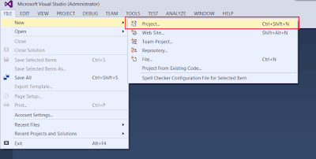
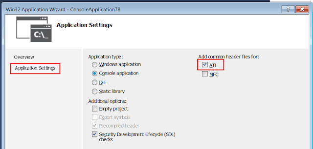

In this tutorial I will demonstrate how to connect to SOLIDWORKS application from out-of-process (a.k.a Stand-Alone) application (e.g. MFC, Win32 Console Application) using C++ and Microsoft Visual Studio.

For more detailed explanation of the approaches discussed in this article refer the [Connect To SOLIDWORKS From Stand-Alone Application](/docs/codestack/solidworks-api/getting-started/stand-alone/) article.

## Creating new project

I will be using Microsoft Visual Studio development environment. You can use any edition of Visual Studio.
The same code will work in Professional, Express or Community editions. Follow this link to download [Visual Studio](https://www.visualstudio.com/vs/community/)

* Open Visual Studio
* Start new project:

{ width=400 }

* Select the project template. I would recommend to start with Win32 Console Application project template as it contains the minimum pregenerated code:

{ width=640 }

* Check the ATL option in the project wizard

{ width=640 }

* Link directory where SOLIDWORKS type libraries are located.
This is an installation directory of SOLIDWORKS (Go to Project Properties, select C/C++ and browse the path in the *Additional Include Directories* field):

{ width=640 }

Now we can add the code to connect to SOLIDWORKS instance.  

## Creating or connecting to instance

Probably the most common and quick way to connect to COM server is using the [CoCreateInstance](https://msdn.microsoft.com/en-us/library/windows/desktop/ms686615(v=vs.85).aspx) function.  

~~~ cpp
#include "stdafx.h"
#import "sldworks.tlb"
#include <iostream>

int main()
{
    ::CoInitialize(NULL);
    CComPtr<SldWorks::ISldWorks> pSwApp;

    if (SUCCEEDED(pSwApp.CoCreateInstance(
        __uuidof(SldWorks::SldWorks), NULL, CLSCTX_LOCAL_SERVER)))
    {
        pSwApp->Visible = TRUE;
        _bstr_t revNmb = pSwApp->RevisionNumber();

        std::cout << revNmb;
    }

    pSwApp = NULL;
    ::CoUninitialize();

    //wait for input (do not close console to see results)
    std::cin.get();

    return 0;
}

~~~

## Getting the running instance via ROT

In order to connect to already running specific session of SOLIDWORKS or to be able to create multiple sessions you can use Running Object Table APIs.
Please read the [Connect To SOLIDWORKS From Stand-Alone Application](/docs/codestack/solidworks-api/getting-started/stand-alone#method-b---running-object-table-rot) article for more details about this approach.

~~~ cpp
#include "stdafx.h"
#import "sldworks.tlb"
#include <iostream>
#include <windows.h>
#include <string>
#include <chrono>
#include <thread>

HRESULT StartSwProcess(LPCWSTR appPath, int& prcId)
{
    prcId = -1;

    STARTUPINFO si;
    PROCESS_INFORMATION pi;

    ZeroMemory(&si, sizeof(si));

    HRESULT res = E_FAIL;
    
    if(CreateProcess(L"C:\\Program Files\\SOLIDWORKS Corp\\SOLIDWORKS\\SLDWORKS.exe",
        L"", NULL, NULL, FALSE, 0,
        NULL, NULL, &si, &pi))
    {
        CloseHandle(pi.hProcess);
        CloseHandle(pi.hThread);

        prcId = pi.dwProcessId;

        res = S_OK;
    }
    
    return res;
}

HRESULT GetSwAppFromProcess(int prcId, SldWorks::ISldWorks** pSwApp)
{
    HRESULT res = E_FAIL;

    CComPtr<IRunningObjectTable> pRot;
    CComPtr<IBindCtx> pBindingContext;

    if (SUCCEEDED(CreateBindCtx(0, &pBindingContext)))
    {
        if (GetRunningObjectTable(0, &pRot) == S_OK)
        {
            CComPtr<IEnumMoniker> pEnumMoniker;
            if (SUCCEEDED(pRot->EnumRunning(&pEnumMoniker)))
            {
                WCHAR szMonikerName[30];
                swprintf_s(szMonikerName, 30, L"SolidWorks_PID_%d", prcId);

                ULONG fetched;
                CComPtr<IMoniker> pMon;

                while (pEnumMoniker->Next(1, &pMon, &fetched) == S_OK)
                {
                    LPOLESTR pName;
                    pMon->GetDisplayName(pBindingContext, NULL, &pName);

                    if (wcscmp(pName, szMonikerName) == 0)
                    {
                        CComPtr<IUnknown> pUnk;

                        if (SUCCEEDED(pRot->GetObjectW(pMon, &pUnk)))
                        {
                            if (SUCCEEDED(pUnk->QueryInterface(_uuidof(SldWorks::ISldWorks), (void**)pSwApp)))
                            {    
                                res = S_OK;
                                break;
                            }
                        }
                    }

                    pMon = NULL;
                }
            }
        }
    }

    pRot = NULL;
    pBindingContext = NULL;

    return res;
}

HRESULT ConnectToSwApp(LPCWSTR appPath, SldWorks::ISldWorks** pSwApp, int timeoutSec) 
{
    HRESULT res = E_FAIL;

    int prcId;

    if (SUCCEEDED(StartSwProcess(appPath, prcId)))
    {
        auto start = std::chrono::high_resolution_clock::now();
        
        while (FAILED(GetSwAppFromProcess(prcId, pSwApp)))
        {
            std::this_thread::sleep_for(std::chrono::milliseconds(200));
            auto end = std::chrono::high_resolution_clock::now();
            std::chrono::duration<double, std::milli> elapsed = end - start;

            if (elapsed.count() > timeoutSec * 1000)
            {
                throw std::runtime_error("Timeout");
            }
        }

        res = S_OK;
    }

    return res;
}

int main()
{
    ::CoInitialize(NULL);
    
    CComPtr<SldWorks::ISldWorks> pSwApp;

    try 
    {
        if (SUCCEEDED(ConnectToSwApp(L"C:\\Program Files\\SOLIDWORKS Corp\\SOLIDWORKS (2)\\SLDWORKS.exe", 
            &pSwApp, 10))) 
        {
            _bstr_t revNmb = pSwApp->RevisionNumber();
            std::cout << revNmb;
        }
    }
    catch (std::runtime_error& e) 
    {
        std::cout << e.what() << std::endl;
    }

    pSwApp = NULL;
    
    ::CoUninitialize();

    //wait for input (do not close console to see results)
    std::cin.get();
    
    return 0;
}

~~~

In the above example new session of SOLIDWORKS is launched by starting new process from SOLIDWORKS application installation path.
*ConnectToSwApp* function requires the full path to **sldworks.exe** as first parameter and timeout in seconds as second parameter.
Timeout will ensure that the application won't be locked in case process failed to start.
