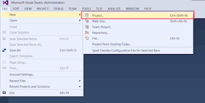

在本教程中，我将演示如何使用 C# 和 Microsoft Visual Studio 从外部进程（即独立应用程序，如 Windows Forms、Windows Console）连接到 SOLIDWORKS 应用程序。

有关本文讨论的方法的更详细解释，请阅读[从独立应用程序连接到 SOLIDWORKS](/docs/codestack/solidworks-api/getting-started/stand-alone/)文章。

## 创建新项目

我将使用 Microsoft Visual Studio 开发环境。您可以使用任何版本的 Visual Studio。相同的代码将适用于专业版、Express 版或社区版。请访问此链接下载[Visual Studio](https://www.visualstudio.com/vs/community/)。

1. 打开 Visual Studio。
1. 启动新项目：

{ width=400 }

1. 选择项目模板。我建议从控制台应用程序项目模板开始，因为它包含最少的预生成代码：

{ width=640 }

1. 添加对 SolidWorks 互操作库的引用。互操作库位于 **SOLIDWORKS 安装文件夹**\api\redist\SolidWorks.Interop.sldworks.dll（针对 Framework 4.0 及更高版本的项目）和 **SOLIDWORKS 安装文件夹**\api\redist\CLR2\SolidWorks.Interop.sldworks.dll（针对 Framework 2.0 和 3.5 的项目）。

{ width=320 }

对于针对 Framework 4.0 的项目，我建议将 **[嵌入互操作类型](https://docs.microsoft.com/zh-cn/dotnet/framework/interop/type-equivalence-and-embedded-interop-types)**选项设置为 false。
否则，在调用 SOLIDWORKS API 时，应用程序可能会由于类型转换问题而出现不可预测的行为。

{ width=320 }

现在，我们可以添加连接到 SOLIDWORKS 实例的代码。

## 创建或连接实例

连接到 COM 服务器的最常见和快速的方法是使用 [Activator::CreateInstance](https://msdn.microsoft.com/zh-cn/library/system.activator.createinstance(v=vs.110).aspx) 方法。

~~~ cs
var progId = "SldWorks.Application";

var progType = System.Type.GetTypeFromProgID(progId);

var app = System.Activator.CreateInstance(progType) as SolidWorks.Interop.sldworks.ISldWorks;
app.Visible = true;
~~~

此方法将根据类型定义构造类型的实例。由于 SOLIDWORKS 应用程序已注册为 COM 服务器，我们可以通过 [Type::GetTypeFromProgID](https://msdn.microsoft.com/zh-cn/library/system.type.gettypefromprogid(v=vs.110).aspx) 方法根据其程序标识符创建类型。
请阅读[从独立应用程序连接到 SOLIDWORKS](/docs/codestack/solidworks-api/getting-started/stand-alone#method-a---activator-and-progid)文章，了解此方法的限制的解释。

或者，您可以使用 [Marshal::GetActiveObject](https://msdn.microsoft.com/zh-cn/library/system.runtime.interopservices.marshal.getactiveobject(v=vs.110).aspx) 方法连接到活动（已启动）的 SOLIDWORKS 会话。
此方法将确保不会创建新的 SOLIDWORKS 实例，并且如果没有正在运行的 SOLIDWORKS 会话可连接，则会引发异常。

~~~ cs
var progId = "SldWorks.Application";

var app = System.Runtime.InteropServices.Marshal.GetActiveObject(progId) as SolidWorks.Interop.sldworks.ISldWorks;
~~~

## 通过 ROT 获取正在运行的实例

为了连接到已经运行的特定 SOLIDWORKS 会话或能够创建多个会话，您可以使用 Running Object Table (ROT) API。
有关此方法的更多详细信息，请阅读[从独立应用程序连接到 SOLIDWORKS](/docs/codestack/solidworks-api/getting-started/stand-alone#method-b---running-object-table-rot)文章。

~~~ cs
using System;
using System.Diagnostics;
using System.Linq;
using System.Runtime.InteropServices;
using System.Runtime.InteropServices.ComTypes;
using SolidWorks.Interop.sldworks;

namespace CodeStack.Sample
{
    class Program
    {
        [DllImport("ole32.dll")]
        private static extern int CreateBindCtx(uint reserved, out IBindCtx ppbc);
        
        static void Main(string[] args)
        {
            const string SW_PATH = @"C:\Program Files\SOLIDWORKS Corp\SOLIDWORKS\SLDWORKS.exe";

            try
            {
                var app = StartSwApp(SW_PATH);
                Console.WriteLine(app.RevisionNumber());
            }
            catch(Exception ex)
            {
                Console.WriteLine("Failed to connect to SOLIDWORKS instance: " + ex.Message);
            }

            Console.ReadLine();
        }

        private static ISldWorks StartSwApp(string appPath, int timeoutSec = 10)
        {
            var timeout = TimeSpan.FromSeconds(timeoutSec);

            var startTime = DateTime.Now;

            var prc = Process.Start(appPath);
            ISldWorks app = null;

            while (app == null)
            {
                if (DateTime.Now - startTime > timeout)
                {
                    throw new TimeoutException();
                }

                app = GetSwAppFromProcess(prc.Id);
            }

            return app;
        }

        private static ISldWorks GetSwAppFromProcess(int processId)
        {
            var monikerName = "SolidWorks_PID_" + processId.ToString();

            IBindCtx context = null;
            IRunningObjectTable rot = null;
            IEnumMoniker monikers = null;

            try
            {
                CreateBindCtx(0, out context);

                context.GetRunningObjectTable(out rot);
                rot.EnumRunning(out monikers);

                var moniker = new IMoniker[1];

                while (monikers.Next(1, moniker, IntPtr.Zero) == 0)
                {
                    var curMoniker = moniker.First();

                    string name = null;

                    if (curMoniker != null)
                    {
                        try
                        {
                            curMoniker.GetDisplayName(context, null, out name);
                        }
                        catch (UnauthorizedAccessException)
                        {
                        }
                    }

                    if (string.Equals(monikerName,
                        name, StringComparison.CurrentCultureIgnoreCase))
                    {
                        object app;
                        rot.GetObject(curMoniker, out app);
                        return app as ISldWorks;
                    }
                }
            }
            finally
            {
                if (monikers != null)
                {
                    Marshal.ReleaseComObject(monikers);
                }

                if (rot != null)
                {
                    Marshal.ReleaseComObject(rot);
                }

                if (context != null)
                {
                    Marshal.ReleaseComObject(context);
                }
            }

            return null;
        }
    }
}
~~~

在上面的示例中，通过从 SOLIDWORKS 应用程序安装路径启动新进程来启动 SOLIDWORKS 的新会话。
*StartSwApp* 函数需要 **sldworks.exe** 的完整路径作为第一个参数，并可选地指定超时时间（以秒为单位）作为第二个参数。
超时时间将确保在进程启动失败时，应用程序不会被锁定。

您还可以将此调用设置为异步，并在 SOLIDWORKS 进程启动时在应用程序中显示一些进度指示：

~~~ cs
static async System.Threading.Tasks.Task<SolidWorks.Interop.sldworks.ISldWorks> StartSwAppAsync(
    string appPath, int timeoutSec = 10)
{
    return await System.Threading.Tasks.Task.Run(() =>
    {
        return StartSwApp(appPath, timeoutSec);
    });
}
~~~