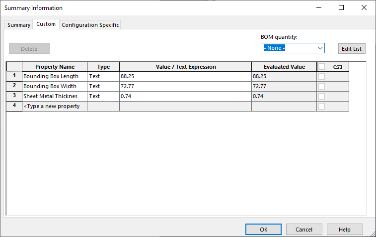

This VBA macro copies the specified or all SOLIDWORKS custom properties from the sheet metal or weldment cut-list item to model or configuration.

Properties from the first found cut-list will be copied.

~~~ vb
Const CONF_SPEC_PRP As Boolean = False
Const COPY_RES_VAL As Boolean = True

Dim PROPERTIES As Variant

Dim swApp As SldWorks.SldWorks

Sub Init(Optional dummy As Variant = Empty)
    PROPERTIES = Array("Bounding Box Length", "Bounding Box Width", "Sheet Metal Thickness") 'list of custom properties to copy or Empty to copy all
End Sub

Sub main()
    
try_:
    
    On Error GoTo catch_
    
    Init
    
    Set swApp = Application.SldWorks
    
    Dim swModel As SldWorks.ModelDoc2
    Set swModel = swApp.ActiveDoc
    
    Dim swCutListPrpMgr As SldWorks.CustomPropertyManager
    Set swCutListPrpMgr = GetCutListPropertyManager(swModel)
    
    If Not swCutListPrpMgr Is Nothing Then
        
        Dim swTargetPrpMgr As SldWorks.CustomPropertyManager
        
        If CONF_SPEC_PRP Then
            Set swTargetPrpMgr = swModel.ConfigurationManager.ActiveConfiguration.CustomPropertyManager
        Else
            Set swTargetPrpMgr = swModel.Extension.CustomPropertyManager("")
        End If
        
        CopyProperties swCutListPrpMgr, swTargetPrpMgr, PROPERTIES
        
    Else
        Err.Raise vbError, "", "Cut-list is not found"
    End If
    
    GoTo finally_
    
catch_:
    swApp.SendMsgToUser2 Err.Description, swMessageBoxIcon_e.swMbStop, swMessageBoxBtn_e.swMbOk
finally_:

End Sub

Function GetCutListPropertyManager(model As SldWorks.ModelDoc2) As SldWorks.CustomPropertyManager

    Dim swFeat As SldWorks.Feature
    
    Set swFeat = model.FirstFeature
    
    While Not swFeat Is Nothing
        
        If swFeat.GetTypeName2() = "CutListFolder" Then
            Set GetCutListPropertyManager = swFeat.CustomPropertyManager
            Exit Function
        End If

        Set swFeat = swFeat.GetNextFeature
        
    Wend
    
End Function

Sub CopyProperties(srcPrpMgr As SldWorks.CustomPropertyManager, targPrpMgr As SldWorks.CustomPropertyManager, vPrpNames As Variant)

    If IsEmpty(vPrpNames) Then
        vPrpNames = srcPrpMgr.GetNames()
    End If
    
    If Not IsEmpty(vPrpNames) Then
    
        For i = 0 To UBound(vPrpNames)
                        
            prpName = vPrpNames(i)

            Dim prpVal As String
            Dim prpResVal As String
                        
            srcPrpMgr.Get5 prpName, False, prpVal, prpResVal, False
            
            Dim targVal As String
            targVal = IIf(COPY_RES_VAL, prpResVal, prpVal)
            
            targPrpMgr.Add2 prpName, swCustomInfoType_e.swCustomInfoText, targVal
            targPrpMgr.Set prpName, targVal
            
        Next
        
    Else
        Err.Raise vbError, "", "No properties to copy"
    End If
    
End Sub
~~~

## Configuration

Macro can be configured by changing the constants

### Properties Scope

*CONF_SPEC_PRP* constant sets the target properties scope.

* True to copy properties to configuration specific tab
* False to copy to Custom tab

### Properties Source

*COPY_RES_VAL* constant sets the property source

* True to copy resolved values
    
 { width=500 }

* False to copy expressions

 { width=500 }

### Properties List

*PROPERTIES* array contains list of properties to copy
    
Copy specified properties

~~~ vb
Sub Init(Optional dummy As Variant = Empty)
    PROPERTIES = Array("Prp1", "Prp2", "Prp3") 'Copy Prp1, Prp2, Prp3
End Sub
~~~

Copy all properties

~~~ vb
Sub Init(Optional dummy As Variant = Empty)
    PROPERTIES = Empty
End Sub
~~~