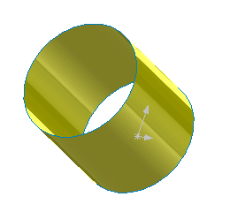

该示例演示了如何使用SOLIDWORKS API从圆柱面创建一个面板体。

运行宏，将显示临时体。可以旋转和选择该体，但它不会显示在特征树中。继续执行宏以销毁该体。

~~~ vb
Dim swApp As SldWorks.SldWorks
Dim swModel As SldWorks.ModelDoc2
Dim swModeler As SldWorks.Modeler

Sub main()

    Set swApp = Application.SldWorks
    
    Set swModel = swApp.ActiveDoc
    
    If Not swModel Is Nothing Then
    
        Set swModeler = swApp.GetModeler
        
        Const RADIUS As Double = 0.1
        Const HEIGHT As Double = 0.2
        
        Dim dCenter(2) As Double
        Dim dAxis(2) As Double
        Dim dRef(2) As Double
        
        Dim swSurf As SldWorks.Surface
        Dim swBody As SldWorks.Body2
        Dim swCurve(2) As SldWorks.Curve
        
        dCenter(0) = 0: dCenter(1) = 0: dCenter(2) = 0
        dAxis(0) = 0: dAxis(1) = 0: dAxis(2) = 1
        dRef(0) = 1: dRef(1) = 0: dRef(2) = 0
        
        Set swSurf = swModeler.CreateCylindricalSurface2(dCenter, dAxis, dRef, RADIUS)
        
        Dim dPt(2) As Double
        dPt(0) = 0: dPt(1) = RADIUS: dPt(2) = 0
        Set swCurve(0) = swModeler.CreateArc(dCenter, dAxis, RADIUS, dPt, dPt)
               
        dCenter(0) = 0: dCenter(1) = 0: dCenter(2) = HEIGHT
        dPt(0) = 0: dPt(1) = RADIUS: dPt(2) = HEIGHT
        Set swCurve(2) = swModeler.CreateArc(dCenter, dAxis, RADIUS, dPt, dPt)
        
        Set swBody = swSurf.CreateTrimmedSheet4(swCurve, True)
        
        swBody.Display3 swModel, RGB(255, 255, 0), swTempBodySelectOptions_e.swTempBodySelectable
        
        Stop '继续隐藏该体
        
        Set swBody = Nothing
        
    Else
        MsgBox "请打开零件文档"
    End If
    
End Sub
~~~