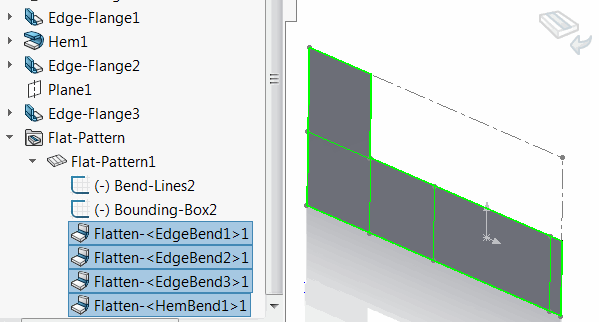
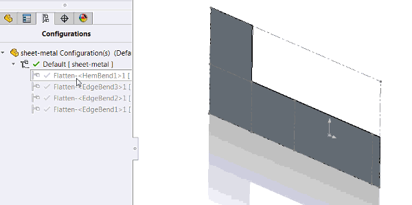

此宏使用SOLIDWORKS API为在特征树中选择的所有特征创建新配置，并逐个在相应配置中抑制它们。

如果需要在配置中表示模型的某些历史数据，此宏可能会很有用。

## 注意事项

* 配置作为活动配置的派生配置创建
* 每个配置以特征名称命名
* 特征按照选择的顺序进行处理
* 在相应配置中，每个特征及其之前的所有特征都将被抑制

## 使用案例

### 金属板弯曲

此宏可用于表示金属板弯曲的步骤。在这种情况下，每个配置将表示弯曲步骤。

* 将金属板零件设置为展开状态
* 按照 *Flat-Pattern* 特征下的顺序选择展平弯曲

{ width=350 }

* 运行宏

结果将创建每个弯曲的子配置，表示弯曲步骤：

请参阅[配置动画](/docs/codestack/solidworks-api/motion-study/animate-configurations/)，了解使用SOLIDWORKS API创建配置动画的示例宏。

~~~ vb
Dim swApp As SldWorks.SldWorks

Sub main()

    Set swApp = Application.SldWorks
    
    Dim swModel As SldWorks.ModelDoc2
    
    Set swModel = swApp.ActiveDoc
    
    If Not swModel Is Nothing Then
        
        Dim vFeats As Variant
        vFeats = GetSelectedFeatures(swModel)
        
        Dim swActiveConf As SldWorks.Configuration
        Set swActiveConf = swModel.ConfigurationManager.ActiveConfiguration
        
        Dim i As Integer
        
        Dim swFeatsList() As SldWorks.Feature
        
        For i = 0 To UBound(vFeats)
            
            ReDim Preserve swFeatsList(i)
            
            Dim swFeat As SldWorks.Feature
            Set swFeat = vFeats(i)
            
            Set swFeatsList(i) = swFeat
            
            If False = SuppressFeaturesInNewConfiguration(swModel, swFeatsList, swFeat.Name, swActiveConf.Name) Then
                MsgBox "Failed to set the feature state for " & swFeat.Name
                End
            End If
            
        Next
        
        swModel.ShowConfiguration2 swActiveConf.Name

    Else
        MsgBox "Please open document"
    End If
    
End Sub

Function GetSelectedFeatures(model As SldWorks.ModelDoc2) As Variant
    
    Dim swFeatures() As SldWorks.Feature
    
    Dim isArrInit As Boolean
    isArrInit = False
    
    Dim swSelMgr As SldWorks.SelectionMgr
    Dim i As Integer
    Set swSelMgr = model.SelectionManager
            
    For i = 1 To swSelMgr.GetSelectedObjectCount2(-1)
            
        On Error Resume Next
        
        Dim swFeat As SldWorks.Feature
        Set swFeat = swSelMgr.GetSelectedObject6(i, -1)
            
        If Not swFeat Is Nothing Then
            If isArrInit Then
                ReDim Preserve swFeatures(UBound(swFeatures) + 1)
            Else
                ReDim swFeatures(0)
                isArrInit = True
            End If
            Set swFeatures(UBound(swFeatures)) = swFeat
        End If
        
    Next
    
    GetSelectedFeatures = swFeatures
    
End Function

Function SuppressFeaturesInNewConfiguration(model As SldWorks.ModelDoc2, feats As Variant, confName As String, parentConfName As String) As Boolean
    
    Dim swFeatConf As SldWorks.Configuration
    Set swFeatConf = model.ConfigurationManager.AddConfiguration(confName, "", "", swConfigurationOptions2_e.swConfigOption_LinkToParent + swConfigurationOptions2_e.swConfigOption_DontActivate + swConfigurationOptions2_e.swConfigOption_InheritProperties, parentConfName, "")
    
    If Not swFeatConf Is Nothing Then
        
        Dim i As Integer
        
        For i = 0 To UBound(feats)
            
            Dim swFeat As SldWorks.Feature
            Set swFeat = feats(i)
            
            Dim confNames(0) As String
            confNames(0) = swFeatConf.Name
            
            If False = swFeat.SetSuppression2(swFeatureSuppressionAction_e.swSuppressFeature, swInConfigurationOpts_e.swSpecifyConfiguration, confNames) Then
                SuppressFeaturesInNewConfiguration = False
                Exit Function
            End If
        Next
        SuppressFeaturesInNewConfiguration = True
    Else
        SuppressFeaturesInNewConfiguration = False
        Exit Function
    End If
    
End Function
~~~