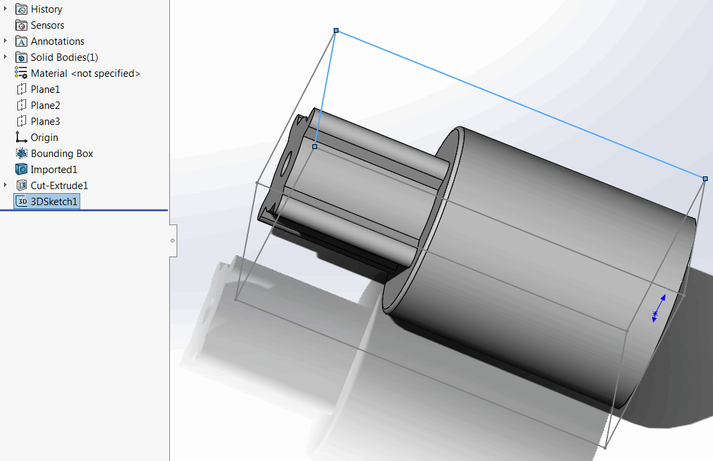

 VBA macro which creates 3D bounding box sketch based on the SOLIDWORKS bounding box with an ability to select sketch segments
image: bounding-box.svg
labels: [bounding box]
group: Geometry
---
{ width=450 }

SOLIDWORKS enables the functionality to insert 3D bounding box into the part document. However the edges (segments) of this bonding box cannot be selected and used for the modelling purposes.

This VBA macro creates a bounding box sketch based on SOLIDWORKS 3D bounding box. All segments from the sketch can be selected and used for reference or geometry creation.

## Notes

* Macro will use existing 3D bonding box or create new one if not exists
* Generated bounding box is automatically updated when original bounding box changes (after the rebuild)
    * It is required for the original bounding box to be visible to update the derived bounding box

~~~ vb
Dim swApp As SldWorks.SldWorks

Sub main()

    Set swApp = Application.SldWorks
    
    Dim swModel As SldWorks.ModelDoc2
    
    Set swModel = swApp.ActiveDoc
    
    If Not swModel Is Nothing Then
        
        Dim swFeat As SldWorks.Feature
        
        Set swFeat = GetBoundingBoxFeature(swModel)
        
        If Not swFeat Is Nothing Then
        
            Dim swSketch As SldWorks.Sketch
            Set swSketch = swFeat.GetSpecificFeature2
            
            Dim vSegs As Variant
            
            vSegs = swSketch.GetSketchSegments
            
            ConvertSegmentsIntoSketch swModel, vSegs
            
        Else
            MsgBox "Failed to get bounding box feature"
        End If
    
    Else
        MsgBox "Please open document"
    End If
    
End Sub

Function GetBoundingBoxFeature(model As SldWorks.ModelDoc2) As SldWorks.Feature
    
    Dim swFeat As SldWorks.Feature
    Set swFeat = FindBoundingBoxFeature(model)
    
    If swFeat Is Nothing Then
        
        Dim status As Long
        model.FeatureManager.InsertGlobalBoundingBox swGlobalBoundingBoxFitOptions_e.swBoundingBoxType_BestFit, False, False, status
        
        Set swFeat = FindBoundingBoxFeature(model)
        
    End If
    
    Set GetBoundingBoxFeature = swFeat
    
End Function

Function FindBoundingBoxFeature(model As SldWorks.ModelDoc2) As SldWorks.Feature
    
    Dim swFeat As SldWorks.Feature
    Set swFeat = model.FirstFeature
    
    While Not swFeat Is Nothing
        
        If swFeat.GetTypeName2() = "BoundingBoxProfileFeat" Then
            Set FindBoundingBoxFeature = swFeat
            Exit Function
        End If
        
        Set swFeat = swFeat.GetNextFeature
        
    Wend
    
    Set FindBoundingBoxFeature = Nothing
    
End Function

Sub ConvertSegmentsIntoSketch(model As SldWorks.ModelDoc2, segs As Variant)
    
    If model.SketchManager.ActiveSketch Is Nothing Then
        model.SketchManager.Insert3DSketch True
    Else
        If False = model.SketchManager.ActiveSketch.Is3D() Then
            Err.Raise vbError, "", "Only 3D sketch is supported"
        End If
    End If
    
    Dim i As Integer
    
    model.ClearSelection2 True
    
    For i = 0 To UBound(segs)
        Dim swSkSeg As SldWorks.SketchSegment
        Set swSkSeg = segs(i)
        swSkSeg.Select4 True, Nothing
    Next
    
    model.SketchManager.SketchUseEdge3 False, False
    
    model.SketchManager.Insert3DSketch True
    
End Sub
~~~

