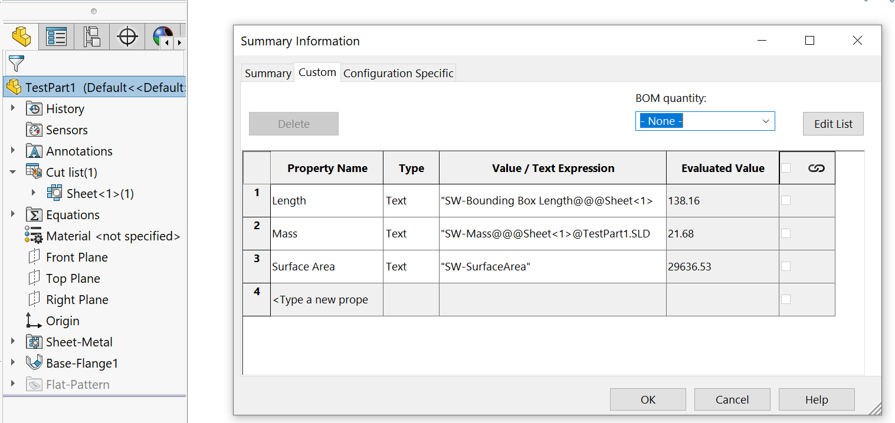

 VBA macro to add a permanent link (expression) between specified cut-list custom properties of a sheet metal part and custom properties of a SOLIDWORKS file. Optional fallback value is available.
image: linked-sheet-metal-cut-list-properties.png
---
{ width=800 }

This VBA macro allows you to link specified cut-list custom properties of a sheet metal part to custom properties of a SOLIDWORKS file.

The custom properties are linked through formulas and will automatically update when the geometry of the sheet metal changes.

You can specify a fallback value that will be written to the custom property if the source part is not a sheet metal document.

To customize the property mapping, add or remove mapping values in the **Init** function below.

When specifying the expression in the last parameter (**fallback value**), you need to escape the double quotes (**"**) with additional double quotes (**""**). For example, if the formula for SOLIDWORKS Mass is **"SW-Mass"**, and you want to set it as the fallback value, the third parameter should be **"""SW-Mass"""**, where the outer quotes represent the quotes for a [VBA string value](/docs/codestack/visual-basic/variables/standard-types#string).

``` vb
Sub Init(Optional dummy As Variant = Empty)
    
    Set Map = New Collection
    
    Map.Add CreateMapValue("Part Number", "", "") ' Add an empty "Part Number" custom property
    Map.Add CreateMapValue("Width", "Bounding Box Width", "") ' Add the "Bounding Box Width" custom property from the sheet metal as "Width", if it's not a sheet metal part, it will be empty
    Map.Add CreateMapValue("Material", "", """SW-Material""") ' Add the custom property "Material" and set it to the "SW-Material" formula, regardless of whether it's a sheet metal part
        
End Sub
```

## Notes and Limitations

* Supports only a single cut-list item (an error will be thrown if there are multiple cut-lists)
* The macro sets the **Automatically create cut list** and **Automatically update** options on the cut-list folder
* Supports only part documents
* Cut-list custom properties are linked through expressions and the cut-list name. If the cut-list is renamed, the properties will not update and the macro needs to be re-run. However, if the cut-list remains with the original name, all properties will update dynamically without re-running the macro.

``` vb
Dim swApp As SldWorks.SldWorks

Dim Map As Collection

Sub Init(Optional dummy As Variant = Empty)
    
    Set Map = New Collection
    
    Map.Add CreateMapValue("Length", "Bounding Box Length", """D1@Boss-Extrude1""")
    Map.Add CreateMapValue("Mass", "Mass", """SW-Mass""")
    Map.Add CreateMapValue("Surface Area", "", """SW-SurfaceArea""")
        
End Sub

Function CreateMapValue(targetPrpName As String, srcCutListPrpName As String, Optional fallbackValue As String = "") As Variant
    
    CreateMapValue = Array(targetPrpName, srcCutListPrpName, fallbackValue)
    
End Function

Sub main()

    Set swApp = Application.SldWorks
    
    Dim swPart As SldWorks.ModelDoc2
    
    Set swPart = swApp.ActiveDoc
    
    If swPart Is Nothing Then
        Err.Raise vbError, "", "Open a part document"
    End If
    
    If swPart.GetType() <> swDocumentTypes_e.swDocPART Then
        Err.Raise vbError, "", "The active document is not a part"
    End If
    
    Init
    
    Dim vCutLists As Variant
    vCutLists = GetCutLists(swPart)
    
    Dim swCutListCustomPrpMgr As SldWorks.CustomPropertyManager
    
    If Not IsEmpty(vCutLists) Then
        
        If UBound(vCutLists) > 0 Then
            Err.Raise vbError, "", "Supports only a single cut-list item"
        End If
        
        Dim swCutList As SldWorks.Feature
        
        Set swCutList = vCutLists(0)
        
        Dim swCutListFolder As SldWorks.BodyFolder
        Set swCutListFolder = swCutList.GetSpecificFeature2
        
        Dim swBody As SldWorks.Body2
        Set swBody = swCutListFolder.GetBodies()(0)
        
        If False <> swBody.IsSheetMetal() Then
            Set swCutListCustomPrpMgr = swCutList.CustomPropertyManager
        End If
        
    End If
    
    Dim swTargetCustPrpMgr As SldWorks.CustomPropertyManager
    Set swTargetCustPrpMgr = swPart.Extension.CustomPropertyManager("")
    
    Dim i As Integer
    
    For i = 1 To Map.Count
    
        Dim targetPrpName As String
        Dim srcCutListPrpName As String
        Dim fallbackValue As String
        
        targetPrpName = CStr(Map.item(i)(0))
        srcCutListPrpName = CStr(Map.item(i)(1))
        fallbackValue = CStr(Map.item(i)(2))
        
        CopyProperty swCutListCustomPrpMgr, swTargetCustPrpMgr, targetPrpName, srcCutListPrpName, fallbackValue
    Next
    
End Sub

Function GetCutLists(model As SldWorks.ModelDoc2) As Variant

    Dim swFeat As SldWorks.Feature
    
    Dim swCutLists() As SldWorks.Feature
    
    Set swFeat = model.FirstFeature
    
    While Not swFeat Is Nothing
        
        If swFeat.GetTypeName2 <> "HistoryFolder" Then
        
            ProcessFeature swFeat, swCutLists
            
            TraverseSubFeatures swFeat, swCutLists
        
        End If
        
        Set swFeat = swFeat.GetNextFeature
        
    Wend
    
    If (Not swCutLists) = -1 Then
        GetCutLists = Empty
    Else
        GetCutLists = swCutLists
    End If
    
End Function

Sub TraverseSubFeatures(parentFeat As SldWorks.Feature, cutLists() As SldWorks.Feature)
    
    Dim swChildFeat As SldWorks.Feature
    Set swChildFeat = parentFeat.GetFirstSubFeature
    
    While Not swChildFeat Is Nothing
        ProcessFeature swChildFeat, cutLists
        Set swChildFeat = swChildFeat.GetNextSubFeature()
    Wend
    
End Sub

Sub ProcessFeature(feat As SldWorks.Feature, cutLists() As SldWorks.Feature)
    
    If feat.GetTypeName2() = "SolidBodyFolder" Then
        
        Dim swBodyFolder As SldWorks.BodyFolder
        Set swBodyFolder = feat.GetSpecificFeature2
        
        swBodyFolder.SetAutomaticCutList True
        swBodyFolder.SetAutomaticUpdate True
        swBodyFolder.UpdateCutList
        
    ElseIf feat.GetTypeName2() = "CutListFolder" Then
        
        If Not Contains(cutLists, feat) Then
            If (Not cutLists) = -1 Then
                ReDim cutLists(0)
            Else
                ReDim Preserve cutLists(UBound(cutLists) + 1)
            End If
            
            Set cutLists(UBound(cutLists)) = feat
        End If
        
    End If
    
End Sub

Function Contains(arr As Variant, item As Object) As Boolean
    
    Dim i As Integer
    
    For i = 0 To UBound(arr)
        If arr(i) Is item Then
            Contains = True
            Exit Function
        End If
    Next
    
    Contains = False
    
End Function

Sub CopyProperty(srcPrpMgr As SldWorks.CustomPropertyManager, targPrpMgr As SldWorks.CustomPropertyManager, targetPrpName As String, srcCutListPrpName As String, fallbackValue As String)

    Dim prpVal As String
    
    If Not srcPrpMgr Is Nothing And srcCutListPrpName <> "" Then
    
        Dim prpResVal As String
                    
        srcPrpMgr.Get5 srcCutListPrpName, False, prpVal, prpResVal, False
    Else
        prpVal = fallbackValue
    End If
    
    targPrpMgr.Add2 targetPrpName, swCustomInfoType_e.swCustomInfoText, prpVal
    targPrpMgr.Set targetPrpName, prpVal
    
End Sub
```