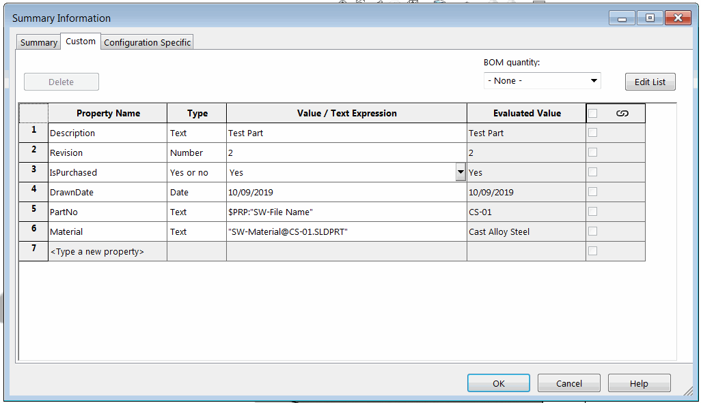

 使用SOLIDWORKS API从活动文档的各种来源（通用、配置特定和切割列表）提取所有自定义属性的VBA示例
image: custom-properties.png
labels: [属性,切割列表,配置]
---
{ width=550 }

这个VBA宏示例演示了如何使用SOLIDWORKS API从所有自定义属性的所有来源中读取所有属性。这包括文件（通用）、配置特定和切割列表属性。

结果输出到SOLIDWORKS的即时窗口中，包含属性的来源、名称、值、表达式、状态和链接状态的信息。

*PrintConfigurationSpecificProperties*的第二个参数允许指定是否需要从缓存中读取属性或需要解析属性。当需要解析表达式以在不同配置中产生不同的值时，这个选项非常重要，例如质量或体积属性。

``` vb
PrintConfigurationSpecificProperties swModel, False '解析配置的属性
```

```
通用属性
    属性: 描述
    值/文本表达式: Test Part
    评估值: Test Part
    已解析: True
    已链接: False
    状态: 已解析的值

配置特定属性
    A
        属性: 重量
        值/文本表达式: "SW-Mass@@A@CS-01.SLDPRT"
        评估值: 70.20
        已解析: True
        已链接: False
        状态: 缓存的值

切割列表属性
    -没有切割列表-
```

``` vb
Dim swApp As SldWorks.SldWorks

Sub main()

    Set swApp = Application.SldWorks
    
    Dim swModel As SldWorks.ModelDoc2
    Set swModel = swApp.ActiveDoc
    
    If Not swModel Is Nothing Then
        PrintGeneralProperties swModel
        PrintConfigurationSpecificProperties swModel, True
        PrintCutListProperties swModel
    Else
        MsgBox "请打开模型"
    End If
    
End Sub

Sub PrintGeneralProperties(model As SldWorks.ModelDoc2)
    
    Dim swCustPrpMgr As SldWorks.CustomPropertyManager
    Set swCustPrpMgr = model.Extension.CustomPropertyManager("")
    
    Debug.Print "通用属性"
    
    PrintProperties swCustPrpMgr, False, "    "
    
End Sub

Sub PrintConfigurationSpecificProperties(model As SldWorks.ModelDoc2, cached As Boolean)
    
    Dim vNames As Variant
    vNames = model.GetConfigurationNames()
    
    Dim i As Integer
    
    Debug.Print "配置特定属性"
    
    For i = 0 To UBound(vNames)
        
        Dim confName As String
        confName = vNames(i)
        
        Dim swCustPrpMgr As SldWorks.CustomPropertyManager
        Set swCustPrpMgr = model.Extension.CustomPropertyManager(confName)
        
        Debug.Print "    " & confName
        PrintProperties swCustPrpMgr, cached, "        "
        
    Next
    
End Sub

Sub PrintCutListProperties(model As SldWorks.ModelDoc2)

    Dim vCutLists As Variant
    vCutLists = GetCutLists(model)
    
    Debug.Print "切割列表属性"
    
    If Not IsEmpty(vCutLists) Then
        Dim i As Integer
        
        For i = 0 To UBound(vCutLists)
            Dim swCutListFeat As SldWorks.Feature
            Set swCutListFeat = vCutLists(i)
            Debug.Print "    " & swCutListFeat.Name
            PrintProperties swCutListFeat.CustomPropertyManager, False, "        "
        Next
    Else
        Debug.Print "    -没有切割列表-"
    End If

End Sub

Function GetCutLists(model As SldWorks.ModelDoc2) As Variant
    
    Dim swCutListFeats() As SldWorks.Feature
    Dim isInit As Boolean
    isInit = False
    
    Dim swFeat As SldWorks.Feature
    Dim swBodyFolder As SldWorks.BodyFolder
    
    Set swFeat = model.FirstFeature
    
    Do While Not swFeat Is Nothing
        
        If swFeat.GetTypeName2 = "CutListFolder" Then
            
            If Not isInit Then
                isInit = True
                ReDim swCutListFeats(0)
            Else
                ReDim Preserve swCutListFeats(UBound(swCutListFeats) + 1)
            End If
            
            Set swCutListFeats(UBound(swCutListFeats)) = swFeat
            
        End If
        
        Set swFeat = swFeat.GetNextFeature
        
    Loop
    
    If isInit Then
        GetCutLists = swCutListFeats
    Else
        GetCutLists = Empty
    End If

End Function

Sub PrintProperties(custPrpMgr As SldWorks.CustomPropertyManager, cached As Boolean, indent As String)
    
    Dim vPrpNames As Variant
    vPrpNames = custPrpMgr.GetNames()
    
    Dim i As Integer
    
    If Not IsEmpty(vPrpNames) Then
    
        For i = 0 To UBound(vPrpNames)
            
            Dim prpName As String
            prpName = vPrpNames(i)
            
            Dim prpVal As String
            Dim prpResVal As String
            Dim wasResolved As Boolean
            Dim isLinked As Boolean
            
            Dim res As Long
            res = custPrpMgr.Get6(prpName, cached, prpVal, prpResVal, wasResolved, isLinked)
            
            Dim status As String
            Select Case res
                Case swCustomInfoGetResult_e.swCustomInfoGetResult_CachedValue
                    status = "缓存的值"
                Case swCustomInfoGetResult_e.swCustomInfoGetResult_ResolvedValue
                    status = "已解析的值"
                Case swCustomInfoGetResult_e.swCustomInfoGetResult_NotPresent
                    status = "不存在"
            End Select
            
            Debug.Print indent & "属性: " & prpName
            Debug.Print indent & "值/文本表达式: " & prpVal
            Debug.Print indent & "评估值: " & prpResVal
            Debug.Print indent & "已解析: " & wasResolved
            Debug.Print indent & "已链接: " & isLinked
            Debug.Print indent & "状态: " & status
            Debug.Print ""
            
        Next
    Else
        Debug.Print indent & "-没有属性-"
    End If
    
End Sub
```