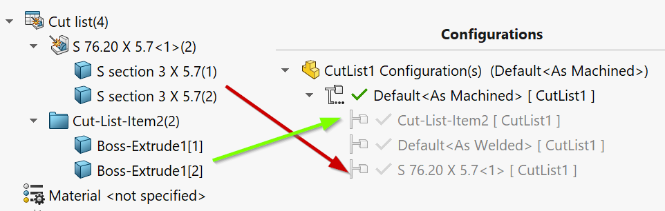
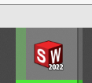

此VBA宏为活动零件文档的所有切割清单体创建单独的配置。

当准备多体切割清单零件的绘图时，此宏非常有用，其中需要为每个唯一体选择绘图。

宏将根据文档中的切割清单特征创建相同数量的配置，并添加相应的**删除实体**特征，并设置此特征的抑制，以便每个配置仅显示单个切割清单的实体。

宏将以切割清单名称命名配置。

宏将在SOLIDWORKS图标中显示进度条：

## 配置

**KEEP_ALL_CUT_LIST_BODIES**常量允许控制宏是否隔离所有切割清单体还是仅保留单个唯一体。

~~~ vb
Const KEEP_ALL_CUT_LIST_BODIES As Boolean = True '保留所有切割清单体
~~~

如果将**KEEP_ALL_CUT_LIST_BODIES**设置为**False**，则仅保留每个切割清单的第一个实体。这简化了绘图创建过程，因为只需要选择相应的引用配置以在绘图中显示实体。但是，这将导致切割清单项的数量不正确，如果插入了BOM表（始终等于1）。

如果将**KEEP_ALL_CUT_LIST_BODIES**设置为**True**，则将保留每个切割清单的所有实体。在这种情况下，用户还需要通过绘图视图中的**选择实体**按钮选择要保留的单个实体。但是，在这种情况下，物料清单表将显示正确的数量。

~~~ vb
Const KEEP_ALL_CUT_LIST_BODIES As Boolean = True

Dim swApp As SldWorks.SldWorks

Sub main()

    Dim swProgressBar As SldWorks.UserProgressBar

try_:
    
    On Error GoTo catch_
    
    Set swApp = Application.SldWorks
    
    swApp.GetUserProgressBar swProgressBar
    
    Dim swModel As SldWorks.ModelDoc2
    
    Set swModel = swApp.ActiveDoc
    
    If Not swModel Is Nothing Then
        
        If swModel.GetType() = swDocumentTypes_e.swDocPART Then
            
            Dim vCutLists As Variant
            vCutLists = GetCutLists(swModel)
            
            swProgressBar.Start 0, UBound(vCutLists), "为切割清单创建配置"
            
            Dim i As Integer
            
            For i = 0 To UBound(vCutLists)
                
                Dim swCutList As SldWorks.Feature
                Set swCutList = vCutLists(i)
                
                Dim swCutListFolder As SldWorks.BodyFolder
                Set swCutListFolder = swCutList.GetSpecificFeature2
                
                Dim vCutListBodies As Variant
                vCutListBodies = swCutListFolder.GetBodies()
                
                If Not IsEmpty(vCutListBodies) Then
                
                    Dim vBodies As Variant
                    
                    If KEEP_ALL_CUT_LIST_BODIES Then
                        vBodies = vCutListBodies
                    Else
                        Dim swBody(0) As SldWorks.Body2
                        Set swBody(0) = vCutListBodies(0)
                        vBodies = swBody
                    End If
                    
                    Debug.Print "为 " & swCutList.Name & " 创建配置"
                    
                    CreateConfigurationForBodies swModel, vBodies, swCutList.Name
                
                Else
                    Debug.Print swCutList.Name & " 没有实体"
                End If
                
                swProgressBar.UpdateProgress i + 1
                
            Next
            
        Else
            Err.Raise vbError, "", "仅支持零件文档"
        End If
    Else
        Err.Raise vbError, "", "打开零件文档"
    End If
    
    GoTo finally_
    
catch_:
    MsgBox Err.Description, vbCritical
finally_:

    If Not swProgressBar Is Nothing Then
        swProgressBar.End
    End If
    
End Sub

Sub CreateConfigurationForBodies(model As SldWorks.ModelDoc2, vBodies As Variant, confName As String)

    If IsEmpty(vBodies) Then
        Err.Raise vbError, "", "未指定实体"
    End If
    
    Dim activeConfName As String
    activeConfName = model.ConfigurationManager.ActiveConfiguration.Name

    Dim swBodyConf As SldWorks.Configuration
    Set swBodyConf = model.ConfigurationManager.AddConfiguration2(confName, "", "", swConfigurationOptions2_e.swConfigOption_DontActivate Or swConfigurationOptions2_e.swConfigOption_SuppressByDefault, activeConfName, "", False)
    
    If swBodyConf Is Nothing Then
        Err.Raise vbError, "", "无法为 " & confName & " 创建配置"
    End If
    
    If model.Extension.MultiSelect2(vBodies, False, Nothing) = UBound(vBodies) + 1 Then
        
        Dim swBodyDeleteFeat As SldWorks.Feature
        Set swBodyDeleteFeat = model.FeatureManager.InsertDeleteBody2(True)
        
        If Not swBodyDeleteFeat Is Nothing Then
            
            swBodyDeleteFeat.Name = confName + "_Isolated"
            
            If False = swBodyDeleteFeat.SetSuppression2(swFeatureSuppressionAction_e.swSuppressFeature, swInConfigurationOpts_e.swThisConfiguration, Empty) Then
                Err.Raise vbError, "", "无法抑制 " & confName & " 的删除实体特征"
            End If
            
            Dim targetConf(0) As String
            targetConf(0) = swBodyConf.Name
            
            If False = swBodyDeleteFeat.SetSuppression2(swFeatureSuppressionAction_e.swUnSuppressFeature, swInConfigurationOpts_e.swSpecifyConfiguration, targetConf) Then
                Err.Raise vbError, "", "无法配置 " & confName & " 的删除实体特征的抑制"
            End If
        Else
            Err.Raise vbError, "", "无法为 " & confName & " 创建删除实体特征"
        End If
        
    Else
        Err.Raise vbError, "", "无法选择 " & confName & " 的实体"
    End If

End Sub

Function GetCutLists(model As SldWorks.ModelDoc2) As Variant

    Dim swFeat As SldWorks.Feature
    
    Dim swCutLists() As SldWorks.Feature
    
    Set swFeat = model.FirstFeature
    
    While Not swFeat Is Nothing
        
        If swFeat.GetTypeName2 <> "HistoryFolder" Then
        
            ProcessFeature swFeat, swCutLists
            
            TraverseSubFeatures swFeat, swCutLists
        
        End If
        
        Set swFeat = swFeat.GetNextFeature
        
    Wend
    
    GetCutLists = swCutLists
    
End Function

Sub TraverseSubFeatures(parentFeat As SldWorks.Feature, cutLists() As SldWorks.Feature)
    
    Dim swChildFeat As SldWorks.Feature
    Set swChildFeat = parentFeat.GetFirstSubFeature
    
    While Not swChildFeat Is Nothing
        ProcessFeature swChildFeat, cutLists
        Set swChildFeat = swChildFeat.GetNextSubFeature()
    Wend
    
End Sub

Sub ProcessFeature(feat As SldWorks.Feature, cutLists() As SldWorks.Feature)
    
    If feat.GetTypeName2() = "SolidBodyFolder" Then
        Dim swBodyFolder As SldWorks.BodyFolder
        Set swBodyFolder = feat.GetSpecificFeature2
        swBodyFolder.UpdateCutList
    ElseIf feat.GetTypeName2() = "CutListFolder" Then
        
        If Not Contains(cutLists, feat) Then
            If (Not cutLists) = -1 Then
                ReDim cutLists(0)
            Else
                ReDim Preserve cutLists(UBound(cutLists) + 1)
            End If
            
            Set cutLists(UBound(cutLists)) = feat
        End If
        
    End If
    
End Sub

Function Contains(arr As Variant, item As Object) As Boolean
    
    Dim i As Integer
    
    For i = 0 To UBound(arr)
        If arr(i) Is item Then
            Contains = True
            Exit Function
        End If
    Next
    
    Contains = False
    
End Function
~~~