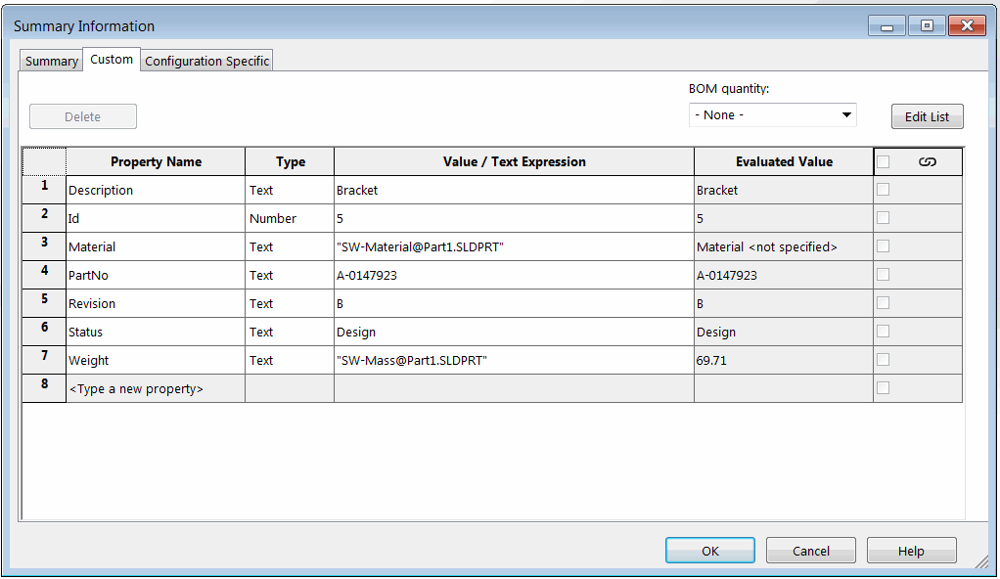

 VBA macro to sort file and configuration specific custom properties (in ascending and descending order) using logical order via SOLIDWORKS API
image: sort-custom-properties.svg
labels: [sort, custom properties, bubble]
group: Custom Properties
---
{ width=350 }

This VBA macro sorts the custom properties in a file and all configurations using the logical order with SOLIDWORKS API. Both ascending and descending order can be specified.

Logical order sorts the element as follows. This is an order of files being ordered in Windows File Explorer

* Property1
* Property2
* Property3
* Property12
* Property20
* Property21
* Property30

While alphabetical sort for the above sequence would produce the following result:

* Property1
* Property12
* Property2
* Property20
* Property21
* Property3
* Property30

## Configuration

Macro can be configured by changing the constant values in the macro as follows:

~~~ vb
Const ASCENDING As Boolean = True 'True to sort ascending, False to sort descending
Const REORDER_GENERAL_CUST_PRPS As Boolean = True 'True to sort file specific custom properties, False to skip
Const REORDER_CONF_CUST_PRPS As Boolean = True 'True to sort configuration specific custom properties (for parts and assemblies), False to skip
~~~

Watch [video demonstration](https://youtu.be/jsjN8zNRTuc?t=97)

~~~ vb
Declare PtrSafe Function StrCmpLogicalW Lib "shlwapi" (ByVal s1 As String, ByVal s2 As String) As Integer

Const ASCENDING As Boolean = True
Const REORDER_GENERAL_CUST_PRPS As Boolean = True
Const REORDER_CONF_CUST_PRPS As Boolean = True

Dim swApp As SldWorks.SldWorks

Sub main()

    Set swApp = Application.SldWorks
    
    Dim swModel As SldWorks.ModelDoc2
    
    Set swModel = swApp.ActiveDoc
    
    If Not swModel Is Nothing Then
                
        If REORDER_GENERAL_CUST_PRPS Then
            Dim swCustPrpMgr As SldWorks.CustomPropertyManager
            Set swCustPrpMgr = swModel.Extension.CustomPropertyManager("")
            ReorderProperties swCustPrpMgr, ASCENDING
        End If
        
        If REORDER_CONF_CUST_PRPS Then
            
            Dim vConfNames As Variant
            vConfNames = swModel.GetConfigurationNames
            
            If Not IsEmpty(vConfNames) Then
                
                Dim i As Integer
                
                For i = 0 To UBound(vConfNames)
                    Dim swConfCustPrpMgr As SldWorks.CustomPropertyManager
                    Set swConfCustPrpMgr = swModel.Extension.CustomPropertyManager(vConfNames(i))
                    ReorderProperties swConfCustPrpMgr, ASCENDING
                Next
                
            End If
            
        End If
        
        swModel.SetSaveFlag
        
    Else
        MsgBox "Please open document"
        
    End If
        
End Sub

Sub ReorderProperties(custPrpMgr As SldWorks.CustomPropertyManager, asc As Boolean)
    
    Dim vPrpNames As Variant
    Dim vPrpTypes As Variant
    
    'NOTE: returned properties values are resolved for both valOut and resValOut parameters
    custPrpMgr.GetAll2 vPrpNames, vPrpTypes, Empty, Empty
    
    If Not IsEmpty(vPrpNames) Then
    
        Dim dict As Object
        Set dict = CreateObject("Scripting.Dictionary")
        
        Dim i As Integer
        
        For i = 0 To UBound(vPrpNames)
            Dim prpVal As String
            custPrpMgr.Get3 vPrpNames(i), False, prpVal, ""
            dict.Add vPrpNames(i), Array(vPrpTypes(i), prpVal)
            custPrpMgr.Delete2 vPrpNames(i)
        Next
    
        vPrpNames = BubbleSort(vPrpNames, asc)
        
        For i = 0 To UBound(vPrpNames)
            Dim vPrpData As Variant
            vPrpData = dict.Item(vPrpNames(i))
            If custPrpMgr.Add3(vPrpNames(i), vPrpData(0), vPrpData(1), swCustomPropertyAddOption_e.swCustomPropertyOnlyIfNew) <> swCustomInfoAddResult_e.swCustomInfoAddResult_AddedOrChanged Then
                Err.Raise vbError, "", "Failed to add property"
            End If
        Next
        
    End If
End Sub

Function BubbleSort(vStrArray As Variant, asc As Boolean) As Variant
    
    Dim swapPos As Integer
    swapPos = IIf(asc, 1, -1)
    
    Dim vResStrArray As Variant
    vResStrArray = vStrArray
    
    Dim i As Integer
    Dim j As Integer
    Dim tempVal As String
    
    For i = 0 To UBound(vResStrArray)
        For j = i To UBound(vResStrArray)
            If StrCmpLogicalW(StrConv(CStr(vResStrArray(i)), vbUnicode), StrConv(CStr(vResStrArray(j)), vbUnicode)) = swapPos Then
                tempVal = vResStrArray(j)
                vResStrArray(j) = vResStrArray(i)
                vResStrArray(i) = tempVal
            End If
        Next
    Next
    
    BubbleSort = vResStrArray
    
End Function
~~~

