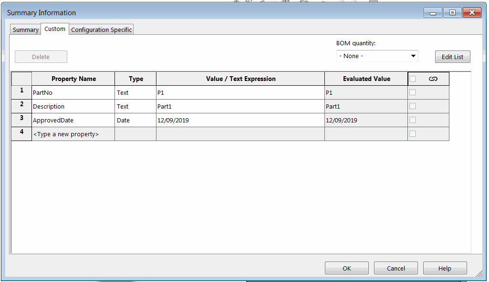

 VBA macro example to write different types of properties (general, configuration specific and cut list) using SOLIDWORKS API
image: approved-date-custom-property.png
labels: [set property,add property,write property,date]
---
{ width=550 }

This VBA macro example demonstrates how to add (create new or change existing) custom properties to various custom properties sources using SOLIDWORKS API. This includes file (general) custom properties, configuration specific custom properties and cut-list items (weldment or sheet metal) custom properties.

Macro adds the *ApprovedDate* custom property of type *Date* and sets the value to the current date.

> By some reasons custom property field type is ignored and defaulted to Text when assigned to cut-list item

~~~ vb
Const PRP_NAME As String = "ApprovedDate"

Dim swApp As SldWorks.SldWorks

Sub main()

    Set swApp = Application.SldWorks
    
    Dim swModel As SldWorks.ModelDoc2
    Set swModel = swApp.ActiveDoc
    
    If Not swModel Is Nothing Then
        
        Dim curDate As Date
        curDate = Now
        
        Dim dateFormat As String
        dateFormat = Format(curDate, "YYYY-MM-dd")
        
        SetGeneralProperty swModel, PRP_NAME, dateFormat, swCustomInfoType_e.swCustomInfoDate
        SetConfigurationSpecificProperty swModel, PRP_NAME, dateFormat, swCustomInfoType_e.swCustomInfoDate
        SetCutListProperty swModel, PRP_NAME, dateFormat, swCustomInfoType_e.swCustomInfoDate
    Else
        MsgBox "Please open model"
    End If
    
End Sub

Sub SetGeneralProperty(model As SldWorks.ModelDoc2, prpName As String, prpVal As String, prpType As swCustomInfoType_e)
    
    SetProperty model.Extension.CustomPropertyManager(""), prpName, prpVal, prpType
    
End Sub

Sub SetConfigurationSpecificProperty(model As SldWorks.ModelDoc2, prpName As String, prpVal As String, prpType As swCustomInfoType_e)
    
    Dim vNames As Variant
    vNames = model.GetConfigurationNames()
    
    Dim i As Integer
        
    For i = 0 To UBound(vNames)
        
        Dim confName As String
        confName = vNames(i)
        
        SetProperty model.Extension.CustomPropertyManager(confName), prpName, prpVal, prpType
        
    Next
    
End Sub

Sub SetCutListProperty(model As SldWorks.ModelDoc2, prpName As String, prpVal As String, prpType As swCustomInfoType_e)

    Dim vCutLists As Variant
    vCutLists = GetCutLists(model)
        
    If Not IsEmpty(vCutLists) Then
        Dim i As Integer
        
        For i = 0 To UBound(vCutLists)
            Dim swCutListFeat As SldWorks.Feature
            Set swCutListFeat = vCutLists(i)
            SetProperty swCutListFeat.CustomPropertyManager, prpName, prpVal
        Next
    End If

End Sub

Function GetCutLists(model As SldWorks.ModelDoc2) As Variant
    
    Dim swCutListFeats() As SldWorks.Feature
    Dim isInit As Boolean
    isInit = False
    
    Dim swFeat As SldWorks.Feature
    Dim swBodyFolder As SldWorks.BodyFolder
    
    Set swFeat = model.FirstFeature
    
    Do While Not swFeat Is Nothing
        
        If swFeat.GetTypeName2 = "CutListFolder" Then
            
            If Not isInit Then
                isInit = True
                ReDim swCutListFeats(0)
            Else
                ReDim Preserve swCutListFeats(UBound(swCutListFeats) + 1)
            End If
            
            Set swCutListFeats(UBound(swCutListFeats)) = swFeat
            
        End If
        
        Set swFeat = swFeat.GetNextFeature
        
    Loop
    
    If isInit Then
        GetCutLists = swCutListFeats
    Else
        GetCutLists = Empty
    End If

End Function

Sub SetProperty(custPrpMgr As SldWorks.CustomPropertyManager, prpName As String, prpVal As String, Optional prpType As swCustomInfoType_e = swCustomInfoType_e.swCustomInfoText)
    
    Dim res As Long
    res = custPrpMgr.Add3(prpName, prpType, prpVal, swCustomPropertyAddOption_e.swCustomPropertyReplaceValue)
    
    If res <> swCustomInfoAddResult_e.swCustomInfoAddResult_AddedOrChanged Then
        Err.Raise vbError, "", "Failed to set custom property. Error code: " & res
    End If
    
End Sub
~~~

