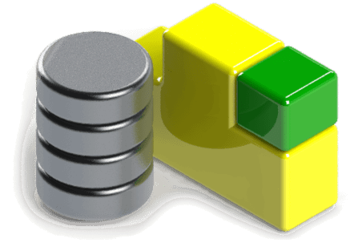

{ width=250 }

SOLIDWORKS provides multiple ways to store the custom user data (i.e. text, numbers or more complex types like images or videos) within the SOLIDWORKS models using API. The most common ways are:

## Custom Properties

Allows to add custom key-value pairs into the model or a configuration. Type of the key is case-insensitive string which must be unique within the scope (i.e. document level or configuration). Type of the value can be: text, number, date and boolean (Yes or No). Custom properties can be edited by the user.

## Attributes

Attributes are custom features added to the feature tree which might hold the parameters with values (string or numeric). Attributes can be also associated with the selectable objects (face, vertex, edge and component). Attributes cannot be associated with sketch segments. Attributes can be hidden in the features tree. Attributes cannot be changed from the User Interface.

## 3rd Party Storage

SOLIDWORKS allows creating custom COM storage within the main model's stream. It is possible to serialize/deserialize any custom data in this stream.

This section contains macros and code examples which demonstrates usage of above techniques to save data in the model using SOLIDWORKS API.
